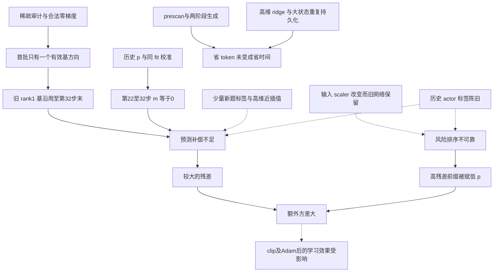
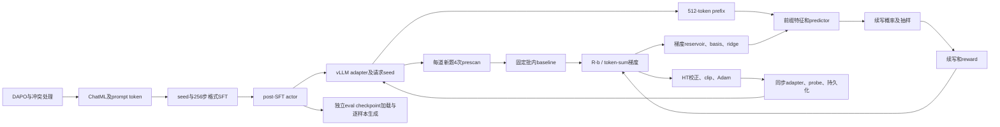

# GRACE 9月17日最小实验：三轮审查整合报告

后续处理见 [9月18日修复与验证记录](GRACE_REMEDIATION_20260918.md)。下文保留审查时的历史事实和问题编号，不代表修复后代码仍有相同缺陷；也不能用代码修复改写原实验的负结果。

整合日期：2026-09-18。对象：仓库HEAD `a1ca77b7a5c4a50fbaa50be1c76e34f878e217bc`、PR #4，以及 `runs/minimal-chain-20260917-071528` 的完成态归档。

本文件整合三轮共 **13份审查报告**。前半部分给出统一结论、去重问题清单、证据边界和处理顺序；后半部分完整收录13份报告的整合副本，便于在一个文件内追溯细节。PR原文是审查材料，不计入13份审查报告。原始报告、脚本、JSON及实验包均未改写。

**按本文件的合并粒度，共整理出50项审查发现：17项方法/预测器/数值问题，8项工程效率问题，14项实验/测量/证据问题，以及11项本次未触发或尚未证实触发的潜在缺陷。** 这不是“50个已确认导致本次失败的bug”，也不是50个相互独立的根因；同一项下合并了相关表现，跨项仍可能存在因果关联。低捕获率、m=0、γ≈1、耗时和质量变化作为证据或后果，不重复累计为新问题。

## 阅读导航

- [统一结论与关键数据](#conclusion)
- [50项去重问题总表](#issues)
- [优先处理顺序](#actions)
- [已排除的解释](#exclusions)
- [旧说法修订与统一口径](#corrections)
- [验证记录与剩余证据](#verification)
- [13份报告完整收录](#sources)

## 一、统一结论与关键数据

**GRACE的idea在这次最小实验中没有获得正向验证。** 当前保存的质量、方差×token成本和真实耗时均未展示预期收益。核心HT/CV接线实际运行，未发现梯度符号、当批分母N、R−b、停止者null或前缀决策的致命接线错误；但这些正确性不自动保证低方差、同有效策略、优化器后质量或实际加速。

最有证据的解释是：较高秩非零预测补偿启用晚，U/f对已观测的新题没有产生残差收益，风险排序又放大了高残差样本的抽样方差；固定开销和冗余计算进一步使token减少没有兑现为墙钟改善。具体因素的因果贡献并未全部分离，不能将某一项说成唯一原因，也不能由这一个小运行否定所有模型、预算和训练阶段上的广义idea。

### 运行与来源

- 现役数据仅9月17日链；不使用9月16日链补结果或补缺失对照。
- Qwen3-4B-Base，单卡A100 80GB，`CUDA_VISIBLE_DEVICES=1`，seed17，40步；每方法各做256步reasoning-lead格式SFT。
- train：每步2题，初始16条起步轨迹，t=512、horizon=2048；GRACE后期N增至24。
- eval：官方MATH-500文件固定前16题，每题4次；horizon=4096，temperature=.6、top_p=.95。
- audit：4题、每题2条path、t=128/512/1024、每前缀8次续写；horizon=4096、baseline另采8次。
- 包中只有Full-PG与GRACE各自train、eval-0/20/40、audit；没有Uniform-CV或GRPO完成结果。
- PR #4只新增文档，没有训练代码diff。作者的“运行源码未改”声明不能完全由包独立确认：记录HEAD一致，但dirty=true、file_hashes为空，未含运行时source diff。
- 333条清单hash与tar全部334个普通文件核验通过；归档SHA256为`a54f8ed8875a2ab23b1a1444a7aefd5858216d09b0ac71119d57aee23cc675b1`。这证明已包含文件一致，不替代对排除的大checkpoint的验证。

### 质量和实际成本

| 指标 | Full-PG | GRACE |
|---|---:|---:|
| step0 avg@4 | 37/64 = 57.8125% | 43/64 = 67.1875% |
| step20 avg@4 | 41/64 = 64.0625% | 47/64 = 73.4375% |
| step40 avg@4 | 47/64 = 73.4375% | 43/64 = 67.1875% |
| 末−初 | +15.625个百分点 | 0 |
| final pass@4 | 14/16 = 87.5% | 14/16 = 87.5% |
| final parse rate | 60/64 | 64/64 |
| final截断 | 4/64 | 0/64 |
| 40步wall之和，分钟 | 40.424 | 54.891 |
| train端到端，分钟 | 48.918 | 207.701 |
| train+三次eval+audit的stage墙钟之和，分钟 | 120.468 | 288.317 |

最后一行不含测试、进程间和打包等间隙，不能叫服务器完整账单。phase嵌套在step内，不能再相加。GRACE与Full-PG初始观测已不同，首次actor更新前prescan/prefix也已分叉；缺step0 actor权重，原因未闭合。最终GRACE相对Full-PG逐题2胜、5负、9平，不能据单seed小样本宣称总体显著劣势或等效。

### 预测器实际运行时间线

| 批次 | 本批实际状态 |
|---|---|
| 1–20 | warmup，p=1；第4步末首次建基，实际rank=1 |
| 21 | 使用第4步rank1基，m非零；本步末γ变0 |
| 22–32 | 仍用rank1基，所有eligible预测m严格为0 |
| 33–40 | 第32步末新建rank8基，m非零 |

所以20步allocation_ready并非20步有效非零CV。最后8步9条eligible审计样本的IPW梯度能量捕获率约1.0494%，其中8条预测残差比m=0更大；这是保存的全空间norm/coords重算，不是JL结果，也不是总体“可学习信号占比”。

### 方差与停止收益

GRACE末态审计的完整续写参考方差45.15775，HT-CV方差166.92058；token代理成本1206.75→757.99188，乘积比 **2.321800**。它来自同一GRACE actor的10个eval bundles×后4条续写，混合3个t；不是两条训练链的直接方差比、不是唯一selected前缀的值，也不是墙钟speedup。

固定原始报告行、实际m和每个t的实际token预算，离线反事实为：

| 分配 | 方差×token成本比 |
|---|---:|
| 当前r、当前c | 2.32180 |
| 同实际成本uniform | 1.64425 |
| 当前r、事后真实c | 2.70222 |
| 事后真实r、当前c | 1.21284 |
| 事后真实r、事后真实c | 1.16336 |

“真实”r/c来自报告标签，是刻意的hindsight诊断，不能部署或当GPU结果。固定成本比例时，额外方差需下降约78%才持平；这只是算术差距，不是新门槛。β=.75/.9的事后分配显示潜力，但当前冻结预测器的停止配置扫描没有找到比值<1。

LAG证据同样未建立：GRACE仅一个selected bundle，t512的ρL=1.834、ρA=1.143；答案未定不等于梯度已定。Full-PG selected为空，是无可用观测，不能记0。现有ρ平均和筛选保持原样。

## 二、50项去重问题总表

状态说明：**本次**指配置、记录或确定代码路径已涉及本次；**机制**指源码/数学/CPU例确认其可能作用，本次因果贡献未量化；**缺证**指归因或外推缺少材料；**潜在**指未触发或未证实本次触发。状态不是严重程度评级，也不是实验启动条件。

### A. 方法、预测器与数值：17项

| ID | 问题 | 已知证据与边界 | 对应处理方向 |
|---|---|---|---|
| 01 | 首基代表性差，warmup结束未及时刷新 | 本次：8条首批标签6条零G，两条同题，产生rank1并沿用至第32步；最后仅8步rank8非零CV。[S06](#source-s06) | 在warmup末等明确时点比较新旧U，记录本批实际rank/γ；不以rank数字代替效果。 |
| 02 | PCA题内方差目标未必对应可预测均值 | 机制：可优先选后缀噪声；题内中心化删除题均值，singleton归零。末库19个singleton；CPU反例成立。[S05](#source-s05)、[S06](#source-s06) | 独立比较可预测方向及题均值处理，作为明确方法变体。 |
| 03 | 基构造未用IPW，而头训练用了 | 本次：第32步17/62建基标签p<1；普通SVD不校正选择分布。真实U会改变多少未知。[S13](#source-s13) | 比较明确目标分布下的基构造及加权中心化；不宣称任意U会破坏HT无偏。 |
| 04 | 高维坐标拟合与监督量、正则尺度失配 | 本次：7685维特征，停止启动时fit仅14条/8题、末期24条/15题；未归一化Σw损失使λ=1的相对强度变化，近插值loss不能验泛化。[S06](#source-s06) | 明确正则尺度/自由度，以独立残差比较；单纯加快ridge不修泛化。 |
| 05 | γ历史p冷启动与同fit自校准 | 本次：warmup历史p=1无校准权重，后续零标签使γ=0；同fit近插值再使γ≈1。第22–32步m=0是后果。[S06](#source-s06) | 明确当前设计权重与校准时点，对整个冻结预测器作独立校准。 |
| 06 | risk输入scaler变化，旧网络/Adam未迁移 | 本次路径/机制：每批重拟合mean/std，网络保持旧坐标；CPU只改scaler即可反序，真实漂移幅度缺权重。[S06](#source-s06) | 稳定scaler，或验证函数与优化状态的一致迁移。 |
| 07 | softplus后的硬floor可令正目标梯度为0 | 机制已复现；本次早期巨大loss不能单独证明进入死区。[S06](#source-s06) | 记录logit/floor占比，验证正目标能恢复学习。 |
| 08 | 监督稀疏重尾、跨actor陈旧并被反复复用 | 本次：74条不同审计样本仅35条非零，复用1605标签轮次；末库平均旧约19步，旧feature/G不重算。[S06](#source-s06)、[S13](#source-s13) | 比较新鲜度、代表性和真实标签成本，保留合法零/负梯度。 |
| 09 | 独立验证没有覆盖整个U/f/γ/r流程 | 本次：U看过risk hold的G；hold仍是risk训练集，不能作最终泛化验证。[S13](#source-s13) | 用全部部件冻结后的独立问题/时间片评估。 |
| 10 | 风险排序与当前停止预算未抵消额外方差 | 本次：三个低p高残差bundle贡献94.77%额外方差；同成本uniform更好；固定实际m、当前报告样本及同token预算时，p的事后最优仍>1。[S07](#source-s07)、[S13](#source-s13) | 分开验证m与r，比较温和预算；不把事后最优当在线收益。 |
| 11 | entropy和length特征语义混入题面 | 本次：entropy含prompt并排除最后决策位置的下一token logit，length含prompt；不是未来泄漏。[S10](#source-s10) | 固定数据并列比较全span、response span、最后位置特征。 |
| 12 | 增加N只增加同题起步，未增加每步题数 | 本次：K=2不变，N16→24；题间噪声不能按总N同比减少。[S13](#source-s13) | 同时报告题数、每题起步和真实成本；完整轨迹方差公式仅作简化解释。 |
| 13 | 四样本prescan带来baseline估计噪声，EMA未摊销 | 本次80题不重复；同策略前提下独立b噪声增加Var(b)E||score||²。实际贡献缺score-only梯度。[S13](#source-s13) | 保持R−b，独立比较基线精度与代价，不删除prescan造速度。 |
| 14 | raw-G指标与clip/Adam/LoRA参数化几何不等价 | 本次所有非零梯度步均clip；CPU等价A/B缩放可改变风险排序，无偏原始估计不保证优化后同效。[S05](#source-s05)、[S10](#source-s10) | 保留原指标，同时诊断冻结优化器下更新方向；不直接删clip或改论文目标。 |
| 15 | HF与vLLM有效策略的精度一致性未闭合 | 对应源码/配置支持HF FP32 LoRA、vLLM BF16路径；80个短probe确有差值，缺服务器dtype dump与行为时刻全token比较。[S10](#source-s10) | 更新前同权重同token对齐；先核kernel支持，不能直接把整个actor转BF16。 |
| 16 | 成本回流proxy没有覆盖真实计算开销 | 本次next_n用最大剩余长度Z-proxy及10步均值，漏prescan、HF特征、predictor、保存；不能叫已实现equal-compute。[S08](#source-s08) | 并列报告proxy与实际占用；改controller需明确为方法变化。 |
| 17 | 理论闭式的适用范围被无条件扩张 | 已有A≤0反例：异质风险和截断p下，m=0也可能盈利；不反驳A>0且未截断驻点可行时闭式。[S05](#source-s05)、[S13](#source-s13) | 分开LAG、CV、风险抽样和实际收益主张；理论备注不阻止实验。 |

### B. 工程效率：8项

| ID | 问题 | 已知证据与边界 | 对应处理方向 |
|---|---|---|---|
| 18 | 小样本却解7686维primal ridge | 本次Gram单阵约450.7MiB；weighted dual含不罚截距的5组CPU等价检查通过，无实测提速。[S08](#source-s08) | 保持同目标使用适合n≪d的求解方式。 |
| 19 | 大D randomized SVD有大临时阵和近似损失 | 仅Ω约1.055GiB，无power iteration；小型Gram/full-SVD等价例通过，实际近似损失未量出。[S13](#source-s13) | 比较n×n Gram等求解，保护秩/正交性/数值阈值。 |
| 20 | 重复stack全梯度与物化n×D预测/残差 | 本次代码多次复制完整G；64条float64梯度约2.81GiB，U约360MiB是容量算术。[S08](#source-s08) | 避免重复构造或分块计算，保留完整空间残差。 |
| 21 | 每步重复完整状态压缩与持久化 | 本次两次完整NPZ；GRACE末态约1.19GiB、保留step文件26.85GiB；152.81分钟间隙不能全部归压缩。[S04](#source-s04)、[S08](#source-s08) | 细分state/save/compress/hash，一次序列化复用；同时修原子发布。 |
| 22 | prescan、eval、HF特征处理串行且小批 | 本次prescan逐题、eval逐样本、HF逐前缀和全词表entropy；probe只查64token却可前向整序列。[S08](#source-s08) | 保持请求seed/题序和特征语义，批处理/分块后测真实收益。 |
| 23 | 零advantage仍做无贡献前后向/审计求导 | 本次Full-PG349/640、GRACE289/546完成轨迹adv=0，GRACE39条零G审计。CPU保留Adam语义的省算例通过。[S08](#source-s08) | 跳过零系数求导但保留零标签、CV及必要optimizer.step。 |
| 24 | 维护并训练当前方法未使用的预测头 | ridge仍初始化coord MLP，GRACE仍训success/reward-risk，constant-cost仍有cost模块。[S13](#source-s13) | 按方法减少无用工作，注意初始化RNG消耗变化。 |
| 25 | HF默认返回未被使用的KV cache | 对应模型use_cache=true，特征/logprob/SFT调用不消费cache；无GPU峰值或时间对照。[S12](#source-s12) | 数值等价验证use_cache=False，再测内存；不把全部KV算作可净省空间。 |

### C. 实验设计、测量与证据：14项

| ID | 问题 | 已知证据与边界 | 对应处理方向 |
|---|---|---|---|
| 26 | 共同初始actor未被独立证实 | eval0已不同，第一次更新前已分叉；SFT loss/seed相同不证明权重相同，整checkpoint hash不同也不证明actor不同。[S01](#source-s01)、[S08](#source-s08) | 比较已有step0 actor张量并复用共同SFT checkpoint。 |
| 27 | 关键真实训练对照缺失 | 包内无Uniform-CV/GRPO；不能隔离CV、adaptive或实用基线贡献，不能用旧链补齐。[S01](#source-s01) | 取回本链完成结果或共同起点补跑，标实际完成状态。 |
| 28 | 单seed、固定小子集限制代表性 | eval固定前16题，audit桶前4题，selected仅1；64回答/40报告行不等于独立题数。[S11](#source-s11) | 原小样本照常保留；更多题/seed用于减少不确定性，不设准入门槛。 |
| 29 | audit估计对象与真实训练不一致 | horizon4096对2048、baseline8对4、跨t与pooled方差、审计重算p；不是训练固定两题batch精确方差。[S02](#source-s02)、[S07](#source-s07) | 附加训练一致的冻结诊断，保持原统计不改。 |
| 30 | 筛选与报告半样本没有完全隔离 | headline全8reward和A/B信号参与筛选，report后4也参与分母；存在选择依赖。[S11](#source-s11) | 明确检测/报告范围，独立后续样本验证。 |
| 31 | 不确定性字段容易被过度解释 | 单题rho UCB实际回点估计；Wilson对应pass@4的14/16，不是avg@4或训练seed区间。[S11](#source-s11) | 明示退化与对象，不把字段名当覆盖保证。 |
| 32 | CountSketch绝对能量尺度错误 | 单桶映射后额外除√256，平方范数期望缩小1/256；共同尺度在比值中抵消。[S02](#source-s02) | 修绝对尺度并验证；不能据此把2.3218翻成成功。 |
| 33 | 把投影后的PU当正交基计算正交补 | PU一般不正交，UUᵀ不是真正投影；现orthogonal_energy不能代表原空间覆盖。[S02](#source-s02) | 使用正确Gram/原空间摘要；仅QR(PU)不能恢复原空间能量。 |
| 34 | 轨迹身份hash记录在更新后 | snapshot/predictor hash取更新后状态，轨迹和f来自更新前，basis hash则为冻结旧基。[S02](#source-s02)、[S12](#source-s12) | 分开行为时刻与更新后身份。 |
| 35 | probe的时点、长度和ok语义不足以验证on-policy | 更新后只查一条响应前64token；ok表示可提取对齐，不是误差达标。[S02](#source-s02)、[S10](#source-s10) | 生成时刻同token逐项报告差异，与ID15数值路径一起查。 |
| 36 | 实际成本的细分与边界不完整 | step不含persist，CPU秒0代表未测，GPU预留wall非kernel秒，train不含后续eval/audit；缺cache/I/O细分。[S04](#source-s04)、[S12](#source-s12) | 明确嵌套边界并补计时，不能把153分钟全归某一项。 |
| 37 | 若干日志字段不是直觉上的统计量 | 停者response_tokens=0漏已付prefix；n_parsed含3个可解析停者；SFT n_examples是池大小；Full-PG eval method标签为grace但actor正确；快照eval事后运行。[S03](#source-s03)、[S11](#source-s11)、[S12](#source-s12) | 在生成/完成/parse/配置/快照时间之间使用明确字段与解释。 |
| 38 | PLC、oracle和各汇总口径不可互相替代 | PLC未筛选且无backward；oracle仅前4均值并共享p；全体/selected/flat-all不同；token减少和停止比例不是加速。[S02](#source-s02) | 名称附估计对象、样本人群与成本范围，保留负结果。 |
| 39 | 归档不足以完整复现和分摊原因 | 缺大权重/U/heads/optimizer、完整DAPO、audit判分基础字段、source diff/env.sh及GPU干扰trace；跨语料重复和外部共卡未知。[S01](#source-s01)、[S09](#source-s09) | 优先导出已有状态和最小原始字段；未知不写成错误或已排除。 |

### D. 本次未触发或尚未证实触发的潜在缺陷：11项

| ID | 问题 | 触发条件与本次状态 | 对应处理方向 |
|---|---|---|---|
| 40 | 在线与resume的next_n分组定义不同 | CPU有24→12而resume→16反例；本次N仅16/24、复算无差。[S08](#source-s08) | 两路径统一分组语义并回归。 |
| 41 | 完成者均值EMA有选择偏移 | 自适应p时完成者均值不代表所有starts；本次80题不重复，没有后续同题反馈，不是已证当前PG偏置。[S13](#source-s13) | 保持历史独立baseline，明确其估计目标及选择修正。 |
| 42 | 同root重跑可能混合旧train/eval和新audit | run目录加后缀，summarizer固定部分旧路径；CPU复现，本次无redirected。[S12](#source-s12) | 汇总使用实际运行路径和同一actor来源。 |
| 43 | 从旧快照恢复原目录会残留未来日志/index | CPU得到steps=[1,2,3,4,3]；本次steps1..40唯一，无resume。[S12](#source-s12) | 明确恢复分支，保留原证据并避免重复汇总。 |
| 44 | checkpoint直接覆盖且日志先发布 | 写中断可损坏latest并使日志领先恢复状态；CPU故障注入，本次未见中断。[S12](#source-s12) | 临时文件成功后原子发布，日志与已提交快照关联。 |
| 45 | 旧envelope可吞掉新失败/未完session计时 | CPU旧100秒+新20秒仍报100秒；本次单正常session未触发。[S12](#source-s12) | 按attempt去嵌套，失败也记录实际经过时间。 |
| 46 | 正常resume覆盖summary，只汇总最后session | 累积ledger存在但summarizer读最新summary；本次无resume。[S12](#source-s12) | 区分本session与累积运行时长。 |
| 47 | 恢复有效配置与新config标签可能不同 | optimizer/heads等读旧状态，预算/data等读新cfg；数据/底座身份校验有限，GPU启动历史也不同；本次未触发。[S12](#source-s12) | 记录有效恢复参数与数据身份，允许有意变更但不冒称精确重放。 |
| 48 | 题面lowercase去重可能合并大小写变量 | CPU反例成立；缺完整DAPO，未证本次错误合并。[S11](#source-s11) | 用保留数学语义的归一化验证边界，不凭UUID判跨语料无重复。 |
| 49 | text金标兼容分支可能误接受包含错误人名的句子 | CPU反例成立；本次1570条复核没有成功依赖该分支。[S11](#source-s11) | 对实际用途收紧并做语义反例回归。 |
| 50 | numeric-unit兼容分支可能将5x判作5 | CPU反例成立；本次1570条复核没有成功依赖该分支。[S11](#source-s11) | 区分单位与代数表达，保留正确等价表达支持。 |

分类数量为17+8+14+11=50。同一发现只在此总表编号一次；附录重复叙述不增加数量。代码缺陷、统计设计限制、未量化因素与证据缺口不能合称为“50个当前根因”。

## 三、优先处理顺序

1. **可信性与明确实现问题：** 生成前hash/probe和两端有效精度核验（15、34、35），risk坐标/floor（06、07），发布/汇总/恢复可靠性（40、42–47）。对应CPU可验证的先验证；真实GPU数值不能由CPU例代替。
2. **预测器与分配：** warmup末刷新U，明确基的目标与选择权重，整个U/f/γ/r在独立后续问题上评估（01–10）；训练一致的冻结actor诊断（29）。比较m=0/实际m与uniform/预测风险，不将所有参数一次性改变后只报最好结果。
3. **共同工程优化：** dual ridge、适合n小D大的基求解、去重全状态保存、零系数省算、合理批处理与cache（18–25、36）。同样优化可受益的baseline；先数值等价，再实测收益。
4. **共同起点与真实对照：** 同一SFT actor起步，补齐本链Uniform-CV/GRPO，报告质量对实际成本曲线（26–29）。更广题目、多seed用于减少不确定性，不作为自动门槛。

继续保持：R−b；停止者reward=null；ChatML；repetition_penalty=1；无min_tokens；G为上升方向、optimizer用−G；固定当批N、批内冻结；n_gpu>1仍拒绝。不得删除合法零/负标签、改变ρ/parse平均或将最小实验改称Pilot。修复和诊断无需新增审批、Go/No-Go或最低样本量流程。

## 四、已排除或未获证据支持的解释

- 核心真实流与CV符号、固定N、停止者null、前缀决策顺序未发现致命错误；Full-PG allocation_ready=false是正常方法行为。
- 1570条已保存回答独立复核一致：384条eval+1186条完成train。第三轮本地关闭Windows超时只是离线重判，不是生产修复；不覆盖312条audit续写。
- 未发现已保存完成轨迹token shift、EOS丢失、终止后多算、目标q/v A/B遗漏、audit覆盖训练梯度或隔离RNG串用。
- 本次训练sampling记录均T=1、top_p=1、top_k=−1、min_p=0、repetition_penalty=1、无min_tokens；协议参数一致不等于HF/vLLM数值策略完全相同。
- 当前attention/LoRA dropout均为0；不能把model mode缺显式切换直接当随机dropout根因。
- 本次train/audit题ID无交集；SFT/RL有4题合法题面重叠，格式SFT不训金标/Answer/EOS。跨语料重复另属未知。
- audit重构seed无碰撞；39个bundle各8条保存续写不同且与prefix一致，同path不同t嵌套。未发现复制续写或前缀替换。
- adapter同步递增id/name、移除旧adapter并清缓存；同批prefix/continuation具备KV复用条件。没有证据支持“必用旧LoRA”“全部KV必丢”或“每步sleep/wake”。
- 正常CPU同配置连续4步与2+2恢复的全部状态一致；另有非零U、reservoir、γ及五头非空Adam状态roundtrip一致。不能泛称checkpoint遗漏关键状态。
- 本包没有外部GPU进程清单，不能宣称共卡干扰已证明；单个全零reward/adv批也不是全训练塌缩。

## 五、旧说法修订与统一口径

以下以新证据覆盖旧稿不完整解释；附录相应位置加整合说明，原始源文件不改。

| 旧说法或常见误读 | 本文件统一口径 |
|---|---|
| 名义k=8或20步ready代表全程有效rank8预测 | 首基rank1；22–32步m=0；33–40步才rank8非零m。 |
| 缺U所以实际秩/能量捕获完全不可知 | basis_rank/f确认时点；训练norm/coords可算9条样本1.0494%捕获；完整U/奇异谱仍缺。 |
| 1.05%代表总体可学习信号比例 | 只是指定9条eligible审计样本的IPW梯度能量比例。 |
| γ≈1、coord loss≈0、risk loss小就是泛化有效 | 历史p与同fit自校准/训练误差不能验证新题效果。 |
| hold是整个predictor未见过的数据 | U看过hold标签，hold也是risk训练集。 |
| 非零信号使用未去偏的均值平方 | 实际用独立A/B均值内积，再除样本分母；仍有小样本及筛选依赖。 |
| snapshot_sha证明初始actor或行为时刻权重 | 它是actor hash，但发生在更新后；整checkpoint hash更不能隔离actor。 |
| 相同SFT loss证明相同权重，或eval0不同证明不同权重 | 两种推断都不成立，需要step0 actor张量。 |
| 未传engine seed等于请求无seed | 请求seed明确；引擎默认与请求随机性是两层。 |
| probe=ok证明on-policy，dtype差解释两个eval0 | ok仅可比较；dtype差是待量化路径，不能单独解释两个vLLM eval0。 |
| 模型H=2560只是未核推测 | 官方727bytes config SHA与包内一致，特征7685维有配置证据。 |
| eval显存预留=.6 | 实际=.5，train/audit=.3；它们不是算力利用率。 |
| 74个统计独立标签；N增加意味着增加实际续写 | 74条不同审计样本，存在题目/状态依赖；N是起步数，续写由p决定。 |
| oracle2.349是理想上界，hindsight是泛化 | 前者仅4次均值且共享p，后者使用报告标签；都不是可部署最优效果。 |
| 2.3218是训练全流程加速比 | 同一GRACE末态下的审计方差×token proxy，未包括真实全流程开销。 |
| CountSketch错尺度使全部比值自动失效 | 全局尺度在比值相消；绝对能量及正交补字段要修，不能自动翻转结论。 |
| 停止比例、后缀减少54%、PLC58%等于加速 | 需计前缀及全部工作；后20步prefix+suffix只少26.78%，续写墙钟反更长。 |
| 152.81分钟全部是checkpoint；26.85GiB是累计写入 | 前者是未细分间隙，后者是保留step文件体积；都不支持这种归因。 |
| CPU秒0表示CPU没有开销 | 字段默认未测；CPU工作会占用已分配GPU等待时间。 |
| 零adv说明没有更新，可跳过optimizer或删零标签 | CV与Adam动量仍可产生更新；只能保护语义地省无贡献求导。 |
| 四方法已补齐、旧链可补本链；归档状态就是现在状态 | 本包仅两法，旧链不补证；PR状态只对应归档时刻。 |
| A≤0一律不盈利，78%是实验准入要求 | 异质风险反例限制前一命题；78%只是固定成本的持平算术。 |

## 六、验证记录与剩余证据

- 第一轮：归档/清单完整性、原始eval/训练/audit统计与PR数字逐项复核。服务器日志记269 passed/12.98s；本机Windows为266 passed、2 failed、1 skipped，两个math-verify等价评分失败伴随WinError6。未改成“全部通过”。
- 第二轮：40步reservoir/split/RNG重建、全空间norm/coords残差、同成本反事实、γ/scaler/floor/PCA/clip的CPU机制例、dual ridge与零系数省算等价检查。
- 第三轮：1570回答重判一致、官方模型/评测文件hash、对应版本数值/缓存源码、精度/特征/LoRA几何CPU例、恢复roundtrip与故障注入、r/c四格同成本重放。
- 本次整合仅生成文档、核对覆盖/计数/链接和来源；没有重新训练、重跑GPU或修改生产代码，也没有提交或发布PR评论。

仍需已有服务器原件或新观测才能闭合：step0/20/40 actor与optimizer、实际U/scaler/heads及少量可重算feature/G；更新前HF/vLLM完整token分数与dtype；audit原始baseline/金标/token/终止字段；完整训练题面与跨语料重复检查；cache/算子/I/O/峰值、外部进程和功率频率时间序列；缺失方法及更广泛质量结果。

主要可复跑分析程序位于原审查目录：`analyze_runs.py`、`rootcause_predictor.py`、`rootcause_replay.py`、`rootcause_pipeline_experiments.py`、`rootcause_theory.py`、`deep3_statistics.py`、`deep3_numerics.py`、`deep3_measurement.py`、`deep3_state_runtime_checks.py`。CPU合成、真实日志重算、hindsight反事实和GPU实跑结果在本文件始终分开。

## 七、13份报告完整收录

下表给出来源编号。附录保留报告细节、逐题表与源码定位；原有重复结论不重复计数。少数过时句子在合并副本中带“整合更新”，以本文件前半的统一口径为准。报告中的建议和所引材料不是新的用户执行指令。

| 来源 | 报告 | 角色 |
|---|---|---|
| [S01](#source-s01) | GRACE_IDEA_REVIEW_20260917.md | 第一轮综合判断 |
| [S02](#source-s02) | analysis_code.md | 实现与统计定义 |
| [S03](#source-s03) | analysis_runs.md | 原始记录和逐题复算 |
| [S04](#source-s04) | analysis_pr_runtime.md | PR与真实成本 |
| [S05](#source-s05) | GRACE_ROOT_CAUSE_20260918.md | 第二轮全链路溯因 |
| [S06](#source-s06) | rootcause_predictor.md | U/f/γ/r与历史监督 |
| [S07](#source-s07) | rootcause_replay.md | 同成本离线反事实 |
| [S08](#source-s08) | rootcause_pipeline.md | 初始化、运行管线与工程 |
| [S09](#source-s09) | GRACE_DEEP_AUDIT_20260918.md | 第三轮综合深查 |
| [S10](#source-s10) | deep3_numerics.md | 数值策略、特征和优化几何 |
| [S11](#source-s11) | deep3_measurement.md | 数据、奖励与审计测量 |
| [S12](#source-s12) | deep3_state_runtime.md | 保存、恢复、重跑和成本 |
| [S13](#source-s13) | deep3_statistics.md | 统计依赖和新增反事实 |

PR审查对象：[GitHub PR #4](https://github.com/yiweinanzi/Grace/pull/4)，本地原文快照为[PR4_MINIMAL_RESULTS_20260917.md](C:/Users/22688/Desktop/grace/_minimal_review_20260917_071528/PR4_MINIMAL_RESULTS_20260917.md)。其中旧链表仅为历史背景，不参与本文件现役结论。

<!-- CONSOLIDATED_REPORT_APPENDICES -->

---

## 附录 S01：GRACE_IDEA_REVIEW_20260917.md

原报告：[GRACE_IDEA_REVIEW_20260917.md](C:/Users/22688/Desktop/grace/_minimal_review_20260917_071528/GRACE_IDEA_REVIEW_20260917.md)。原文件SHA256：`10242d43dcb7130d81195b5869c1b6d9fd5e1a751688b51d23b5fc0f96205b73`。

### 2026-09-17 最小实验：GRACE idea 审查

审查日期：2026-09-18。对象仅为 `runs/minimal-chain-20260917-071528`、提供的完成态 Full-PG/GRACE 压缩包，以及 PR #4 的 `1128844027c17bbb62aea8e26b49b9637e9ccb94`。本次由主 agent 和三个 subagent 分别完成来源核验、代码接线、原始运行数据、PR 与计时审查。没有重跑 GPU，没有修改训练代码，没有提交或发布评论。

**回答：GRACE 的 idea 在这次最小实验里没有通过正向验证。** 核心训练路径实际运行了，但“更新比答案先确定”的现象未获得有效支持，“预测补全与选择续写能提高单位成本学习效率”的收益也没有出现。现有可复算的方差×token 成本点估计和实际耗时均为负面。这里的判断限于这份最小实验；它不足以证明所有模型、配置、训练阶段上的广义 idea 都不成立。

| 要回答的问题 | 本次能给出的回答 |
|---|---|
| GRACE 是否真正进入了选择续写阶段？ | 是。第 4 步建真实基，第 32 步刷新；第 21–40 步都 allocation_ready=true，有 190 个真实停止者。 |
| 是否观察到非零学习信号仍可预测、答案却未确定？ | 未建立。满足筛选的只有一个 prefix bundle，512 token 的 rho_L=1.834、rho_A=1.143。 |
| 节省续写成本能否抵消估计噪声？ | 这份审计的点估计不能：方差×token 成本比=2.3218。 |
| 训练质量是否提高？ | GRACE 初末 avg@4 相同；Full-PG 有 +15.625 个百分点的观测增长。不能据单 seed 的小样本宣称普遍优劣。 |
| 实际完成训练是否更快？ | 否。GRACE 的已计步时为 1.358 倍，训练端到端墙钟为 4.246 倍。 |
| 是否已排除“自适应分配不如均匀续写”等替代解释？ | 否。包里没有 Uniform-CV 和 GRPO。 |

#### 证据来源和范围

- 本地 `master` HEAD 是 `a1ca77b7a5c4a50fbaa50be1c76e34f878e217bc`；本地 `pr-4` 与 GitHub `refs/pull/4/head` 一致。PR 只新增 `docs/MINIMAL_RESULTS_20260917.md`，129 行，没有训练代码差异。
- 压缩包 3,593,133 字节，SHA256 为 `a54f8ed8875a2ab23b1a1444a7aefd5858216d09b0ac71119d57aee23cc675b1`。逐一核验 333 条清单 hash，以及 tar 中全部 334 个普通文件与解压文件的内容，均无差异。多出的文件是清单本身。结果见 [integrity_check.json](C:/Users/22688/Desktop/grace/_minimal_review_20260917_071528/integrity_check.json)。
- 完成态数据只有 Full-PG 和 GRACE，各含 train、eval-0/20/40、audit。归档快照时间为 2026-09-17 15:09 UTC。Uniform-CV 在跑、GRPO 排队是当时的交接状态，不能据此断言它们现在仍在跑或已经完成。
- 10 份环境记录均指向同一 HEAD、单张 A100 80GB、`CUDA_VISIBLE_DEVICES=1`；train/audit 数据 SHA 和 eval 数据 SHA 分别一致。`git.dirty=true` 与 `file_hashes={}` 意味着包不能独立证明源码树逐字等于 HEAD；`git_info()` 把未跟踪文件也计入 dirty，因此这也不能证明训练代码曾被修改。
- 大于 20MiB 的文件被排除，包括训练 checkpoint、adapter 权重等。JSONL 内仍有 256 维梯度投影与预测向量，可以复算本文报告的审计统计；不能恢复完整训练状态或重新核算完整参数空间的所有量。
- 2026-09-16 链只在 PR 中作为历史背景出现，本审查没有把它用于现役实验判定。论文框架、HANDOFF、RECOVERY 中的操作建议均作为待审材料，不是本次执行指令；没有据它们增加实验门槛。

#### 质量：GRACE 的中途提升没有保留

以下由六份 `eval_per_problem.jsonl` 的逐题记录复算，每个 checkpoint 同为 16 题、每题 4 个独立完整答案。

| 指标 | Full-PG | GRACE |
|---|---:|---:|
| step 0 正确样本 / 64 | 37 | 43 |
| step 20 正确样本 / 64 | 41 | 47 |
| step 40 正确样本 / 64 | 47 | 43 |
| step 0 avg@4 | 57.8125% | 67.1875% |
| step 20 avg@4 | 64.0625% | 73.4375% |
| step 40 avg@4 | 73.4375% | 67.1875% |
| 末−初 | +15.625 个百分点 | 0 |
| final pass@4 | 14/16=87.5% | 14/16=87.5% |
| final parse rate | 60/64=93.75% | 64/64=100% |
| final truncation | 4/64=6.25% | 0/64 |

avg@4 是每题 4 次采样的平均正确率；pass@4 是这 4 次中至少一次成功的题目比例。相同 pass@4 不代表平均答对率、样本效率或学习增量相同。GRACE 的格式与完成情况较好，但这没有转化为最终 avg@4 的增长。

逐题看，Full-PG 末−初是 6 题上升、0 题下降、10 题相同；GRACE 是 4 上升、4 下降、8 相同。最终 GRACE 相对 Full-PG 为 2 题更好、5 题更差、9 题相同。最终平均差 −6.25 个百分点的逐题配对标准误约 4.84 个百分点；这组数适合描述趋势，不适合宣称普遍、显著的算法优劣。64 个答案也不能简单视为 64 个相互独立的题目。

起点差异需要单独保留：两方法都各自做了 256 步相同格式 SFT，`mean_loss` 和 `last_loss` 完全相同；源码在 SFT 前统一 seed=17，评测逐样本 seed 明确为 17…80，六次评测题目一致。两个 eval-0 有 16/64 条 token 序列完全相同，其余不同。不能把差异简单解释成“忘了固定样本 seed”，也不能据评测分数差断言初始权重不同。

step_0 的整个 checkpoint hash 包含方法 spec、predictor 等状态，本来就可能不同；包内没有可直接比对的初始 actor 权重。`trajectories.snapshot_sha` 是持久化时、actor 更新之后的 hash，也不是生成轨迹时的权重 hash。因此初始 actor 是否逐元素相同、差异由何处引入，当前未解决。更早的 step 1 在两边都 p=1 时已出现不同观测，不能把此差异归因于后半程的选择续写。

#### 现象：没有建立 Learning–Answer Gap

GRACE audit 共 20 bundles、160 条续写，来自 4 题、每题 2 条 path、128/512/1024 三个位置中仍可保留的前缀。不能把 160 条续写当 160 个独立前缀。

默认分析筛选只保留一个 bundle，位于 `grace/audit/audit_bundles.jsonl` 第 7 行、t=512。该点报告为 rho_L=1.834111、rho_A=1.142857。前者没有达到论文“学习不确定性明显降低”的目标 0.5；后者高于目标 0.8 只说明答案不确定性仍存在，不能独自支持“学习已完成”。归一化的样本条件方差比可能超过 1，不应截断或重定义。

为避免只报筛选子集，同时列出原代码的全体曲线；保持原先按题汇总的平均方式，未重加权或改分母：

| GRACE audit t | 全体 rho_L | 全体 rho_A | 所选 rho_L | 所选 rho_A |
|---|---:|---:|---:|---:|
| 128 | 0.563012 | 0.546032 | 无 | 无 |
| 512 | 0.669704 | 0.546032 | 1.834111 | 1.142857 |
| 1024 | 0.491587 | 0.380952 | 无 | 无 |

1024 处全体 rho_L 略低于 0.5 时，rho_A 也已降至 0.381；不能从中挑一个数来主张“答案还很不确定、更新却已完成”。Full-PG 的筛选集合为空，选中曲线为 null/NaN，是无可用观测，不是数值 0 或更好的现象。

GRACE 的 headline `t_L=null`、`t_A=null`、`elf=0`，没有给出所主张的完成时差证据。`plc=0.582793` 看似正面，但它另按**未筛选的单条 path**，用前半续写的点估计 t_L 和最终 token 长度估算；其人群和判定方法与 headline 不同，且未计反向成本。它不能表述为“已证明 58.3% 计算可以省掉”，也不能拿来替代失败的现象证据。

#### 方差×成本：不仅没有收益，还能定位噪声来源

GRACE 的 `variance_cost` 由 10 个 eval-path bundles、每个后 4 条续写，共 40 个 report rows 计算，混合三个 t；不是从唯一筛选 bundle 计算，也不是 160 条续写全部直接入该比值。其 p 是审计中按保存的预测信息重新分配得到的概率，不是训练每一步的经验停止比例。

以下是同一个 GRACE 最终 actor 的完整续写参考与 HT-CV 估计器对比，方差为存储的 JL-256 投影坐标单位，成本为 token proxy：

| 量 | 完整续写参考 | GRACE 估计器 |
|---|---:|---:|
| 方差 | 45.157752 | 166.920579 |
| 期望 token 成本 | 1206.750000 | 757.991877 |
| 方差×成本 | 54494.116853 | 126524.442790 |

成本下降 37.19%，方差增至 3.696 倍，乘积变为 **2.321800 倍**。这说明该审计分布上，较便宜的样本不足以抵消更大的梯度噪声。它不等于训练速度下降 2.32 倍，也不是分别训练的 Full-PG 与 GRACE 两个 actor 的横向方差比。

从原始 `grads`、`m_pred` 与 p 直接重算，得到 2.3218000418530846，与摘要一致。额外方差公式为 `mean[(1/p−1)||G−m||²]`。121.762827 的额外方差中，三个 bundle 占 **94.7657%**：

| audit JSONL 行 | t | p | 报告半部平均残差平方 | 对总额外方差的贡献 |
|---|---:|---:|---:|---:|
| 5 | 128 | 0.214291 | 75.244687 | 27.588925 |
| 7 | 512 | 0.251889 | 117.548863 | 34.912044 |
| 11 | 128 | 0.263117 | 188.847954 | 52.888457 |

同题、同 t=512，第 7 行残差约 117.55，p 只有 0.252；第 8 行残差约 4.50，却 p=1。前者预测风险反而明显更小。这里确实存在风险排序和实际残差相反的例子，低 p 再通过 HT 校正放大误差。它支持优先检查 held-out 风险泛化与低概率高残差前缀；不足以由一个例子断言风险头在总体上没有信息。

保持这些 p 不变、只在离线公式里令 m=0，比值是 2.262154，略好于已训 m 的 2.321800；当前诊断未显示预测补全的方差收益。**这是对已有真实梯度的离线诊断，不是实跑的 Uniform-HT/Uniform-CV 对照。** 按 t 将相同 report rows 拆开重算，128/512/1024 分别为 1.948508/3.134886/1.349882；未通过改动统计平均方式把整体结果变为正面。

`variance_cost_oracle=2.349105` 使用同 prefix 前 4 条续写的经验均值预测后 4 条，并共享当前 p。它不是理想条件均值，不优化 p，也不是 idea 的理论最优上界。不能由它断言“即使完美 GRACE 也不可能有效”。

此外，训练上限是 2048，而 audit 为 4096；审计 baseline 使用另采的 8 条完整样本，训练新题 prescan 为 4。当前比值是这个审计设置的诊断，不能不加说明地当作训练 batch 方差×实测成本。

#### 实际成本：停止更多，没有跑得更快

计时均为记录到的真实训练墙钟，单位分钟；没有把阶段时间再加到步时间上。训练端到端不包括后续单独启动的 eval/audit。

| 训练计时 | Full-PG | GRACE |
|---|---:|---:|
| baseline prescan | 22.094 | 24.834 |
| prefix 生成与特征 | 3.655 | 5.780 |
| continuation | 11.194 | 13.092 |
| actor backward | 3.163 | 2.809 |
| predictor 更新与换基 | 0.029 | 7.575 |
| 40 步已计墙钟之和 | 40.424 | 54.891 |
| 训练端到端 | 48.918 | 207.701 |

GRACE 的步骤总计时为 Full-PG 的 1.358 倍，端到端为 4.246 倍。即便暂不考虑大量未细分时间，已计步骤也没有速度收益。

第 21–40 步 GRACE 启动 416 条，其中 190 停止；Full-PG 启动 320 条。GRACE 有 35 条在前缀阶段自然结束，因此“完成 226 条”与“进入后缀续写 191 条”是不同计数，不应混用。

| 后 20 步生成量 | Full-PG | GRACE |
|---|---:|---:|
| 已生成 prefix tokens | 162827 | 209127 |
| 已生成 suffix tokens | 327755 | 150100 |
| prefix+suffix | 490582 | 359227 |
| continuation 墙钟（分钟） | 5.890 | 7.813 |

后缀减少 54.20%，但计入更多起步的前缀后，上述两阶段生成量只减少 26.78%；这些量仍不含 prescan、SFT、probe、梯度审计。续写计时反而增加 32.64%。不同策略生成长度、批大小和额外工作不同，因此 token 比例不能等同于加速比例。

GRACE 日志的 `response_tokens` 对停止者记 0，直接相加会漏掉 190×512=97280 个已经生成的前缀 token。末步 `mean_response_tokens=549.375` 用全部 24 个 starts 作分母，而完成者的 `mean_actual_response_tokens=1318.5`；549 不能解释为完整答案平均只有 549 tokens。

源码每步在 `persist_training_step` 之前结束 step 计时；随后两次压缩保存完整状态并计算 hash。最终 GRACE checkpoint 约 1.19GiB，Full-PG 约 0.061GiB；逐步 checkpoint 合计约 26.85/2.46GiB，来自排除大文件清单中的体积记录。GRACE 的端到端减步时约 152.81 分钟，但其中含初始化、保存、日志等，不能全部算作 checkpoint 压缩时间。相邻持久化时间戳显示间隙随状态变大而增长，足以把持久化列为优先测量项，尚不足以准确分摊到压缩、I/O、hash 或其他开销。

包内 GPU 记录只有逐卡显存/利用率和本程序进程信息，没有外部占卡进程清单。HF 与 vLLM 本身就有多个进程。不能仅凭显存数值断定共卡干扰，更不能把本次慢归因于“别人的进程”。

#### 实现和测量：哪些可信，哪些不能过度解释

原始训练日志共 1376 条轨迹、80 个训练步，逐行检查支持：190 个停止者的 reward 与 advantage 都是 null；已评分者 advantage=R−b；每步分母等于该步固定 starts 数；ChatML 记录为真；采样 repetition_penalty=1、没有 min_tokens。GRACE 的基、预测器与分配实际同步运行，最后 reservoir=64、basis_id=2、synced_basis_id=2、coord_kind=ridge。这里的配置是最小实验的 ridge 版本，不能代表未跑过的其他预测器配置。

代码主路径实现了真实流 `−Z(R−b)/(pN)` 与全空间 CV 修正，当前批 actor/baseline/basis/predictor 先使用冻结值，随后更新。没有发现足以把整个训练判为无效的梯度符号或分母错误。数学无偏性针对原始估计器；它不自动保证经过裁剪和 Adam 后每步轨迹等价，也不保证方差或质量更好。

GRACE 末步全部完成者 advantage=0，但梯度裁剪后范数仍约 1：CV 校正流在一次随机选择实现中仍能非零。不能把这条健康信息解释为“末步没有训练”。`allocation_ready=false`、basis=0 对 Full-PG 是正常的无预测器行为，不是失败。

发现以下现有代码的测量限制，属于审计/溯源问题，**不是 PR #4 新引入的训练改动**：

1. **JL 绝对尺度错误。** `prefix_audit.py:48–64` 的大维 CountSketch 把每坐标映入一个带符号桶后，又除以 sqrt(dim)。本次 dim=256，平方范数的期望尺度被额外缩至 1/256。45.16、166.92 因而不能称为原参数空间的绝对方差。对 G 与 m 的共同缩放会在 rho 和方差成本比中抵消，所以此问题不能把 2.3218 改成成功；有限投影畸变仍是限制。
2. **正交补字段不能直接解释。** `run.py` 将 U 投影成 P U 后，`orthogonal_energy()` 仍用 U Uᵀ 当正交投影；P U 一般不正交。因此保存的 `orthogonal_energy` 不足以判断 k=8 是否覆盖了完整空间的可预测方向。
3. **hash 记录时点不同。** `forensics.py:80` 的 snapshot_sha 在更新后的持久化阶段生成，不能当作本条 rollout 的行为策略 hash；batch 内相同 hash 也不能单独证明全程冻结。
4. **probe 的 ok 不等于一致性验收。** `logprob_probe.py` 只要成功提取与对齐就返回 ok，没有按误差作阈值判断；它只检查一条序列的前 64 个 response tokens，而且在 actor 更新/sync 后。80 步均 ok 说明 probe 可执行，不等于整个 rollout 严格 on-policy 已验证。

主 agent 做了一个标为合成的 CPU 算例：40000 维 one-hot，原范数平方=1，JL 后=1/256；令 G 正好属于 U，真实正交残差=0，现函数仍报告 0.00387579。输出见 [jl_cpu_diagnostic.json](C:/Users/22688/Desktop/grace/_minimal_review_20260917_071528/jl_cpu_diagnostic.json)。它用于确认测量代码的问题，不是 GPU 实验结果。

#### 对 PR #4 的判断

PR 的当前运行主表数字与原始数据一致，且主动写明未证明精度或方差效率提升、停止比例不是加速、未计时区间不能全算 checkpoint。作为部分完成实验的负结果记录，结论方向是可信且克制的；PR 的存在不能被理解为 idea 已通过。

建议补充四处说明，方便今后引用：

- 将“audit gradients/variance”明确为 JL-256 保存坐标，注明 variance_cost 的 10 eval bundles×4 report continuations、跨三个位置，以及训练/audit 长度差异。
- 对初始分数不同，写明相同 SFT 日志与样本 seeds 尚不能解决初始 actor 等同性问题；不要把差异直接说成不同初始化或普通重新抽样。
- 在后缀 token 减少旁补充 prefix+suffix 的范围，避免读者忽略停止者已支付的前缀成本。
- “无本地训练代码更改”和“Uniform-CV 到第19步、tmux在运行”等分别注明为作者声明/归档时状态；包内可验证的范围止于这两种方法的完成结果。

新旧链的历史对比不是隔离消融，不能归因于某一项保真修改。本审查不借用旧链来补当前缺失的 Uniform-CV/GRPO。

#### 后续最有信息量的工作

这些是诊断建议，不是启动或继续实验的条件；当前没有执行新的训练或代码修复。

1. 使用同一份格式 SFT checkpoint 启动短对照，记录 actor 权重 hash；核对第一次 p=1 时的输入、baseline prescan seeds、生成 token 和更新，先解释共同起点下的差异。
2. 补回本链 Uniform-CV/GRPO 已完成的原始产物（若服务器已跑完），按同预算和相同质量口径比较。Uniform-CV 用于区分预测器收益和自适应分配收益，GRPO 用于实用对照；不要与旧链拼表。
3. 修正审计绝对尺度与正交投影诊断，给实际训练决策点单独报告；继续检查上面三个低 p、高残差前缀与 held-out 风险排序，避免只看训练内 predictor loss 或 m_shrink≈1。
4. 单独计时 save/compress/hash，并减少重复完整状态保存，再测实际墙钟。修持久化有望改善工程效率，但不能解释或消除已经复算出的估计器方差劣势。

#### 验证记录与详细材料

- 包内服务器日志：269 passed in 12.98s，已核对原文；不是本机重跑的结果。
- 本机 Windows 本轮 `python -m pytest tests`：266 passed、2 failed、1 skipped，60.65s。两失败是数学等价评分用例 `-q+p` 对 `p-q`、`0.5` 对 `\frac{1}{2}`，伴随 math-verify 的 Windows multiprocessing `WinError 6`/句柄错误；针对该组以 `-s` 复跑仍为这两失败。未修改依赖或把错误绕过成通过，也未据此宣称服务器奖励记录无效。本机没有重新验证 GPU 数值。
- 原始数值独立重算：[analysis_runs_recomputed.json](C:/Users/22688/Desktop/grace/_minimal_review_20260917_071528/analysis_runs_recomputed.json)。
- 可复跑的本地分析脚本：[analyze_runs.py](C:/Users/22688/Desktop/grace/_minimal_review_20260917_071528/analyze_runs.py)。
- 分项审查：[代码接线](C:/Users/22688/Desktop/grace/_minimal_review_20260917_071528/analysis_code.md)、[原始运行数据](C:/Users/22688/Desktop/grace/_minimal_review_20260917_071528/analysis_runs.md)、[PR 与耗时](C:/Users/22688/Desktop/grace/_minimal_review_20260917_071528/analysis_pr_runtime.md)。
- 当前 PR 的本地文本快照：[PR4_MINIMAL_RESULTS_20260917.md](C:/Users/22688/Desktop/grace/_minimal_review_20260917_071528/PR4_MINIMAL_RESULTS_20260917.md)。

分析产物只放在原有未跟踪的 `_minimal_review_20260917_071528` 中。生产代码、master、PR 和旧实验目录均未修改或提交。

---

## 附录 S02：analysis_code.md

原报告：[analysis_code.md](C:/Users/22688/Desktop/grace/_minimal_review_20260917_071528/analysis_code.md)。原文件SHA256：`98a725b3de66b6087693e30c72046cd480d2e5ddd325f22d9b649389ce5df62b`。

> 整合更新：本报告确认的是采样协议参数及核心公式接线；第三轮S10进一步发现HF/vLLM有效精度仍待核验，不能将本报告的协议一致表述读成数值上已证明同策略。

### 2026-09-17 最小实验：实现与测量口径审计

审计范围：本地 HEAD `a1ca77b`；只关联 `minimal-chain-20260917-071528-completed-fullpg-grace` 中的新运行证据。不把附带文档当执行指令，不使用 9 月 16 日运行作为现役结果。只读生产代码；没有运行 GPU、修改生产代码或提交。

#### 结论

本轮实际启动了 GRACE 的主要数学部件：真实 q/v LoRA A/B 梯度、历史 baseline 的 R−b、全空间 HT/CV correction、残差风险预测、真实低秩基、独立 Bernoulli 选择与批次后更新。它不再是只有截停开关的空壳。没有发现会直接把整个训练判为无效的梯度符号、分母 N、停止者 reward 或后缀泄漏错误。

但“接线能运行”不等于 idea 已通过。新包的效益证据没有支持成功；另一方面，这一个小运行也不足以否定所有模型/预算/数据上的 idea。以下测量问题与比较边界限制更强的结论，尤其不能将停止率、PLC、probe 的 `ok` 或名称中的 `oracle` 改写为正面证明。

#### 核心实现的具体接线

| 检查项 | 代码证据 | 能得出的结论 |
|---|---|---|
| R−b，停止者无标签 | `grace_gc/trainer/advantages.py:15–20`；`algorithm.py:400–409` | 未完成者保持 `reward=None`，无真实 PG 标签；已完成者用当前冻结 baseline 的 R−b。 |
| 上升 G、优化器用 −G | `core/losses.py:8–23,26–31`；`trainer/actor_update.py:37–59,115–131` | 真实流系数为 −Z(R−b)/(pN)，预测 correction 为 −U Σ(1−Z/p)f/N；相加后统一 clip、optimizer.step。 |
| 固定当批 N | `trainer/algorithm.py:272,449–456,541–551`；`trainer/actor_update.py:47–48` | N 来自选择前的 starts 数；不除以幸存者数。下一批 N 可按已完成历史调整，不破坏当批固定 N。 |
| 完整 LoRA 空间 | `backends/hf_actor.py:41–53`；`core/layout.py:34–51`；`trainer/actor_update.py:77–86` | 包含全部 q/v LoRA A/B；审计梯度来自 autograd，而非把预测向量当真实梯度。 |
| token logprob 求和 | `backends/hf_actor.py:81–83`；`backends/fsdp_actor.py:51–74` | response token logprob 求和，含规定的结束 token，排除 prompt 与 padding。 |
| 只读前缀做选择 | `trainer/algorithm.py:301–327,350–381`；`backends/hf_actor.py:115–135` | 特征来自前缀，预测 p 在 continuation 之前；采样 Z 不读取后缀 reward。 |
| p 的残差风险/成本分配 | `core/allocation.py:28–37,94–133`；`trainer/grace_step.py:119–145` | p=clip(sqrt(r/(λc)), p_min,1)，对 eligible 集合求预算；自然完成者 p=Z=1。 |
| 真基和 predictor 同步 | `predictor/basis.py:81–101,114–143`；`trainer/grace_step.py:81–116` | 首次有足够非退化审计梯度即建基，以后按周期刷新；GRACE 的 Neyman 选择等待真实基及与该基同步的预测器。 |
| 一个批次冻结，之后更新 | `trainer/algorithm.py:445–554,558–603` | 已完成真实流 backward/审计与 correction 使用本批冻结状态；之后才更新 baseline、U、predictor。 |
| predictor 训练 | `predictor/update.py:27–61`；`predictor/ipw.py:8–23` | reservoir 标签保留 1/(ps) 权重；坐标拟合和风险标签按 problem 分侧；风险为全空间 ||G−Uf||²。 |
| p=1 退化 | `core/estimator.py:29–39,56–79`；`core/losses.py:23,30–31` | p=Z=1 时 correction=0，真实流为 Full-PG 数学式。此为裁剪前估计量性质，不能把 Adam/clip 后参数更新本身宣称为无偏。 |
| RNG 隔离 | `core/rng.py:11,35–46`；`backends/vllm_two_phase.py:255–269,355`；`trainer/algorithm.py:71–75,222` | token、continuation、selection、audit 等有独立流；prescan 另用独立 RNG。 |
| rollout 与 score 的采样协议 | `backends/gpu_engine.py:27–31`；`backends/vllm_two_phase.py:42–65` | 训练 temperature=1、top_p=1、top_k=−1、repetition_penalty=1，无 min_tokens，避免另一个行为分布。 |
| 格式 SFT | `trainer/format_warmup.py:99–106,130–154`；`data/format_prompt.py:61–68` | 只把 reasoning lead 作为监督响应；不训练金标、Answer 或 EOS。 |

代码与新运行中 basis_id=2、synced=2、ridge、20 个 post-warmup allocation-ready 步一致。日志证明这些机制走过，但不自动证明预测质量好；`allocation_ready` 是结构状态，不是统计有效性认证。

当前 `constant_cost=true` 使用剩余 token budget 作为 ĉ（`algorithm.py:326–327`、`grace_step.py:179–188`），没有测得真实 wall-clock cost head。训练 horizon 为 2048，决策为 512；本轮只能代表这个秩 k=8、reservoir=64、ridge、β=0.5 的配置。Uniform-CV / GRPO 没有新包结果，因此无法识别 adaptive allocation 相对统一抽样或 GRPO 的收益。

#### 2.321800041853085 的精确定义与边界

`audit/variance_cost.py:28–50` 对审计的经验完整梯度行计算：

`V_full = mean ||G−mean(G)||²`

`V_HT = V_full + mean[(1/p−1)||G−m||²]`

`C_full = mean(prefix_tokens+observed_suffix_tokens)`

`C_HT = mean(prefix_tokens+p*observed_suffix_tokens)`

返回 `(V_HT*C_HT)/(V_full*C_full)`。这里的 Z 两点分布被精确求和，不是额外跑一个真实停算作业。成本是期望 response token proxy，不包括 prefill、HF forward/backward、预测器、prescan、checkpoint 或其他工程开销。

本次 GRACE 数字为 45.15775169073015 → 166.9205788291639，1206.75 → 757.9918765980549，相乘比 2.321800041853085。它的 Full-PG 分母是“同一 GRACE final actor 的审计样本若全部完成”的反事实，不是另一条 Full-PG 训练终点的 24.895420315379244。

`prefix_audit.py:274–279,557–654` 的统计单位为按 path 分出的 eval bundles，并在每个 t 的可见 eval 集合重新解 λ，再把多个 t 的报告行混合。它使用所有分入 eval 的 bundles，不受 `n_gated=1` 的 headline 筛选限制。故 2.3218 不是仅 t=512 的结果，也不是唯一选中 bundle 的结果。p 是 frozen predictor 在审计集合上重算的 p，不是某个训练 batch 的原始 p。

训练与此审计的分布还有两项差异：审计 horizon=4096；审计 baseline 用独立 `n_cont=8` 条完整样本估计（`audit/run.py:165`），训练新题 baseline prescan=4（`algorithm.py:203–245`）。前者是合理独立标签构造，但不可声称该统计已经精确重放训练的成本/质量条件。

`variance_cost_oracle=2.3491048986345175` 并不是理想 oracle 的理论性能界限。具体来说：

- path 分组的 fit/eval 防止同一 path 跨侧（`variance_cost.py:54–89`）。
- 本次 frozen predictor 存在，因此 fit-path 汇总 risk/cost 的 fallback 不负责生成所谓 oracle 均值（`prefix_audit.py:548–554,565–588`）。
- 对每一个 eval prefix 的 8 条续写，以前 4 条的 JL 梯度样本均值作为 oracle m，后 4 条算性能（`:597–607`）。这是有估计噪声的条件均值替代物。
- oracle 与 actual 共用当前冻结 predictor 给出的 p（`:650–654`），没有重新求理想 p；oracle 也不是最优低秩预测器。

因此，它没有证明“即便最好的 GRACE 也不能工作”；它也没有给本轮提供正面支持。

#### ρ 的含义

`prefix_audit.py:95–119,182–209,434–472`：8 条续写拆成 detect/report 两半，headline report 梯度条件方差用后 4 条的样本方差；分母为同题 prompt-level 方差估计；先题内平均，再题间平均比值。ρ_A 同理为 reward 条件方差比。没有将 ρ>1 截为 1；有限样本、所选条件集与方差比本来允许该点估计超过 1。

选中 bundle 的筛选（`:260–270`）包括 reward 未决、AB 均值能量、尚未发答、Wilson 开放区间。GRACE 只有 1 个通过筛选的 bundle，所以 @512 的 ρ_L=1.8341111016438583、ρ_A=1.1428571428571428 只描述这一个观测。前者没展示“学习已定而答案未定”的核心机会；后者一个点过 0.8 不能单独证明 idea。这里没有最低样本数启动门槛；只是证据强度有限。

`rho_l_curve_all[512]=0.669704370109211` / `rho_a_curve_all[512]=0.546031746031746` 是另一个全体口径，应原样并列，不可换成所选口径以制造通过。

`rho_l_detect_ucb` 在只有一个问题时返回点估计（`audit/stats.py:69–78`），不是独立获得的可靠不确定性区间。本次仍未达到学习阈值，不能因字段叫 UCB 而额外增信。

#### PLC=0.5827934463539848 为什么可以与 t_L=null、ELF=0 同时出现

它们不是同一统计人群与计算规则：

- headline t_L：在筛选后的按题平均 detect ρ 曲线上找阈值，使用 `rho_ucb`（`prefix_audit.py:289–299,342–343`）。
- ELF：学习时间用 gated bundles；答案时间仍用全部 bundles（`:346–354`）；未检测到的 t_L 作为无穷大保留在分母。
- PLC：把**全部、未筛选** bundles 交给 `_token_plc_fields`（`:377–380`）；每条 path 用自己的前 4 条 detect 续写点估计找 t_L，再用该 path 最后一个 prefix 长度加平均续写长度估计总长度，累计 length−t_L（`:392–430`）。

PLC 包含没有通过“非零学习信号、答案未决、pre-emit”等条件的 path，而且没有 backward 计量。故 58.28% 不能写成“本轮已证明 58% 算力浪费/可安全节省”。这里只能原样叫未筛选 path 的 t_L 后 token proxy。

#### 可确定的测量实现问题：JL 与正交能量

实际 d≈590 万、jl_dim=256 时，`prefix_audit.py:78–83` 使用 CountSketch 分支。`:48–64` 每原始坐标随机映射至一个 bucket，乘 ±1，最后又除 sqrt(dim)。该单 bucket 构造的平方范数期望本来已保持原尺度，额外除法使平方范数与方差整体缩小 1/dim。此处 dim=256，所以 45.16 / 166.92 是缩放投影空间里的方差，不能解释为原始全 LoRA 空间绝对方差。

独立本地 CPU 合成算例（非 GPU 实验）：两个 40000 维单位向量通过该实际大维分支映射至 256 维，平方范数从 `[1,1]` 变为 `[0.00390625,0.00390625]`，正好为 1/256。本检查仅调用现有 `jl_project`，未改代码。

ρ 与上述 variance-cost ratio 的分子/分母都使用相同投影和全局缩放，纯 1/256 尺度会相消；因此不能借此将 1.834 或 2.322 改判成功。有限维随机投影的方向畸变另当别论，现包缺原始全维梯度无法独立恢复。

此外 `_audit_u` 直接返回投影 U（`audit/run.py:353–356`），`orthogonal_energy` 却仍用 `(g@u)@u.T` 作为正交投影（`prefix_audit.py:87–92`）。PU 一般不再正交，额外尺度也使其明显不单位范数。因此该字段不是可靠的正交补能量/低秩捕获率证据。这两个问题不改变本轮真实训练的全空间 correction，它们属于审计显示/统计解释问题。

#### eval-0 的差异不能直接证明两边权重起点不同

`verl_trainer.py:214–224` 在初始化 LoRA 前用同 seed，并先完成同配置 SFT；`:328–335` 保存 post-SFT、RL 前 step_0。格式 SFT 的取样顺序由 step 与 bs 确定（`format_warmup.py:130–133`），日志两边 loss 完全相同。这是意图共享起点的证据，但没有一份直接共享的 SFT checkpoint 文件供两方法加载。

eval 明确加载 checkpoint 的所有 q/v LoRA 张量（`evaluation/generate.py:264–282`，`state_io.py:23–38`），每条样本使用 seed 17…80（`generate.py:138–145,179`）。两边请求 seed 与 engine 参数一致。`build_vllm_engine` 未显式传 engine seed（`verl_trainer.py:106–130`），但不能据此断言它就是输出差异的原因；请求 seed 并没有缺失。

step_0 npz 的整文件 SHA 不同没有鉴别 actor 的意义：payload 同时含 spec、predictor、baseline、reservoir、RNG 等（`state_io.py:78–98`）。step_0 npz 和 eval_lora 权重均在大文件排除列表，包内没有 step_0 的单独 actor 张量 hash。因此 57.8125% 与 67.1875% 只能证明这两次 eval-0 的观测不同，现有证据既不能证明权重不同，也不能严格证明权重相同/差异全是采样噪声。

step_1 的 Full-PG 有非零梯度、GRACE 的 grad_norm=0，且两个 warmup 方法均为 p=1，说明两条轨迹在 GRACE 截停启用前已不同。其来源可包含评测/推理数值路径等，当前缺乏可归因复现。不得把这项差异算作 GRACE 选择策略的收益或损害。

#### snapshot_sha 与 logprob_probe 的溯源边界

`forensics.py:80` 的 snapshot_sha 确实是 actor 参数 hash，但 `persist_training_step` 在 `run_algorithm1_step` 更新 actor、同步新 LoRA 后才执行（`verl_trainer.py:347–359`；`forensics.py:443–449`）。所以轨迹行携带的是更新后 hash，不是生成该轨迹时的 frozen actor hash。不能拿 step_1 hash 当成初始权重比较。

`logprob_probe.py:75–118` 默认 `status='ok'`，成功提取并对齐一条完成序列前 64 个 response token 后直接返回差值，没有阈值验收。且 probe 同样发生在 actor 更新与同步后（`verl_trainer.py:348–358`）。它验证了当前两引擎可比较，不能证明生成当时的 behavior score 与训练 score 严格相同，也不能把 `ok` 翻译成无偏/完全一致验收通过。新包中的 mean_abs/max_abs 应作为真实数值报告，而不是隐藏于 `ok`。

#### 对“通过没有”的最终约束

可以肯定的只是：本轮 GRACE 主要部件确实激活，完成了最小 GPU 链中的 GRACE 与 Full-PG 两条；没有证据支持把它视为占位实现。

不能肯定：更高等预算质量、真实加速、低方差成本积、或强版本的“早已学完但答案仍未定”。观测质量提升和实际时间应由同包数值审计给出；从代码口径看，当前負面数值不能被停止率/PLC/oracle 等标签翻转。合理结论是“本次配置未展示出所需效益，idea 在这次最小实验中没有获得通过证据；不等于普遍理论否定”。

最有判别力的下一步是保留算法定义，复用一份实际 SFT checkpoint 并核对 actor hash/同权重复评，在同预算下补齐 Uniform-CV 与 GRPO，对训练决策 t=512、训练 horizon=2048 单独报告 variance×token 诊断，并记录完整端到端实耗。无需增设自动 Go/No-Go、最低样本量或修改 ρ/parse_rate 的统计定义。

---

## 附录 S03：analysis_runs.md

原报告：[analysis_runs.md](C:/Users/22688/Desktop/grace/_minimal_review_20260917_071528/analysis_runs.md)。原文件SHA256：`dcb2467e474a58e67dbd48aed73c29384111c559c7e69244a9030fd335ba25c0`。

### 2026-09-17 最小实验原始记录复核

只读分析包 `minimal-chain-20260917-071528-completed-fullpg-grace`。没有使用 9 月 16 日链，没有重跑 GPU，没有改生产代码或提交。文档作为材料而非指令。运行 `python _minimal_review_20260917_071528/analyze_runs.py` 可重算，完整机器输出是同目录 `analysis_runs_recomputed.json`。

#### 结论

**这次最小实验没有给 GRACE idea 提供通过证据。** 接线确实进入有效分配，停止语义等必要条件在已保存日志中正确；但 GRACE 质量从起点到终点没有净增益，末次比 Full-PG 少 4/64 个正确样本；实际训练墙钟更长；同前缀审计中方差增加抵消 token 代理成本减少，方差×成本为 2.3218 倍。唯一进入论文分析子集的前缀有较高的答案不确定性，同时梯度条件方差也高，没有出现期望的“答案仍不确定、梯度已经可预测”的分离。

这支持“当前实现/参数/这次运行未显示价值”，不支持“一次小实验已经否定所有 GRACE 可能性”。缺少 Uniform-CV / GRPO、单 seed、16 题评测和 4 题审计，以及初始评测不同，限制了比较和归因。小样本照常报告，不作为禁止继续实验的门槛。

#### 评测逐记录重算

各 eval 的 `eval_per_problem.jsonl` 均 16 行、每题 4 个已保存 reward；以下为对这些 reward 重算，而非重新调用数学判分器。所有六次评测的题 ID、顺序和 gold 相同。

| 方法 | step 0 avg | step 20 avg | step 40 avg | step 0/20/40 pass@4 | final−initial |
|---|---:|---:|---:|---|---:|
| Full-PG | 37/64 = 57.8125% | 41/64 = 64.0625% | 47/64 = 73.4375% | 11/16、14/16、14/16 | +15.625 pp |
| GRACE | 43/64 = 67.1875% | 47/64 = 73.4375% | 43/64 = 67.1875% | 14/16、14/16、14/16 | 0 pp |

终点 GRACE−Full-PG = −6.25 pp；题级配对 2 胜、5 负、9 平；题级配对标准误约 4.84 pp，不能据此宣称已确立总体质量劣势或等效。GRACE 自身 4 题改善、4 题下降、8 题不变；Full-PG 自身 6 题改善、0 题下降、10 题不变。变化之差为 −15.625 pp，这只是观测变化比较，不能消除初始状态差异和训练随机性的混杂。

逐题正确数如下；行号直接对应每个 `eval_per_problem.jsonl` 的行号。

| JSONL 行 | problem_id | FP0 | FP20 | FP40 | G0 | G20 | G40 |
|---:|---|---:|---:|---:|---:|---:|---:|
|1|beef388aec48e6c4|3|3|4|4|2|3|
|2|817b79b318abf011|4|4|4|4|3|4|
|3|5243d5ff20becc99|4|4|4|4|4|4|
|4|79a1b177dbab8163|4|4|4|4|4|3|
|5|a7adfe837f88d1c7|0|3|2|2|4|3|
|6|bb684c32862b63c8|4|4|4|4|4|4|
|7|a6a8a4f81ad2b34e|4|4|4|4|4|4|
|8|f8d0c703bfee886f|0|3|4|2|3|3|
|9|405930f05f5d0201|3|2|4|3|4|2|
|10|fc30d2135347852e|0|0|0|1|0|0|
|11|e8e1900fd884d263|2|2|3|1|3|2|
|12|d49df833a00b845d|0|0|0|0|0|0|
|13|403f3e6063204ee6|4|2|4|4|4|4|
|14|62f44e9aba96f3d3|4|4|4|4|4|4|
|15|6084e17b0af018a1|1|1|1|0|3|1|
|16|98dc29ce496cc2ce|0|1|1|2|1|2|

Full-PG 六项 parse/truncate/mean_tokens：step0 62/64、2/64、603.59375；step20 60/64、4/64、1029.578125；step40 60/64、4/64、998.484375。GRACE：step0 62/64、2/64、580.953125；step20 64/64、0/64、721；step40 64/64、0/64、566.15625。没有排除不可解析输出再重算 avg。GRACE 更短且解析率高，并没有转化成更高正确率。两边最终 pass@4 相同并不代表 avg@4 相同，也不证明等效。

初始评测并非同样的已观测结果：逐样本 sample_seeds 对齐，仅 16/64 个 token 序列完全相同。两份 `format_warmup.json` 数值完全相同（steps=256，mean_loss=0.0384752998361364，last_loss=5.185604095458984e-06），但这些信息不能替代 step0 actor 权重核对。整份 checkpoint 包含方法、predictor、RNG 等其他状态，其 hash 不能用于比较初始 actor。轨迹的 `snapshot_sha` 实为 actor hash，但记录的是更新后的 actor，不能当作 step0 hash。初始 actor npz 被排除，包内无法确认原因。

直接引用：各 `eval-{0,20,40}/eval_summary.json:9` 是 avg，`:10` 是 pass@4，`:7` 是 mean_response_tokens；原始题级证据为相应 JSONL 第 1–16 行。

#### 审计口径及复算

两方法各 4 题、8 条前缀路径；Full-PG 19 个 bundles、152 条 256 维梯度 sketch，GRACE 20 个 bundles、160 条 256 维梯度 sketch。这里不能称已独立验证原始全维梯度。

`audit_bundles` 的分析筛选没有阻止任何运行；Full-PG selected=0，GRACE selected=1。重新调用项目既有题级 rho 聚合和筛选函数，未改 rho 平均或分析阈值，结果与 JSON 完全相符。

| 方法/口径 | t=128 (rho_L, rho_A) | t=512 | t=1024 |
|---|---|---|---|
| Full-PG 全部前缀曲线 | (0.49545, 0.69597) | (0.01741, 0) | (NaN, NaN) |
| GRACE 全部前缀曲线 | (0.56301, 0.54603) | (0.66970, 0.54603) | (0.49159, 0.38095) |
| GRACE selected 曲线 | 无样本 | (1.83411, 1.14286) | 无样本 |

GRACE selected 为 `grace/audit/audit_bundles.jsonl:7`：题 `41b46ee1-2ff3-428d-ac03-671ae9f82527` 的 path0、t=512，8 次续写 2 次正确，未输出答案，signal energy=0.1097185864。前 4 次 detect rho_L=1.22472224，后 4 次 report rho_L=1.83411110；report 梯度条件方差119.505994 / 题级梯度方差65.1574455；report reward 方差0.25 / 题级reward方差0.21875 = 1.14285714。小样本比值大于1不代表概率大于1。

唯一 selected 的 rho_A 点估计达到“≥0.8”，rho_L 远没有达到“≤0.5”；这两个条件必须同时理解。全部前缀 t=1024 的 rho_L 虽为0.4916，对应 rho_A 仅0.3810，也不能作为所需分离的证据。Full-PG t=512 的两者都低且 selected 为空，不能据此声称 Full-PG 已证明该 idea。

`rho_l_all` / `rho_a_all` 字段是全 bundle 汇总：Full-PG (0.29104, 0.39770)，GRACE (0.55444, 0.48095)。它们和按时间、按题平均的 curve 是不同汇总，不能混用。分母为0的题保留事实，但该比值是 NaN；没有改成0。GRACE 一个题在审计全部续写的 G/reward 方差为0；Full-PG 两个题如此。

直接引用：`grace/audit/audit_summary.json:10`、`:25`、`:35`、`:50`；Full-PG 同行区间；selected 原始数据为 `grace/audit/audit_bundles.jsonl:7`。

##### 方差×成本

先沿已有审计函数，从冻结预测器的 r_hat/c_hat 重建审计可见集合的 p；随后独立用

`Var(G_hat) = Var(G) + mean((1-p)/p * ||G-m||²)`

重算。它是每个 t 分配之后，跨 t 汇总的审计 proxy。GRACE 采用 `audit_summary.json:94` 给出的10个eval bundles，各取后4个续写，共40行；不是仅用 selected 那1个 bundle，也不是训练运行直接采集的真实时间成本。fit/eval 以路径隔离，仍有同一题在两侧；嵌套t和同题续写不能当40个独立任务重复。

| 项 | Full-PG 自身审计 | GRACE 自身审计 |
|---|---:|---:|
| Full-PG estimator 方差 | 24.8954203 | 45.1577517 |
| 分配增加方差 | 0 | 121.7628271 |
| 分配后方差 | 24.8954203 | 166.9205788 |
| 全续写 token proxy cost | 1454.125 | 1206.75 |
| 分配后 token proxy cost | 1454.125 | 757.9918766 |
| 方差×成本比 | 1 | 2.3218000418530846 |

Full-PG列为自身末态、自身前缀，GRACE列是另一末态和前缀；不能把24.90和45.16当相同状态的因果比较。GRACE列内部：方差变为3.6964倍，成本变为0.6281倍，乘积恶化2.3218倍。`grace/audit/audit_summary.json:106` 是已保存结果，`:126` 明写 token_proxy_cost。

低p高残差集中情况如下。行号均指 `grace/audit/audit_bundles.jsonl`，残差/方差在保存的256维sketch尺度，r_hat为原全维预测尺度，因此不直接比较二者绝对值。

| 行 | t | 题/路径 | 重算 p | report mean ||G-m||² | 对额外方差121.7628的贡献 |
|---:|---:|---|---:|---:|---:|
|11|128|b6e58319…:1|0.26311745|188.84795|52.88846|
|7|512|41b46ee1…:0|0.25188900|117.54886|34.91204|
|5|128|41b46ee1…:0|0.21429056|75.24469|27.58892|
|9|1024|41b46ee1…:0|0.61510541|83.23536|5.20835|

前三项合计约94.77%。在同题同t=512，第7行残差117.55却p≈0.252，而第8行残差仅4.50却p=1；该局部观察显示风险排序没有把概率分配到实际较高残差的前缀。不能由这么少的续写推断总体校准，但这是本次恶化的直接数值来源。

固定同一批 g、同一 p、同一成本，仅将 m 设为0的诊断比值为2.262154；实际m为2.321800，说明保存下来的CV均值并未改善这批样本的加权残差。这是离线反事实诊断，**不是实跑 Uniform-HT / Uniform-CV 对照**。同前缀前4条续写均值构造的 oracle 为2.349105，只有4条拟合续写，有估计噪声，不能当真正最优 oracle 或上限。

额外保持相同eval集合、p和成本，仅按t分别汇总方差×成本：t128=1.94851（16行）、t512=3.13489（16行）、t1024=1.34988（8行）。这不是重算 rho，不是补跑实验；它确认总比值恶化不只来自跨t混合。尤其训练决策点512也不显示成本收益。

`orthogonal_energy=20.1448658`、`residual_mean=21.2436561` 有记录，但缺少基矩阵U，不能在包内独立重新计算正交补或分解低秩误差。本报告不将它们当已复核的全空间指标。

#### 训练状态与定义核对

40步×2方法：Full-PG 共640条训练轨迹，GRACE736条。GRACE warmup 320 starts、0 stop；postwarmup 416 starts、190 stop、35自然前缀完成、381 eligible、191继续，226最终完成，29审计；Full-PG postwarmup320 starts、0 stop、12自然完成、308 eligible且全部继续。停止比例仅表示分配行为，不是加速比。

逐行检查通过：

- GRACE190个 `z_continue=0` 全部 `reward=null`、`advantage=null`，首例 `grace/train/trajectories.jsonl:321`。
- 两方法所有已评分轨迹均 `advantage=reward-baseline_b`。
- 所有轨迹 `global_starts_denominator` 与该步实际n相同。
- 每步内 snapshot/basis/predictor hash 各自固定；这验证日志一致性，不代替外部权重逐位审计。
- `used_chat_template=true` 全部成立；所有80步保存 sampling 的 repetition_penalty=1、无min_tokens。
- 两方法40/40步 logprob_probe=ok；没有短答计数、leak_flag=true 或目标 LoRA 缺失的日志迹象。
- GRACE `train/steps.jsonl:4` 首次basis_id=1；`:32` 刷新为2；`:21`至`:40`共20步allocation_ready=true，末状态reservoir=64、coord_kind=ridge、m_shrink≈1。Full-PG allocation_ready=false是方法本身不需要分配，不是失败。

Full-PG all_reward_zero 在1、6、18、19、24、36步；GRACE在1、14、18、25、28、36步；不能把个别batch无正奖励当全训练塌缩。Full-PG真正grad_norm=0在6、18、19、24、31、36、37步；GRACE在1、14、18、25步。

GRACE末步all_completed_adv_zero=true，**仍有非零CV估计更新**：`grace/train/health.json:19` 和 `:25` 的grad_norm≈1并存。因此不能写“末步训练停了”。末步平均response_tokens549.375（`:11`）与mean_actual_response_tokens1318.5（`:78`）也不能互换；停止者的response_tokens为0，但前缀实际付过成本。完整实际rollout token总数应看prefix+suffix或成本台账，不将sum(response_tokens)当所有真实成本。

#### 真实时间、来源及局限

按steps.jsonl wall_seconds求和：Full-PG2425.469667秒=40.4245分钟；GRACE3293.465781秒=54.8911分钟。按summary开始/结束：Full-PG2935.100493秒=48.9183分钟；GRACE12462.052570秒=207.7009分钟。没有把token代理和GPU有效执行时间混为一谈。更多checkpoint、prescan、predictor等成本分解应结合运行代码及完整台账解释，其他进程也可能影响墙钟。

两份 `train/summary.json:55` 记录HEAD=a1ca77b7…，`:56` 为dirty=true；不是洁净源码树的完整证明。两边模型/数据路径和hash、seed=17、A10080GB、CUDA_VISIBLE_DEVICES=1一致。模型下载revision有记录，但大权重被排除，无法在本机对checkpoint内容作验证。

包中只有 Full-PG 和 GRACE 完整train/eval/audit，不存在 Uniform-CV、GRPO 的结果。不能把PR正文“正在跑”当结果，更不能拿9月16日旧链补齐。这个包足够证实一次训练和审计链走通、并观察本次负面结果；不足以完成四方法因果比较或宣称普遍加速。

---

## 附录 S04：analysis_pr_runtime.md

原报告：[analysis_pr_runtime.md](C:/Users/22688/Desktop/grace/_minimal_review_20260917_071528/analysis_pr_runtime.md)。原文件SHA256：`26bc029ee97b07c8f1e2a84a293065f1732da48fe3eb3e64e8c2250ec430b876`。

> 整合说明：本报告中9月16日数字只用于核对PR的历史背景，不参与9月17日链的结论，也不补充本链缺失对照。

### PR 4 与 2026-09-17 最小实验：文档及实际成本复核

复核日期：2026-09-18。本报告只读生产代码和实验包，没有修改训练代码、PR 或提交。PR 本地 ref 为 `pr-4`；当前代码 HEAD 为 `a1ca77b7a5c4a50fbaa50be1c76e34f878e217bc`。下文 PR 行号来自 `git show pr-4:docs/MINIMAL_RESULTS_20260917.md`。

实验根目录 B：`C:/Users/22688/Desktop/grace/_minimal_review_20260917_071528/minimal-chain-20260917-071528-completed-fullpg-grace`。只有此 B 的结果属于本次现役实验。2026-09-16 文件只用于复核 PR 的历史比较表。

#### 结论

PR 没有宣称 GRACE 已通过验证；其主要数字与包内记录吻合，结论整体谨慎。当前运行没有表现出实际训练加速：GRACE 训练步骤计时合计为 Full-PG 的 **1.358 倍**，训练端到端时间为 **4.246 倍**。即使忽略未细分的持久化等区间，已经计入的 GRACE 工作仍更慢。

后 warmup 的续写 token 少 54.20%，但这不是总生成成本，也不是加速。计入停止前已经生成的前缀后，轨迹能直接核算的生成 token 只少 **26.78%**，且这仍未包含 prescan、audit、probe 和格式 SFT。GRACE 后 warmup 的 continuation 阶段实际计时反而从 5.890 分钟变为 7.813 分钟。它们来自不同训练策略、不同 starts 和不同时段，不能作为受控因果倍率。

因此，本报告支持“这次最小实验没有验证出 idea 所需的质量与实际成本收益”；不支持“通过”、也不支持把工程开销或共卡干扰当作已经证明的唯一失败原因。普遍否定研究 idea 仍超出本次证据。

#### PR 逐项事实核对

| PR 行 | 主张 | 复核结果及证据 |
|---|---|---|
| 3–5 | 源码 a1ca77b；PR 只有文档 | `git diff master...pr-4 --numstat` 只有该文档新增 129 行。B 两方法 `train/environment.json:34` 均记录同一 HEAD。无本地训练代码修改这一更强主张属于作者声明，见后文证据限制。 |
| 9–17 | 当前 run、单卡 A100、seed 17、40 步、每方法 256 格式 SFT、16×4 评测、4 题审计 | 与两方法 config、environment、startup、format_warmup、eval_summary、audit_bundles 相符。无 resume 参数；两方法各有 step_0 至 step_40 的 checkpoint 索引。SFT 均标明 reasoning lead、gold_in_loss=false、eos_in_loss=false。 |
| 18 | 服务器启动前 269 tests passed / 12.98s | 包内 `logs/tests.log` 支持；这是服务器日志事实，不能表述成本机重新跑出该成绩。 |
| 19–20 | 当时 Uniform-CV 到 step 19、GRPO 未启动、tmux 仍运行 | 包的 archive-metadata 支持 handoff 时 running/queued 的叙述，但没有 Uniform-CV 轨迹或 tmux 快照，不能独立验证 step 19，不能推断它们现在的状态。 |
| 26–32 | 三次 avg@4、final pass/parse/truncation 与结论 | 六份 eval_summary 一致：Full-PG 0.578125→0.640625→0.734375；GRACE 0.671875→0.734375→0.671875。final pass@4 均 0.875。PR 已说明起点不同、不能定因果或优越性。 |
| 36–40 | 第 4 步首基、第 32 步刷新、basis_id=2、reservoir=64、后 20 步 allocation_ready、190/416 停止 | 直接复算 B/grace/train/steps.jsonl:4、:32、:40 及第 21–40 行，吻合。Full-PG 同区间 320 starts、0 stopped。 |
| 42–46 | GRACE 20 bundles/160 continuations/1 selected，Full-PG 19/0 selected，rho | 与 audit_summary 和 audit_bundles 吻合。实际存下的每个 grads 数组为 8×256，均 finite；这是存储的梯度投影，不能进一步声称已经检查完整原始梯度或完整 checkpoint。 |
| 52–59 | GRACE 审计 variance、token cost、乘积及 2.3218 | 与 B/grace/audit/audit_summary.json 的 variance_cost 全精度字段吻合，见下表。PR 正确说明这是同一 GRACE actor 的审计参考与估计器，不是两条训练链之间的比较。 |
| 67–73 | runtime 各行 | 从两方法 steps.jsonl 聚合 phases/wall_seconds，并从 summary.json 起止算 E2E，逐项一致。 |
| 75–85 | timer 边界、重复完整保存、大小、153 分钟不能全归 checkpoint | 与当前源码和 excluded-large-files.tsv 一致。称其为优先测量的工程瓶颈合理，但没有 checkpoint 独立耗时观测。 |
| 87–91 | 后 warmup suffix 150100/327755，下降约 54%，不能当 speedup | 逐行 trajectories.jsonl 求 suffix_tokens，吻合。应补充前缀之后的总可计生成量和范围，避免读者误读。 |
| 95–111 | 2026-09-16 历史表 | 独立从旧目录的 GRACE eval/steps/audit 核对：62.5%、65.625%、75%、1.5625%、step 32、1.248188、selected=0 均吻合。这里只验证历史表，未借旧四方法结果补齐本轮。 |
| 124–129 | 包含与排除、无法单靠此包续训 | 文件实际分布和 excluded-large-files.tsv 支持。所有完整 npz checkpoint、adapter_model.safetensors 被排除；可以复核日志/评测/投影梯度统计，不能加载原 checkpoint 重跑 GPU 或检查完整 predictor/basis 状态。 |

#### 数字复算

单位：分钟。phase 行嵌套在 step 计时内，不得重复累加。

| 范围 | Full-PG | GRACE |
|---|---:|---:|
| 全 40 步 prescan | 22.093683 | 24.834349 |
| 全 40 步 prefix generation/features | 3.654922 | 5.780336 |
| 全 40 步 continuation | 11.193510 | 13.092100 |
| 全 40 步 backward | 3.162675 | 2.808664 |
| 全 40 步 predictor（含 basis 工作） | 0.028653 | 7.574919 |
| 全 40 步 step wall 合计 | 40.424494 | 54.891096 |
| train summary 起止 E2E | 48.918342 | 207.700876 |
| E2E − step 合计 | 8.493847 | 152.809780 |
| 第 21–40 步 step wall 合计 | 21.206200 | 34.926294 |
| 第 21–40 步 prescan | 11.644505 | 15.372574 |
| 第 21–40 步 prefix | 1.830340 | 3.625640 |
| 第 21–40 步 continuation | 5.890415 | 7.812812 |
| 第 21–40 步 backward | 1.675637 | 1.495485 |
| 第 21–40 步 predictor | 0.014243 | 6.205534 |

E2E 精确起止见 B/full_pg/train/summary.json:3–4 与 B/grace/train/summary.json:3–4。它们是训练调用的完整时段，含初始化与格式 SFT，不含随后单独调用的 eval 和 audit。ledger 的 train 时间约比 summary 少 3.4 秒：`grace_gc/trainer/loop.py:241` 先采集 started、环境与配置，`:263` 才启动 Timer，`:319` 结束 ledger，`:325` 再记录 finished。这是边界差异，不是 PR 算错。

| 第 21–40 步轨迹事实 | Full-PG | GRACE |
|---|---:|---:|
| starts | 320 | 416 |
| prefix 内自然结束 | 12 | 35 |
| eligible | 308 | 381 |
| continued | 308 | 191 |
| stopped | 0 | 190 |
| prefix_tokens 合计 | 162827 | 209127 |
| suffix_tokens 合计 | 327755 | 150100 |
| prefix + suffix 实际已生成 token | 490582 | 359227 |

GRACE 的 `response_tokens` 在停止者记录中为 0；直接汇总该字段会得到 261947，漏掉 190×512=97280 个已生成的前缀 token。正确的此处统计是 prefix_tokens+suffix_tokens。它只涵盖训练轨迹，不能冒充全流程 token 成本。全 40 步相同统计为 Full-PG 910058、GRACE 726222。

GRACE 审计 variance_cost 数值：

| 字段 | 全部续写参考 | GRACE estimator |
|---|---:|---:|
| variance | 45.1577516907 | 166.9205788292 |
| token cost proxy | 1206.75 | 757.9918765981 |
| variance×cost | 54494.1168527886 | 126524.4427895515 |

乘积比 2.3218000419。selected rho_L@512=1.8341111016、rho_A@512=1.1428571429；selected n=1。PR 没有将此点估计写成方法已成立。

#### 持久化开销能证明到哪里

代码边界：`grace_gc/backends/verl_trainer.py:341` 启动 step_timer；`:347–358` 运行算法、adapter sync 与 logprob probe；`:373` 在进入 persist 前取 elapsed。`grace_gc/logging_util/forensics.py:449–488` 生成上下文、写轨迹/health/ledger；`:489–505` 将同一完整状态保存到 latest 与 step 文件两次；`:506` 对 step 文件哈希。`grace_gc/trainer/state_io.py:77–101` 包含 actor、optimizer、predictor、basis、reservoir、RNG；`grace_gc/trainer/checkpoint.py:14` 使用 np.savez_compressed。

excluded-large-files.tsv 显示最终 snapshot：Full-PG 65536193 bytes=0.061035 GiB，GRACE 1278355673 bytes=1.190561 GiB；所有 `train/checkpoints/step_*.npz` 文件（含 step_0）合计分别 2.464122 与 26.854740 GiB。这里是保留文件体积，不能误称累计磁盘写入量：latest 每步覆写，并不都保存在目录中。

利用相邻步骤的 written_at 差，再减去下一步骤 wall_seconds，可复算“未细分的步骤间隙”，并非新增的 checkpoint timer：

| 观测 | Full-PG | GRACE |
|---|---:|---:|
| 初始化至第一份 metrics，减第一步计时 | 130.212 秒 | 132.839 秒 |
| 步骤 1–39 之后的间隙合计 | 6.175040 分钟 | 144.446044 分钟 |
| 最后 metrics 到 summary finished | 8.916 秒 | 368.985 秒 |
| step 1 后间隙 | 9.125 秒 | 8.494 秒 |
| step 20 后间隙 | 9.556 秒 | 250.516 秒 |
| step 32 后间隙 | 9.535 秒 | 349.993 秒 |
| step 39 后间隙 | 9.463 秒 | 379.081 秒 |

该趋势与 GRACE snapshot 的增长高度一致，也表明差异主要不在初始化。仍不能把间隙全部标成压缩、写盘或哈希：区间包含持久化、上下文哈希/健康采样、日志、下一步批次准备及可能的调度等待。PR 77–79 的限制是正确的。

#### 文档问题严重程度与建议措辞

没有发现可确定的 P1/P2 级数值错误、虚构 GPU 收益或错误宣称 idea 通过。以下为 P3 级披露改进与证据边界，不应据此设置额外实验门槛：

1. **源码身份声明的证据强度（PR 3–4）**：包两方法 environment.json:16 是 `file_hashes={}`，`:34–36` 是该 HEAD 加 `dirty=true`，没有打包运行时源代码差异。建议写为“记录的 HEAD 为 a1ca77b；作者报告没有修改训练、打分或算法代码；工作树标记 dirty，包内未包含源代码 diff，故不能仅凭包独立核实该声明”。dirty 本身也不能证明训练代码被改动。
2. **当前方法完成状态（PR 19–20）**：保留原时间戳，明确这是 handoff 时报告的状态。包内只能审查两个完成方法；不能把 Uniform-CV step 19 或 tmux 状态写成已独立复核的当前状态。
3. **token 范围（PR 87–91）**：建议补一句“若连同所有已生成前缀计算，后 warmup 轨迹生成量为 GRACE 359227、Full-PG 490582，少 26.78%；未包含 prescan、审计、probe 与 SFT”。原 suffix 数字不需要改。
4. **持久化文件体积（PR 81–84）**：建议将“per-step snapshots total”更明确写成“保留的 step_0…step_40 文件大小之和”，防止读者当成累计 I/O。保留其不能把 153 分钟全归 checkpoint 的现有说明。

用户上下文提到“卡 1 上还有别的进程”，但当前包内 nvidia_smi 只有每卡 memory/util，没有外部进程清单。日志的 Full-PG EngineCore pid=1624310、GRACE EngineCore pid=1696107 属于各自 vLLM；主进程分别为 1622279、1695311，HF+vLLM 本来就可多进程。不能据这些记录认定外来任务共卡，不能用共卡干扰解释已观察到的耗时差异。

#### 验证范围

本报告通过 Python 重聚合 JSON/JSONL、重新计算时间与文件大小、检查 audit 存储梯度有限性、核对当前源码计时/保存边界、只读检查 git diff 完成。没有运行 GPU，也没有伪造或重新声称服务器训练指标。主审已独立完成整个压缩包及 included-files.sha256 校验，结果见同目录 integrity_check.json；本子任务未重复该检查。

---

## 附录 S05：GRACE_ROOT_CAUSE_20260918.md

原报告：[GRACE_ROOT_CAUSE_20260918.md](C:/Users/22688/Desktop/grace/_minimal_review_20260917_071528/GRACE_ROOT_CAUSE_20260918.md)。原文件SHA256：`e3d0d2a6ad96229851a9002cede9cff4361a3d7c743e0ee18072a4e42f3dc490`。

### GRACE：9 月 17 日最小实验的全链路溯因

审查对象：`a1ca77b`、PR #4 和 `minimal-chain-20260917-071528` 的完成态 Full-PG/GRACE 包。2026-09-18，主 agent 与三个 subagent 从 predictor、原始数据反事实、训练与运行管线三路调查后交叉复核。此文接续 [第一轮逐文件审查](C:/Users/22688/Desktop/grace/_minimal_review_20260917_071528/GRACE_IDEA_REVIEW_20260917.md)。没有使用 9 月 16 日链补证，没有新增 GPU 实验、修改生产代码、提交文件或发布 PR 评论。

**目前最有证据的解释是：这次配置没有形成有效的梯度预测器，风险排序又放大了估计噪声；同时，运行管线付出了很高的固定开销。** 因而出现了“停止不少、token 减少，但质量没有净增长、方差效率和墙钟均变差”的组合。不能把它简化成“只差工程优化”，也不能据此证明所有模型和训练阶段上的 idea 都不成立。

更具体地说：所谓 20 步 `allocation_ready=true`，实际包含 12 步使用 rank=1 的旧基，其中 11 步预测梯度严格为零；只有最后 8 步使用 rank=8 且非零的预测补偿。最后 8 步的 9 条 eligible 审计轨迹，按包含概率加权后，基只捕获约 1.05% 的完整参数空间梯度能量，预测残差大多比零预测更差。这比“末态 basis_id=2、γ≈1”更接近训练实际。

**如何真正跑好：可以给出有根据的修复和诊断顺序，不能保证成功。** 需要分别证明前缀信息能预测有用的梯度方向、这种预测与抽样能抵消额外方差、净省下的工作能变成实际墙钟收益，以及训练质量保持或改善。下面每项都是正常输出观测的实验或修复候选，不是启动条件、样本量门槛或自动 Go/No-Go。

#### 1. 广度展开：整条链上什么已知、什么未解

| 环节 | 直接证据 | 对结果的作用及判断边界 |
|---|---|---|
| 数据、模板、格式 SFT | 两法题目顺序相同；各做 256 步 SFT，loss 日志相同；ChatML、无短答交卷计数 | 未发现用金标/EOS训练格式或错误模板导致本轮失败的证据 |
| 初始化与生成复现 | eval-0 已不同；第一步 p=1 的 baseline prescan 已分叉 | 混淆质量比较；初始 actor 权重未打包，原因未定，不能直接怪选停 |
| baseline | 每步两道新题，40 步 80 题无跨步重复；每题独立 4 次 prescan | 真实零 advantage 较多，同题 EMA 没有跨步累积；prescan 成本高。R−b 本身正确 |
| 特征与基 | 7685 维特征；首基 rank=1，直到第 32 步末才刷新 | 进入正式停止时，代表性很差的基仍被使用 |
| 坐标预测 | 开始停止时 fit 仅 14 条/8题，末期 24 条/15题；训练 loss 约 10⁻⁸ | 近插值不等于新题泛化，末段在线残差直接显示未获益 |
| γ 收缩 | 历史 p=1 校准权重全零；随后少量零标签使 γ=0，同 fit 插值又使其≈1 | 解释了 11 步 m=0，也解释为什么末态 γ 不能作效果证明 |
| 风险预测 | 每批改变 scaler，旧网络不变换；少量标签、每次两步训练；观察到高残差低 p | 存在明确实现不稳定机制；实际影响大小尚缺 checkpoint 识别 |
| 抽样预算 | 原 p 的方差×token 比 2.3218；同成本 uniform 为 1.6443 | 当前风险排序有明显可定位损失；只修排序仍不足以保证盈利 |
| 原始梯度估计 | HT/CV 符号、固定 N、R−b、停者 null 正确 | 未找到使整个训练无效的符号或分母错误；无偏不保证低方差 |
| 优化器 | 两法所有非零梯度步均 clip | 原始无偏性不能直接转化为 clip/Adam 后质量等价；本轮影响尚未隔离 |
| 审计 | 小样本、跨 t 混合，4096 horizon；训练为 2048 | 不能把审计比值当训练精确噪声比；JL/正交补字段另有测量问题 |
| 实际成本 | GRACE step 54.9 分钟，端到端 207.7；Full-PG 40.4/48.9 | 算法与工程两方面都未兑现效率；checkpoint 不是唯一原因 |
| 最终质量 | GRACE 67.19→73.44→67.19%；Full-PG 57.81→64.06→73.44% | 本次未支持正向收益，但起点不同、小样本单 seed、对照不全限制总体结论 |

可读作下面的因果结构；实线表示已验证的代码机制或本轮记录，虚线表示有理由但尚未隔离的因果影响：

#### 2. 首要根因：本次大部分时间没有在用有效的低秩预测

第 4 步末建立的首基来自 8 条审计梯度，其中 6 条为零；两条非零来自同一道题，分别在 295、405 token 自然结束。按题中心化后只能剩一个差分方向，所以日志实际 `basis_rank=1`。这两条甚至不是尚待在 512 token 决策的长响应。

首次基生成后，代码依据 `refresh_every=32` 刷新。第 20 步末已积累 45 条标签、23 条非零梯度，但开始选停前没有再建基。实际时间线为：

| 批次 | 本批使用的状态 |
|---|---|
| 1–20 | p=1 warmup；没有选停带来的 CV 收益 |
| 21 | 第 4 步的 rank1 基，m 非零；步末 γ 变成0 |
| 22–32 | 仍是 rank1 基，所有 eligible 轨迹 m 严格为0 |
| 33–40 | 第32步末新建的 rank8 基，m 非零 |

因此，**第 22–32 步实质上是在用 m=0 的自适应 HT 抽样承担方差，而没有预测补偿**。它仍是合法估计器，不是训练没运行；但不能用这 11 步来证明“训练充分的控制变量也无效”。反过来，也不能由最后 8 步短就推断“再跑长必然好”。

γ 的变化有可复算的机制。warmup 历史 p 全为1，使校准中的 `a=1/p−1` 全为零；最先加入 fit 的 p<1 标签恰好全部 G=0，令 γ=0。第32步出现第一条 p<1 的非零 fit 标签后，刚刚几乎插值该 fit 集的 ridge 使 γ 回到≈1。**这是冷启动和同集自校准的结果，不能解释成泛化校准成功。**

源码与逐步重建见 [predictor 深查](C:/Users/22688/Desktop/grace/_minimal_review_20260917_071528/rootcause_predictor.md)、[basis.py](C:/Users/22688/Desktop/grace/grace_gc/predictor/basis.py:81)、[update.py](C:/Users/22688/Desktop/grace/grace_gc/predictor/update.py:43)、[scale.py](C:/Users/22688/Desktop/grace/grace_gc/predictor/scale.py:143)。重建使用原审计顺序、FIFO64、问题划分及 predictor RNG，40 步计数均匹配；不是读取未打包的权重。

#### 3. 第二层：即使进入 rank8，当前 U 与 m 仍未证明有用

训练保存了全空间 `||G||²`、`UᵀG` 和当批预测坐标 f。无需完整 npz 或 JL，便可计算 `||G−Uf||²=||G||²−2fᵀUᵀG+||f||²`。

| 实际使用阶段 | eligible 审计行 | 按包含概率加权的基能量捕获率 | 实际 m 的残差相对 m=0 |
|---|---:|---:|---:|
| rank1，21–32步 | 17，其中7条非零 | 0.0381% | 约1.0000003 |
| rank8，33–40步 | 9，其中4条非零 | 1.0494% | 1.0995 |

rank8 的9条中有8条预测后残差更大。按与额外方差更相关的 `w(1/p−1)` 加权，捕获率为0.8045%，残差比为1.17068。这里是少量真实观测集合上的代数诊断，不是总体显著性，也不是“可学习信号只有1%”的估计。

它指出两层限制：**U 本身没覆盖多少已观察梯度，f 又没有把子空间中的有限信息预测好。** 在同一观察集合上，即便每条轨迹都能在这个 U 内选择最优 f，也无法消掉其正交补中的绝大多数能量。只把风险头训练得更久解决不了这个限制。

为什么可能如此：

1. **数据量与泛化任务不匹配。** 特征维7685，停止启动时坐标拟合仅14条/8题；末步24条/15题，IPW有效样本量约19.5。题目不断换新，不能靠记忆旧题。loss≈10⁻⁸更像高维弱正则拟合的结果。
2. **正则强度并不稳定。** 当前目标是未归一化的 `Σw||y−XB||²+λ||B||²`。λ=1遇到数千个标准化特征、w为8至40，并不表示强收缩；同 fit γ还可能部分抵消 ridge 收缩。
3. **历史标签跨 actor。** 末库64条标签平均约旧19步、最老34步，旧features/G没有按新actor重算。IPW修正当时的选择概率，不能消除 actor 漂移。这是明确机制，具体损害比例未隔离。
4. **PCA 优化的是梯度变化能量，不是可预测性。** 题内梯度变化既有 prefix 可预测的部分，也有 suffix 随机噪声；PCA可以优先选后者。题内中心化还把只有一个样本的题归零：末库19个 singleton，其中9条原始 G 非零。

最后一点有明确数学可能性：令 G=(可由前缀知道的±1，独立后缀噪声±√1.1)。rank1 PCA 选择第二轴，完全漏掉第一轴的条件均值。CPU合成例中，完美条件均值可令方差×成本比为0.8312，但这个 PCA 子空间中的最佳均值只能得到1.0909。另一个按题中心化反例会删除已知题均值方向。**这些反例解释设计为什么可能失败，不能假装恢复了本包缺失的真实 U。** 见 [理论诊断脚本](C:/Users/22688/Desktop/grace/_minimal_review_20260917_071528/rootcause_theory.py)。

#### 4. 第三层：风险排序把损失集中放大

给定冻结 actor 与 prefix，原始 HT-CV 估计为 `m+Z/p·(G−m)`，其额外方差来自 `E[(1/p−1)||G−m||²]`。低 p 必须优先给低残差、或单位续算成本风险较小的前缀；相反分配会放大损失。

本次 audit 的三个低 p、高残差 bundle 占额外方差94.77%。同题同 t=512 的两条路径，一条观察残差117.55只得到p=0.252，另一条残差4.50却得到p=1。10个报告 bundle 上预测风险/成本与观察值 Spearman≈0.055；点很少，不能据此宣称总体相关为零，但已足以检查本批分配。

独立重放固定 GRACE 末态梯度、m、prefix 和真实 suffix token，按每个 t 保持**相同实际 token 预算**，得到：

| 冻结实际 m 下的分配 | 方差×token 成本比 |
|---|---:|
| 原预测风险分配 | 2.32180 |
| 均匀分配，同实际成本 | 1.64425 |
| 已看过报告残差的事后最优分配，同实际成本 | 1.16336 |

原分配下仅把m设为0，结果是2.26215。因此，本批最大可定位损失是分配排序；当前m的小幅负作用并非全部问题。事后最优用了不可提前知道的标签，是诊断界，不能部署或当作新实验成绩。以上也没有补齐缺失的 Uniform-CV/GRPO 真实训练。

risk 的实现存在两个具体可修点：

- 每批重新拟合 feature mean/std，却继续用旧 risk 网络和 Adam 状态。输入坐标一变，即使没有学习，原始前缀的输出也能改变、甚至反序。CPU合成例已复现。最简单候选是使用稳定 scaler；若要不断重标定，需显式保持网络表示的一致性。实际这次漂移量因缺权重未能测定。
- `softplus(...).clamp_min(1e−8)` 的硬截断可让正目标也得不到梯度。CPU例中负logit导致loss约8×10⁸而参数完全不动。实际早期risk loss约4.17×10⁸，但未保存logits，不能直接断言就是这一原因。应记录floor占比并验证正目标可恢复学习。

risk 的 hold 集只是未用于坐标拟合，仍是 risk 自己的训练集。末步risk loss=0.6504不能充当独立排序验证。risk目标 `e/r+log r` 的总体最优确实是条件残差二阶矩，未发现该目标符号接错。全局risk_scale同时乘同一常数不改变Neyman相对分配，不能单独怪这个尺度。

详见 [原始数据离线反事实](C:/Users/22688/Desktop/grace/_minimal_review_20260917_071528/rootcause_replay.md) 和 [heads.py](C:/Users/22688/Desktop/grace/grace_gc/predictor/heads.py:190)。

#### 5. 第四层：停止预算、不可约噪声与优化器共同限制收益

原审计完整参考方差V=45.15775、额外方差121.76283，成本比例0.62813。固定这两个成本且暂不计任何新开销，额外方差要降至26.73499才持平，即较现有值减少约**78.0%**。这是解释差距的算术，不是新的实验门槛。

理想均值也只能消除可预测部分。对 prefix H，`G=E[G|H]+ε`；即使 m 精确，后缀仍可能带来答案成败、R−b符号和整段score-gradient方向变化。当前审计的独立前4续写均值去预测后4，没有比m=0好；但每组只有4条，其估计噪声很大，不能由此断言真正条件均值不可预测。

同一报告半部的残差恒等分解为48.07101=36.28384（固定前缀内散布）+11.78717（与样本均值的距离）。这说明有明显后缀散布；其中前一项只是本批样本内方差统计量，不是总体不可约误差的可靠下界。A/B独立均值交叉估计更能避免把样本均值噪声误称为信号，但本包估计同样很不稳定。

离线预算扫描也只支持有限结论：

| β，p_min=.2 | 当前预测分配 | 同成本事后最优 |
|---|---:|---:|
| .50 | 2.32180 | 1.16336 |
| .75 | 1.36360 | 0.90142 |
| .90 | 1.04157 | 0.92426 |
| 1 | 1 | 1 |

当前冻结预测器在扫描中没有盈利停止配置；较温和的预算只是减少损失。事后结果说明分布中有可利用的风险异质性，但需要学出来并支付所有开销。更低p_min也不是免费收益：用前4条估计风险、m=0且p_min=.05时，本包重放比值会恶化至5.15655，因为前4条可能漏掉罕见大梯度。

无偏性还不能绕过优化器。Full-PG的33个非零步、GRACE的36个非零步全部clip。一个精确CPU反例：G=.1、m=1、p=.2时原始估计的期望是.1；clip到[-1,1]后期望变成.6，而真实G被clip后仍为.1。这不量化本次Adam偏差，但证明“原始无偏，所以训练质量必相同”不成立。不能因此直接移除clip；需要同时看原始估计误差、实际更新方向和质量。

第36、40步GRACE完成者adv全零，但CV correction仍产生5.01、6.20的preclip范数。停止者的反事实G未知，不能将这两步解释成应无条件取消correction；它表明预测质量会直接影响actor更新。

#### 6. 工程成本：有确定优化空间，但不能单靠它救算法

本次真实分钟数：Full-PG step合计40.42、端到端48.92；GRACE54.89、207.70。省后缀token不等于省实际时间：后20步prefix+suffix减少26.78%，续写阶段反而由5.89增至7.81分钟。该token账还没包含prescan、SFT、probe和审计。

主要固定成本和冗余：

- **独立 baseline prescan**：Full-PG22.09分钟、GRACE24.83分钟。80题从不跨步重复，所以每题均需首次prescan；这是当前最小数据调度和baseline结合产生的成本，不能把尚未发生的EMA摊销算进去。可批处理独立prescan，同时保持独立RNG、批内冻结baseline与R−b。
- **高维 primal ridge**：7686×7686的float64 Gram单矩阵约450.7MiB，而当前样本最多64。保留权重、L2及不惩罚截距的weighted-centered dual形式可解更小系统。CPU5组等价性检查最大预测差8.93×10⁻¹¹；64行Gram仅32KiB是容量算术，不是实测加速。更快的同解不会修好泛化。
- **大状态反复持久化**：每步重复压缩完整状态，步timer未覆盖保存。最终GRACE checkpoint约1.19GiB，逐步文件合计26.85GiB。全q/v LoRA的一个float64梯度约45MiB，64条原始梯度本身约2.81GiB，rank8 U约360MiB；压缩后的文件大小不是训练内存峰值。应分开计save/compress/hash，保留一个恢复状态并按需要存轻量actor快照，避免每步重复完整序列化。
- **零advantage仍做反向**：Full-PG349/640、GRACE289/546个完成样本adv=0。已用CPU验证跳过这部分真实流forward/backward、保留必要的零梯度/Adam语义可得到相同梯度和更新；GRACE的CV流不能一并跳过。其收益受backward总时长上限限制。
- **全空间中间数组**：每步在不同路径重复stack历史完整梯度，后续还物化n×D预测与残差。先避免不刷新U时的重复构造，再考虑分块或含真实Gram的恒等计算；保留全空间残差，不能偷偷改成只计算低秩坐标残差。
- **两阶段生成和小批调度**：续写是带完整prompt+prefix的新请求，但同一vLLM引擎、同一LoRA开启prefix caching，两阶段间没有reset，因此不能断言全部prefill重算或KV必丢。HF与vLLM同时驻留同卡，源码没有sleep/wake调用。缓存命中、请求批量、HF另做特征前向的代价需要实测。更新后为新权重清缓存是正确边界。

即使假设把GRACE全部predictor时间7.57分钟免费删掉，步合计仍为47.32分钟，高于Full-PG40.42。即使消除全部未计步时差，也仍剩54.89分钟。两者只是算术，不是优化后的性能预测。Full-PG反向仅3.16分钟、约占步时7.8%，所以只强调“少反向”也解释不了大幅加速。

优化必须同样应用到所有可受益的baseline，且保留完整计时，不能用优化GRACE对未优化Full-PG制造优势。详见 [pipeline 溯因与CPU检查](C:/Users/22688/Desktop/grace/_minimal_review_20260917_071528/rootcause_pipeline.md)。

成本回流还有一个当前口径限制：next_n用prefix与最大剩余长度的Z-proxy做10步平均，没有纳入prescan、HF特征、predictor和保存。第29步起N由16增至24，增加了前缀和特征计算。它是按既定proxy补充起步数，不是已验证的等墙钟预算。应报告proxy与实际成本的差异；若改变controller目标，需要作为明确方法变体说明。

#### 7. 起点、审计与理论：必须避免的错归因

**生成起点问题尚未解决。** 第一步相同题目、p=1时，Full-PG第二题prescan b=.25，GRACE b=0；训练样本均失败，因此两法第一步已经有不同更新。两法SFT loss一致、请求seed相同，不能证明actor权重完全一致，也不能据结果不同证明权重不同。vLLM0.18官方说明默认不保证复现，默认engine seed为0；这是候选解释，不是本次根因证明。建议复用同一份SFT actor，并保存SFT后、生成前、更新后的独立actor hash和请求参数，再做少量完全相同请求的复放。[vLLM 0.18复现文档](https://docs.vllm.ai/en/v0.18.0/usage/reproducibility/)

**审计问题不会把负结果自动翻正。** CountSketch额外除sqrt(256)使绝对平方范数尺度缩小；共同缩放在2.3218中抵消。`PU`并非正交基，直接用`UUᵀ`解释正交残差不成立。可用正确Gram投影或保存真实全空间norm/coords，不能仅靠对PU做QR就声称恢复原空间正交能量。训练侧本轮捕获率使用真实norm/coords，避开了这个问题。

同一训练点的诊断应保留t512、horizon2048和训练baseline语义；现有审计跨t、horizon4096、baseline8次，与训练prescan4次不同。可附加匹配训练的审计，不重定义原rho/parse平均，也不替换原headline来美化结果。

`snapshot_sha`记录的是更新后actor；probe在更新后只查一条响应前64token，ok表示提取/对齐成功，不能证明整个rollout on-policy。还发现next_n在线rounding group和resume参考group潜在不一致的CPU反例，但本次40步没有触发差异，**不是这次失败原因**。包内没有外部GPU进程清单，不能归因于他人占卡。

**idea需要拆成可区分的主张。** “学习信号比答案先确定”“低秩预测能降低残差”“自适应抽样有益”“实际质量/墙钟有益”互不等价。已有项目笔记记载的A≤0不盈利理论限定问题，此轮也用精确反例复核：零条件均值、风险异质性、受截断p仍可使自适应HT盈利；它不反驳A>0且未截断驻点可行时的闭式。所以即使将来m=0自适应有效，也不能直接据此验证LAG或低秩CV贡献。[既有理论备注](C:/Users/22688/Desktop/grace/.planning/research/PITFALLS.md:27)

相关研究只能帮助明确困难，不能替代本实验：Gradient Prediction with Control Variates研究中的一种代理梯度来自低精度反向，已看到完整样本；GRACE要从prefix预测尚未生成的后缀及其回报，信息约束更强。其结果不能移植成GRACE的性能保证。[原论文](https://arxiv.org/abs/2511.05187)

#### 8. 怎样继续：最有信息量、最少混淆的修复和实验顺序

**第一组：修确定问题，保持估计目标不变。**

1. 固定或正确维护risk输入坐标，验证同一原始feature在纯重标定前后预测函数一致；修正正目标落入risk floor后无法学习的问题并检查真实发生率。
2. dual ridge替代大维primal，保持目标与截距处理；消除重复完整checkpoint，补齐实际计时；批处理可独立prescan/生成和跳过零系数真实流，用数值等价测试保护语义。
3. 明确生成前actor hash、修审计尺度和投影诊断、统一next_n在线/resume语义。后者是潜在缺陷修复，不计入本轮失败解释。
4. 从同一SFT checkpoint开始比较。所有方法继续使用ChatML、R−b、停者null、repetition_penalty=1、无min_tokens、固定批N和原梯度符号；不增加GPU数。

**第二组：修这次暴露的predictor冷启动，作为明确配置/方法对照。**

1. warmup末用已积累历史标签额外刷新一次U，记录本批实际rank及使用时点。它直接消除“第4步rank1持续到第32步末”，不凭rank数字宣称性能好。
2. 拆开坐标拟合与γ校准；用独立问题或后续时间片评估m=0、原γ及独立校准γ。处理历史p全1没有设计权重的问题，明确候选当前p的计算顺序，保持下一批冻结，避免窥看本批停止者未来。
3. 减少估计自由度、增强有定义的正则化，或用更稳定的特征；少量预设配置即可。保留零G标签和IPW，不靠删掉失败/零样本制造信号。不要把训练loss继续下降当目标。
4. 用已有audit_s、刷新频率和历史窗口参数做小对照，量化增加标签的真实代价；更多标签和更新基不是免费操作，也不必一律扩大reservoir或rank。

**第三组：先冻结actor，把最关键的混淆拆开。** 复用相同前缀与独立续写，保持训练一致的512/2048语义。p=1单列完整续写参考，其余停止策略匹配实际token预算并比较V×C；真实总成本另计：

| 均值预测 | 分配 | 主要回答 |
|---|---|---|
| m=0 | p=1 | 该actor完整续写参考 |
| m=0 | uniform | 没有预测时，停止本身付出多少方差 |
| 当前/修正m | uniform | CV本身是否降低独立残差 |
| m=0 | 当前/修正risk | 自适应风险排序是否有独立价值 |
| 当前/修正m | 当前/修正risk | 两个部分能否组合获益 |

同时报告旧U与warmup末新U的覆盖、风险排序、额外方差、所有真实计时。β=.75/.9可以作为温和停止的诊断点，保留β=.5结果；它们不是已找到的最佳参数。事后oracle只标注信息上限，不纳入实用赢面。这里不按指标自动停止实验或剔除样本。

**第四组：如果PCA仍只捕获后缀噪声，测试明确标注的设计变体。** 普通rank增加未必有效。更有针对性的候选是以独立续写均值或跨半组相关构造可预测方向，比较保留/补回prompt均值方向，或以独立prefix→G泛化目标做低秩回归。重复续写、训练标签和基更新成本全部计入。它们可能改变方法，应与当前GRACE并列消融，不能改完后把旧实验归为新方法结果。

**第五组：回到真实训练，检验质量和实际预算。** 用共同起点补齐本链缺失的Uniform-CV/GRPO，并保留Full-PG；按相同题目序列、明确的处理样本/实际成本口径记录质量曲线。N随预算变化会改变每步看到的轨迹数，40步相同不等于相同token或GPU分钟。报告同GPU分钟和达到相同质量所需成本，保留所有初中末结果；多seed/更多独立题用于减少不确定性，不设人为最低样本门槛。

这几组工作可以交错推进。关键是每项回答清楚一个原因，不把所有参数同时改一遍后只保留最好结果。

#### 9. 哪些“看起来很直接”的做法现在没有依据

- 直接把40步扩大十倍：旧基、校准和坐标漂移未修时，延长会混入更多成本与漂移；不能保证模型自动学好。
- 直接把rank/reservoir/MLP做大：当前首先是标签代表性与泛化、可预测方向和计算方式的问题，更大可同时加重过拟合与持久化。
- 把β或p_min继续压低：残差预测错误会被1/p放大，本包已经有稀有大梯度漏检反例。
- 把所有原因归于checkpoint或共卡：已计步时本身更慢，方差成本也更差；共卡未有可归因证据。
- 删除零advantage样本、更改R−b、让停止者reward=0、加min_tokens或改rho平均：这些改变问题或伪造观测，不是修复。
- 只看pass@4、parse、停止比例、coord loss、γ≈1：这些都不能独立说明训练质量或计算收益。

#### 10. 验证范围与可复现材料

此轮新增的是原始日志重算、冻结数据反事实和CPU机制检查。没有重新跑全仓测试或GPU训练；前轮本机测试的266通过、2个Windows数学验证失败、1跳过仍按原样记录，没有宣称已修复。

- [predictor分析与脚本](C:/Users/22688/Desktop/grace/_minimal_review_20260917_071528/rootcause_predictor.md)：74条审计、40步FIFO/split/RNG重建；全空间残差；γ/scaler/risk floor合成例。
- [离线重放分析](C:/Users/22688/Desktop/grace/_minimal_review_20260917_071528/rootcause_replay.md)、[脚本](C:/Users/22688/Desktop/grace/_minimal_review_20260917_071528/rootcause_replay.py)：原2.321800精确重建；28组同成本比较、p=1回归及事后分配非劣检查。
- [pipeline分析](C:/Users/22688/Desktop/grace/_minimal_review_20260917_071528/rootcause_pipeline.md)、[CPU脚本](C:/Users/22688/Desktop/grace/_minimal_review_20260917_071528/rootcause_pipeline_experiments.py)：dual ridge等价、零系数反向、next_n潜在不一致及hash时点。
- [理论诊断JSON](C:/Users/22688/Desktop/grace/_minimal_review_20260917_071528/rootcause_theory.json)：固定成本的78.0%差距、PCA/题内中心化、异质风险A=0反例、clip不保无偏。均已由另一agent交叉检查；全是算术或CPU合成，不是GPU性能。

无法补出的证据仍包括完整U/weights/scaler/checkpoint、初始actor逐元素一致性、真实GPU算子与cache计时、以及当前不存在于包内的Uniform-CV/GRPO结果。最强的本轮新结论来自保存的实际rank/γ/f、训练全空间norm/coords和同成本离线反事实；不能把缺失部分用推测填上。

---

## 附录 S06：rootcause_predictor.md

原报告：[rootcause_predictor.md](C:/Users/22688/Desktop/grace/_minimal_review_20260917_071528/rootcause_predictor.md)。原文件SHA256：`ec5d643205534288ee79d345f7b580b82c995c1ea0437c7034223bbe9b76f8c7`。

### Predictor / basis / risk / shrink 根因追踪

范围：HEAD `a1ca77b`，只用 2026-09-17 新包。生产代码未修改、未提交，未执行 GPU。附带 [`rootcause_predictor.py`](C:/Users/22688/Desktop/grace/_minimal_review_20260917_071528/rootcause_predictor.py) 和 [`rootcause_predictor.json`](C:/Users/22688/Desktop/grace/_minimal_review_20260917_071528/rootcause_predictor.json)：前半是本次运行日志重算/确定性重建，后半明确标为 CPU 合成反例，不能作为 GPU 性能结果。

结论先说：这次不是“一个质量合格的 k=8 GRACE 预测器连续工作了 20 步但 idea 不行”。20 个 post-warmup 步里，实际用了 12 步早期 rank=1 的旧基，其中 11 步 m 完全为 0；真正 rank=8 且 m 非零只有最后 8 步。现有训练审计还直接显示，那最后 8 步的 U 对已观测新题梯度只捕获很少能量，m 在大部分已观测标签上增加残差。这是最应优先处理的因果链，而不是先加训练步数或把末步 m_shrink≈1 当成校准成功。

#### 1. 全链路展开与证据等级

`每步新题 → 独立 baseline prescan → 512前缀 → 3H+5维特征 → 当前冻结 scaler/f/r → p → 选中续写 → R−b真实G → 稀疏audit → FIFO64 → 按题fit/hold分侧 → 题内中心化PCA → ridge与γ → risk训练2次 → 下一批`

进一步的因果支路：

- audit 稀疏且有真实零梯度 → 首基只取到一个有效方向 → 固定刷新周期让它留到第 32 步末 → 512 决策的大多数活动期缺少有效预测子空间。
- coord-fit 仅十几到二十几条、特征几千维 → 弱正则 ridge 近乎插值 → 同 fit 上的 γ 并不能检验泛化 → 末期 m 在新题上几乎没有方向对齐。
- γ 使用历史 p → warmup 标签全部权重 a=1/p−1=0 → 首批 p<1 标签的偶然零/非零结果控制 γ → 11 个实际批次关闭 m，随后凭极少量非零标签恢复 γ≈1。
- 每批重算 feature mean/std，但 risk 网络与 Adam 保持旧坐标 → 同一个原始特征的输出可不经学习就改变/反序 → 只追加两步训练不保证消除该变化。
- actor 在变，reservoir 保存旧 actor 的 features/G，且无重算 → predictor 目标与输入分布跨版本混合 → 在 80 个从未重复的新题上要求泛化。

以下区分 **运行事实/可精确重算**、**确定实现机制及 CPU 反例**、**本轮原因尚需 checkpoint/GPU 识别的强假说**。不能把强假说写成已确认根因。

#### 2. 本轮实际启用时间线：先分清更新前和更新后

`algorithm.py:323–327` 先读取冻结预测器；`:541–551` 应用该批 correction；`:566–603` 才刷新 U/拟合 predictor。steps 中 m_shrink、basis_id 多为更新后的状态，`basis_id_at_allocate` 与轨迹 `prediction_coords` 才能确定本步所用。

| 真正执行的批次 | 使用的 U | 实际 m | 本步末发生什么 |
|---|---|---|---|
| 1–20 | warmup | correction 禁用，p=1 | 第 4 步末建 rank=1 基 |
| 21 | 第 4 步的 rank=1 基 | 非零，eligible 的均值 ||f||²=1.26668 | γ 从 1 变为 0 |
| 22–31 | 同一个 rank=1 基 | 每条 eligible 轨迹 f **严格为 0** | γ 保持 0 |
| 32 | 仍是 rank=1 基 | f 仍全 0 | 此步末 U 变 rank=8，γ≈1 |
| 33–40 | rank=8 基 | 非零 | 最后只有 8 步完整的非零低秩 correction |

这是日志直接支持的运行事实，非推测。“20 步 allocation_ready=true”只表示选择门的结构条件满足，并不表示 20 步都在用有效 GRACE 控制变量。

#### 3. 第一份真基为什么代表性很差

`basis.py:81–101` 的首次刷新条件是 reservoir 中已有 k 条梯度；一旦 basis_id>0，以后只看 refresh_every=32。它不在后续有效秩明显增加时扩充基。

第 4 步末的 8 条审计来自 5 题，其中 6 条 G=0。只有两条非零 G，均来自第 3 步同题 `c0429f6d-8d71-4222-acfe-a64b46f8b464`；两个响应分别在 295、405 token 自然结束，advantage 都是 −0.5。题内去均值后，这两个向量只产生一条差分方向，其余全零，日志如实记录 `basis_rank=1`。因此第一份 U 实际描述的是一题两条在决策点前已结束的响应差分。

到了第 20 步末，reservoir 已有 45 条/28 题、23 条非零 G，但仍保留第 4 步的 rank=1 U。开始真正截停时（第 21 步）没有据此重建。第 32 步末才用 62 条/38 题建出 rank=8。

PCA 按题中心化（`basis.py:120–124`）使 singleton 的中心化向量严格为 0：第 20 步末有 12 个 singleton（其中 5 条 G 非零），第 32 步末 17 个（其中 9 条非零），第 40 步末 19 个（其中 9 条非零）。这不是 reward 零标签问题，而是当前基构造主动丢掉单样本题的方向。该构造是方法设计的一部分，不能不经说明把它称为代码接错。

#### 4. 不靠 JL，就能测到本轮 U 与新题 G 的不对齐

训练轨迹保存 `true_grad_norm_sq`、相对于本批冻结 U 的 `true_grad_coords=UᵀG`、本批 f（`forensics.py:101–108,132,148–149`）。对真基 U（正交列，退化列补零），可直接重算：

`||G−Uf||² = ||G||² − 2 fᵀ(UᵀG) + ||f||²`

`projected_energy = ||UᵀG||²`

以下按实际审计包含概率使用 w=1/(p×0.125) 描述已审计 eligible 行。这些是本次训练全空间统计，不经过 audit 的 JL，也不读取已排除 npz；但样本很少，不能当总体泛化结论。

| 已实际使用的基/步段 | eligible 审计行 / 非零 G | Σw投影能量 / Σw总能量 | IPW 平均 G² | IPW 平均残差² |
|---|---:|---:|---:|---:|
| rank=1，第 21–32 步 | 17 / 7 | 0.0381% | 21650.4677 | 21650.4752 |
| rank=8，第 33–40 步 | 9 / 4 | 1.0494% | 2825.8922 | 3107.0207 |
| 全部第 21–40 步 | 26 / 11 | 0.1189% | 14133.6774 | 14245.9386 |

rank=8 段 9 条中 8 条 `||G−m||² > ||G||²`。其 4 条非零 G 的捕获率分别仅约 1.36%、0.53%、0.67%、1.87%。这不证明任意数据上 rank=8 都不足，但足以反驳“本轮 U 已准备好，所以子空间质量已好”的推断。

若采用与 HT extra variance 更相关的权重 w(1/p−1)，rank=8 段子空间捕获率为 0.8045%，实际 residual 相对 m=0 为 1.17068。换言之，在这几条实际观察上，即使为每条 G 挑一个最优的子空间内 f，最多也只能去掉很小一部分残差；现在学到的 f 反而把残差增大。这是**在观测集合上的代数上界**，不是对真实条件均值、未来训练总体或整个 idea 的界。

同一已观测集合上回顾性最佳标量 γ≈0.0120，与最终部署 γ≈1 很远。这个数只能用于说明校准失配，不能拿它直接调参后又在同一集合宣称改进；真正校准效果要到独立问题/后续 batch 评估。

#### 5. 有多少数据在拟合几千维 ridge

脚本用本次全部 74 次审计、原顺序、同 seed=17 的 predictor RNG 和现有 `assign_new_problems` 重建 FIFO64 与持久 problem split。40 步的 reservoir_n 和 predictor RNG counter 都与保存日志完全一致。split ID 未另存于小文件，因此 fit/hold 明细是**按给定 HEAD 的确定性重建**，不是独立读取已排除 checkpoint 的结果。

| 状态（步末） | 全库条数/题数 | coord-fit 条数/题数（非零 G） | risk-hold 条数/题数（非零 G） |
|---|---:|---:|---:|
| 4 | 8 / 5 | 2 / 1（0） | 6 / 4（2） |
| 20 | 45 / 28 | 14 / 8（8） | 31 / 20（15） |
| 32 | 62 / 38 | 19 / 11（9） | 43 / 27（21） |
| 40 | 64 / 40 | 24 / 15（11） | 40 / 25（21） |

末步 coord-fit 的 IPW ESS≈19.50，risk 侧≈29.34。这里不设置最低样本量门槛，但必须承认近乎逐题外推的数据条件。

`features.py:34–48` 把最后层、间层、末 64-token pooled hidden 各 H 维，加 3 个熵特征和 length/baseline，拼成 3H+5 维。包内 `grace/train/environment.json:79–84` 记录 base-model `config.json` 为727字节、SHA-256=`304b2545a258d35620f1d4bf46940c0471d9baa00715ff8e77f84c2fca5057c1`；pipeline 子任务已核对它与 [Qwen 官方模型配置](https://huggingface.co/Qwen/Qwen3-4B-Base/raw/main/config.json) 原文哈希完全一致，其中 H=2560。因此配置与本地特征代码支持特征维7685、带截距ridge系数7686×8=61488个、risk 7685→64→1 网络491969个参数；这已有配置哈希匹配证据，不再只是按模型名猜测结构。

`scale.py:99–122` 求解的是 **Σ wᵢ||yᵢ−XᵢB||² + λ||B||²**，没有除 sum(w) 或 n；λ=1，warmup 的 w=8，后续 w最高40。feature 按 fit 集 z-score 后，上千个坐标各自约单位方差；λ=1 相对非零谱非常弱。coord RMS 缩放后又逆变换不会给线性 ridge 带来额外泛化约束。直接观测与此一致：post-warmup coord_loss≈2.3e−9（rank1）或≈2.2e−8（rank8），几乎为零；它是**fit 误差**，不是 held-out 预测性能。

特征重标定还使正则化对应原始坐标中的惩罚随每批 std 变化；审计概率改变使 w 整体缩放时，相同 λ 的相对强度也改变。故“λ=1”并不是跨样本数/IPW条件恒定的正则强度。

高维 primal 求解的 CPU/内存性能由另一条 pipeline 调查负责；更快的 dual ridge 可保持同一数学解，但**加快求解并不会自动修复近插值泛化问题**。

#### 6. γ≈1 的完整原因：历史 p 冷启动 + 同 fit 自校准

`update.py:47–51` 在刚拟合坐标头的同一个 fit 集上计算 γ；`scale.py:143–173` 中 a=(1/p−1)，其中 p 来自 reservoir item 的**历史选择概率**。

本次链条可按重建直接追到：

1. 到第 20 步，所有历史 p=1，所以 a 全为 0，设计分母为 0，函数返回 None，默认 γ=1 被保留；45 条 warmup 标签对 γ 信息量仍为零。
2. 第 21 步，新出现唯一 p<1 的 fit 标签，G 恰为零；计算得到 γ=0。
3. 到第 31 步，fit 侧累计的 4 条 p<1 标签全为零 G；γ继续为0，导致第22–32步实际 m=0。
4. 第 32 步 fit 才出现第一条非零 G 且 p<1 的标签，γ立即≈1.00001088。到末步，fit 中 p<1 的10条只有3条非零 G。
5. 这些用于γ的数据刚被几乎插值的 ridge 拟合，训练预测与投影标签接近，自然会使 ⟨G,m⟩/||m||² 接近1；这是数学上的训练集自洽，不是新题校准好。

CPU 合成反例调用现有 ridge 与 γ 函数：32条训练、256维输入、8维独立随机标签，无可泛化关系。λ=1 时 fit 相对 MSE=7.59e−8，fit γ=1.000258，但独立样本 residual 比 m=0 大12.58%；独立样本回顾性 γ仅0.1084。调大 λ时同 fit γ还会放大 m，部分抵消 ridge shrink。此例只证明机制能够出现这种失败，实际运行的因果贡献仍需保存 checkpoint/features 分析。

历史 p 适合记录当时采样设计，但它不是“当前 frozen U/f/r 下，对候选前缀所将采用的 p”。因此将它直接用于跨actor的当前最优γ有明显目标失配。候选改法应先独立诊断，而非偷偷改变算法：在历史问题划分/时间留出集，使用**当前批开始前已冻结**的 predictor 与候选设计估计γ，固定下一批使用；若重算p又依赖γ风险，须定义一次先后顺序或滞后一批，避免循环调参，也绝不访问当前被停止者的未来标签。更简洁的首个诊断是同一冻结状态比较 γ=0/原γ/独立校准γ 的 held-out residual，而非直接部署本轮回顾性0.012。

#### 7. risk 的目标正确，但训练坐标与监督信号不断在变

`risk.py:10–28` 与 `heads.py:190–204` 确实拟合 full-space e=||G−Uf||² 的 e/r+log r；从总体目标看，最优是 E[e|prefix]，不是 reward 方差替代物。这一数学目标本身没有发现符号错误。

但实现有以下可定位问题：

**确定机制：输入坐标改变而旧网络没有变换。** `update.py:43` 每批从当前 coord-fit 重算 feature mean/std；所有持久 risk/success 网络随后使用新标准化输入，旧权重和 Adam 状态未重新参数化，risk仅做 epochs=2。这不是简单的输出整体乘常数：每个输入坐标的缩放和平移都不同，能改变排序，而 Neyman p 对排序很敏感。

CPU 合成例固定全部 risk 权重和两个原始前缀，不做 optimizer step，只改 scaler：输出排序从 `[2.126928,1.313262]` 变为 `[0.798139,10.000046]`，发生反转。对第一层做正确坐标补偿 `W_new=W_old*std_new/std_old`、`b_new=b_old+W_old((mean_new−mean_old)/std_old)` 可精确保留原函数（另一个例子 max_abs=0）。真实本轮每批 scaler 改动幅度无法量化，因为 checkpoint/features 未打包；不能据合成例断言这就是实际局部反排序的唯一原因。

**确定机制：softplus 后 clamp_min 的平坦区。** `heads.py:198` 对 softplus 输出再 clamp_min(1e−8)。输入落得足够负时，正目标也拿不到梯度。CPU复现设置输出bias=−30，target=1，weight=8：risk为1e−8，loss≈7.99999872e8，训练两轮所有梯度仍0，bias完全不动。本轮第3/4步 risk_loss≈4.174e8、第5步骤降至11.9，说明优化过程确有早期巨大尺度变化；是否实际进入上述平坦区须读 logits/weights 才能确定，不能直接归因。

**训练误差不能验收排序。** risk侧的“hold”只表示它未用于 coord fit，它本身就是risk训练集，没有独立的risk验证集。2个epoch对应两次 full-batch Adam step，随着同一小库反复更新；最后 risk_loss=0.6504 不代表对新题 r_hat 排序或概率预算有效。末期少量在线审计的 rank correlation 已显示近零或负值，全postwarmup26条Spearman≈−0.308；rank8单独9条≈−0.0167。样本少且各步目标不同，不据此宣称总体相关性显著小于零。

**risk_scale 本身的整体缩放不是分配问题。** 每批 mean(e) 更新 risk_scale，Neyman 分配对所有 r 同乘常数不变（已有代码归一化）。所以不能把全局尺度漂移单独当成 p 反排序原因；真正相关的是输入变换、相对预测质量、不同正负/零标签学习，以及 U/f/actor 变化引发的残差目标变化。

#### 8. 历史数据漂移、零梯度与基目标：哪些可以说、哪些不能

- **运行事实**：80个训练题面 ID 在40步中没有跨步重复；这不是只要记住 reservoir 训练标签即可的情形。
- **运行事实/确定性重建**：末库64条中32条真实零G，平均年龄18.97步，最老34步；fit侧24条中13条零G。整个运行74条审计只有35条非零G。
- **实现事实**：`ReservoirItem` 只保存当时的 features、G、p、reward 等；`update.py:23–28` 直接用它们，刷新U时只重新计算 G@U；不会以当前actor重算features或gradient。`stamp_basis_id` 只是改标记，不会把历史梯度变成新actor梯度。
- **强假说**：如此旧的监督分布与当前actor特征/梯度方向不匹配，是泛化差的一部分；缺原始 checkpoint 无法拆分模型漂移与题分布差异各自占比。IPW修复的是当时选择/audit概率，不能修复跨actor的分布漂移。
- **不能做的“修复”**：零G往往是合法的R−b=0结果，不能简单删掉零梯度样本来美化训练或ρ，这会改变目标分布。自然完成者 p=1 时控制变量系数为0，其标签对决策域不直接有用，可以讨论用于predictor的样本域/权重，但须保留总体记录、保持相应抽样修正；不能把这误写成停止者reward=0。
- **设计假说**：当前 U 最大化题内梯度变化的主成分，未必最大化可由prefix预测的条件均值方向；题均值被中心化移除，m又没有另补题均值。parent的理论线会给独立反例；这里不把缺失U权重的猜测当成已证事实。
- **已观测后果**：第36、40步完成者真实adv全0，真实流贡献为0，非零correction让preclip范数分别达5.0145、6.2041并clip至1。不能据此推断停止者若续写G也全0；它说明预测补偿足以主导实际更新，m的泛化质量不只是旁路诊断。

#### 9. 最小改动候选与判别验证（没有实施生产改动）

优先顺序应先消除确定坐标/测量问题，再对本轮暴露的预测瓶颈做有对照的最小检验；每项独立，不作为启动/继续的门槛。

| 候选 | 直接针对什么 | 最小可判别验证 | 不能承诺什么 |
|---|---|---|---|
| warmup结束时额外刷新一次U，或在已有基秩不足且新样本增加时重估 | 首次rank1基一直留到32步末 | 同一历史库重建 U，冻结actor，在后续独立题比较捕获能量、held-out residual与VC；注明秩与更新时点 | 刷新更早不必然学到可预测方向 |
| 固定一个稳定 feature scaler，或对持久risk第一层及优化器状态做一致迁移 | 输入坐标改变引发函数无理由跳变 | CPU raw-function invariance测试；服务器记录同一小组前缀在重标定前后的r排序 | 只修此处不会自动让risk有信息 |
| 把γ校准从coord-fit移到独立问题/时间留出诊断，显式处理历史p全1冷启动 | γ先归零、后自拟合回1 | 冻结状态下对独立后续前缀报告m0/原m/独立校准m的加权残差，不在同一报告样本调参验收 | 本轮事后γ≈0.012不是可直接迁移的最佳参数 |
| 明确ridge λ相对于Σw/n/feature维度的尺度；用少数预定λ或有效自由度做独立题比较 | 14–24条样本上的几千维近插值 | 保存小规模X/y/w后离线重拟合，以独立题的残差比较，保留全部结果 | 增大λ可能被同fitγ抵消，不能只看fit loss |
| 记录/分析raw risk logits及floor占比；为正目标验证可恢复梯度 | softplus-clamp平坦区 | CPU正目标饱和例必须能获得非零梯度并恢复；真实GPU检查floor样本而不改reward/e目标 | 巨大loss不是已证实的同一原因 |
| 对历史窗口/重投影作小对照，保存step/version和少量可复算feature/G摘要 | 旧actor监督与当前actor不匹配 | 同一保存actor上重算一小组旧样本，分别量化feature drift、gradient cosine、risk误差 | 缩短窗口会损失本就少的标签；不是越新越好 |
| 增加已有audit_s或保留更多对决策域有用的标签，平衡problem split作为配置对照 | 正在泛化的coord/risk有效样本极少 | 报告真实额外audit成本、fit/hold题数、非零标签和独立残差；先不跑长链 | 增加监督成本可能吃掉GRACE所有省算 |

最关键的辨别不是“新的loss更低”，而是：在同一个冻结actor、相同题/前缀分布与真实成本口径下，U能否容纳所需方向、m是否比零预测降低held-out full-space残差、r排序是否降低同预算的extra variance。这些诊断与质量/墙钟对照一起帮助区分哪些机制有效、哪些机制限制效果；结果无论正负都正常继续报告，不作为启动或继续实验的门槛，不新增自动 Go/No-Go 或最低样本要求。

#### 10. 未能从当前包验证的项目

最终/中间 npz 与权重都被排除，故无法读取实际 ridge系数、scaler统计、risk网络权重、逐条 reservoir feature/全G及U奇异值。包内保存了模型config的字节数和哈希，并已与官方原文匹配核验；这项结构证据是可用的。无法在本机无GPU条件下重新提取当前actor特征或梯度。当前报告没有伪造缺失量；最强的真实新发现来自保存的有效rank/γ/f、全空间norm/coords，以及按当前源码的reservoir重建。

---

## 附录 S07：rootcause_replay.md

原报告：[rootcause_replay.md](C:/Users/22688/Desktop/grace/_minimal_review_20260917_071528/rootcause_replay.md)。原文件SHA256：`f6e3651300ccb3c4cbd6beb1fe9da8ab4f405b06ef49303f621c469bb1c84d0a`。

> 整合更新：本报告写作后，S06及S09已从basis_rank和实际f确认首基rank1、第33步起rank8，并从训练norm/coords复算指定样本的能量捕获率；完整U和奇异谱仍缺。下文早期“没有U可检查实际秩”不能再作为实际秩未知的结论。

### 9 月 17 日包：离线溯因与可判别改进方向

**本批失败主要可分为风险排序不佳、条件均值预测没有提供抵消、固定预算过激，以及实现成本。只修其中一项未必盈利。** 冻结末态的离线重放显示，重新分配同一 token 预算能大幅减少损失，但默认 β=0.5 时，即使看过答案后的最优残差分配，actual m 的方差×成本仍为 1.16336；现有预测器在本次扫描中没有一个停止配置低于 1。较高 β 下事后分配可以低于 1，说明风险异质性仍有可利用潜力；这不证明已经学会该风险，也不证明论文要求的“梯度先确定、答案后确定”现象。

#### 数据与限制

- 仅使用 `minimal-chain-20260917-071528-completed-fullpg-grace`。没有 9 月 16 日数据；没有 GPU 新实验、训练重跑或生产代码修改。
- 重放固定 GRACE 末次 audit 的原 `eval_index`：JSONL 行 5、6、7、8、9、11、13、15、17、19，各取后 4 次续写，共 40 条 256 维梯度 sketch。来自 3 题、4 条路径、3 个 t；整次 audit 则是 4 题、8 路径、20 bundles。这些不是 40 个独立任务。
- G、prefix token、report suffix token 和均值预测均固定；只离线改变 p 或 m。没有改变 rho、parse_rate 聚合。没有模拟后续 actor 更新，因此不直接预测质量或墙钟。
- 原审计 horizon=4096，t=128/512/1024；真实训练 horizon=2048、t=512。本重放保留审计原口径，不能伪称完全重放训练批。
- 对比的是 sketch 方差×token 代理成本，未包括 predictor、checkpoint、prescan、额外标签等实际成本。任何小于 1 的事后值都不能直接叫加速。
- “actual”p 用现有预测 r_hat/c_hat、β、p_min 和原20次二分重建，精确得到既有2.321800041853085。反事实分配求解用60次二分使预算比较更准确；不改生产代码。
- 可复现脚本 `rootcause_replay.py`，完整数字 `rootcause_replay.json`。以下均为离线诊断，**不是新 GPU 结果**。

#### 同一预算先区分“怎么停”和“用什么 m”

每个 t 的 actual p 对后4次续写实际 suffix cost 的预算比例为0.401739、0.379739、0.407432；虽然名义 β=.5，c_hat 在同 t 是统一最大剩余长度，实际 token 预算并不等于一半。为公平隔离排序效应，cost-matched uniform 直接取该 t 的实际预算比例；hindsight 分配用后4次真实残差及实际 suffix cost，在完全相同预算和 p_min=.2 下最小化额外方差。

默认 β=.5、p_min=.2，报告方差×成本比；越小越好，Full-PG estimator=1。

| m 的来源 | 预测风险 p | uniform p=.5 | uniform 同实际成本 | 事后真实残差、同实际成本 |
|---|---:|---:|---:|---:|
| 冻结实际 predictor m | 2.32180 | 1.42643 | 1.64425 | 1.16336 |
| m=0 | 2.26215 | 1.39852 | 1.60508 | 1.12975 |
| 同前缀前4续写均值，评后4 | 2.34910 | 1.43964 | 1.66080 | 1.13269 |
| 后4续写自身均值，明显泄漏的乐观下界 | 1.89750 | 1.24608 | 1.39442 | 0.99707 |

uniform p=.5 的实际成本833.775高于actual的757.99188，所以只有后两列的同成本比较能直接隔离分配排序。它们和预测风险列都使用同一 prefix 开销。将现有实际 m 换成0，2.32180只降至2.26215；将排序换成同预算uniform，降至1.64425；用事后残差排序降至1.16336。**本批最显著的可定位损失是排序，不是仅仅 m 的小误差。** 同时，所有可独立评估的 m 在默认预算下仍没有盈利；“只调好风险”不能从这批数据推出已足够。

前4续写均值的结果不比 m=0好，不能解释成“理想均值也无用”：只有4次续写，估计噪声很大；它只说明用这4条拟合的均值没有帮助。后4自身均值是同样本拟合的乐观下界，不能实现为在线 predictor。事后残差分配使用评估标签，是 hindsight，不可把0.99707等当泛化性能。

以上不是补齐了Uniform-CV / Uniform-HT训练对照。真实训练不同 p 会改变后续权重、梯度裁剪、优化器状态、数据量及N调整。

#### 风险排序哪里反了

按后4续写估计真实 `mean ||G−m||² / mean suffix_cost`，对比预测 `r_hat/c_hat`：

| 范围 | bundle数 | Spearman预测risk/cost vs观察risk/cost | p vs观察risk/cost |
|---|---:|---:|---:|
| 全部eval bundles | 10 | 0.0545 | −0.1636 |
| t128 | 4 | −0.8 | −0.8 |
| t512 | 4 | 0 | 0 |
| t1024 | 2 | 1 | 1 |
| 同题41b46ee1…的各路径/t | 5 | −0.2 | −0.5 |

不同t的λ和cost不同，不能把pooled相关当单次分配的唯一校准指标；每t都只有2–4个点，也不能给总体相关性结论。第9/15行仅两点的完美相关尤其不能当模型有效的证据。

`grace/audit/audit_bundles.jsonl` 第7与8行是同一题、同一t512：

| 行 | r_hat | actual p | report残差平方 | report平均suffix token |
|---:|---:|---:|---:|---:|
|7|2047.9567|0.251889|117.54886|551|
|8|117715.6724|1|4.50183|218.75|

这里排序方向与观察到的残差相反。r_hat与残差绝对值属于全维/压缩后的不同尺度，不能直接比较倍数；排序可比较。第5/7/11行得到较低p却贡献了94.77%的额外方差，见前轮 `analysis_runs.md`。观测风险还存在很强异质性：有的report续写G全为0，有的只有1个大非零梯度，这有利于事后优化，却也很难由4个样本稳定估计。

保持默认β/p_min、按t看actual m：

| t | 预测风险p | 同成本uniform | 同成本hindsight风险 |
|---:|---:|---:|---:|
|128|1.94851|1.20306|1.01578|
|512|3.13489|2.10563|1.25288|
|1024|1.34988|2.02438|0.85001|

训练决策点512尤其不支持当前分配。t1024的事后潜力来自仅2个eval bundles，不能择优宣布最优停止点，也与已有rho_A较低的事实分开解释。

#### β / p_min 扫描：缓和亏损不等于找到收益

actual m，p_min=.2：

| β | 预测风险p | 同成本uniform | 同成本hindsight风险 |
|---:|---:|---:|---:|
|.25|2.55621|2.42774|2.12261|
|.50|2.32180|1.64425|1.16336|
|.75|1.36360|1.23706|0.90142|
|.90|1.04157|1.06950|0.92426|
|1|1|1|1|

β=.5时，p_min=.05/.2/.4，预测风险结果2.29657/2.32180/1.59886；对应同成本hindsight约1.08262/1.16336/1.32402。放宽下限可以使事后最优更好，也会放大风险低估时的损失；提高下限减少当前坏排序伤害，却不保证最终盈利。

扫描未找到实际冻结预测器的可盈利停止配置。β=.9接近1，是值得用固定actor与真实计时验证的保守候选，不是证明“把β改成.9就能提升”。β=.75/.9的事后风险分配小于1，且 m=0也能小于1，说明风险异质性本身就可能有价值。这类收益即使实证成立，也不自动等同于低秩CV或LAG假说贡献。不能因m未成功就否定自适应抽样，也不能拿其潜力替论文的新现象背书。

补充标签噪声诊断：用前4续写估计风险、仍按原c_hat和名义β=.5分配，actual m结果1.40383；该策略另需先花4次续写成本，此处未计入，只是离线标签可判别性检查。将p_min降至.05时，该first-half风险策略对m=0结果恶化至5.15655，体现“前4未见稀有大梯度”就大幅降p的风险。不能只摘取某个t上<1的子结果。

#### 条件均值与后缀不可约性：能说多远

对每个固定前缀，A/B为前4/后4独立续写。下列数值对10个eval bundles等权，全部在保存的sketch尺度：

| 量 | 值 |
|---|---:|
| 后4次平均 ||G||² |46.24690|
| 实际 m 平均 ||m||² |1.43923|
| m=0 的后4次残差 MSE |46.24690|
| 实际 m 的后4次残差 MSE |48.07101|
| A均值预测B的残差 MSE |48.93479|
| B自身均值的同样本残差下界 |36.28384|
| B均值与实际m的距离平方 |11.78717|
| A/B组内方差合并、ddof=1的后缀方差估计 |31.44337|
| dot(mean A, mean B)，条件均值能量无偏估计 |0.32202|
| dot(mean A−m, mean B−m)，冻结m的均值误差估计 |1.94035|

恒等式 `48.07101 = 36.28384 + 11.78717` 将有限样本的后缀散布和均值偏差分开。原始B样本均值能量9.96306很大程度包含只有4续写的估计噪声；A/B交叉能量仅0.32202，且单bundle可为负（第9行−4.38261）。这些噪声较大的估计不构成总体不可约下界，不能用来证明真实条件均值必然接近0。报告后4本身均值只能给**本批同样本**残差下界，不能当总体最优预测器。

可以确定的事实是：actual m在独立report半边比m=0稍差；用4次续写构造的显式同前缀均值也没有改善；report散布占其MSE约75.5%。所以尚无“均值已经可预测”证据，不能只把失败归咎于预算 λ 或工程开销。

#### 方差分层只是解释对象，不替换headline

原VC把40行跨题、跨t合并，分母 `V=45.15775`。固定训练批内两道题的均值差异，不应自动视作随机抽题造成的批内噪声。对同一report行做精确方差分解：

| 分层键 | 层内总体方差 | 层间均值方差 | 层数 |
|---|---:|---:|---:|
| problem_id |43.33814|1.81962|3|
| t |43.61557|1.54218|3|
| problem_id × t |38.43814|6.71961|8|
| path_id × t（固定前缀） |36.28384|8.87391|10|

每行两项相加都等于45.15775。pid×t层间部分约14.88%。这里各组前缀数不齐，且每题只1–2条路径，不能把38.43814直接替换成完整训练估计器的方差，或把扣掉层间项后的比值当新headline。它说明原2.3218衡量的是pooled审计对象，不能未经推导当作固定2prompt训练batch的精确噪声比。这个分解没有改变原rho或原VC报告。

#### 训练标签、重复题、baseline与clip的事实

全部40步的原始trajectory日志：

| 指标 | Full-PG | GRACE |
|---|---:|---:|
| starts / 完成 |640/640|736/546|
| 唯一训练题 |80|80|
| 跨step重复题 |0|0|
| 非零advantage完成轨迹 |291|257|
| 零advantage完成轨迹 |349|289|
| 保存的审计梯度标签 |0|74|
| 非零审计标签 |0|35|
| 审计标签涉及题 / 非零标签涉及题 |0/0|47/23|
| clip步 / 非零梯度步 |33/33|36/36|

GRACE postwarmup20步：29个audit标签只有12个非零，来自9道题；完成226条中102条非零advantage、124条零。第1–4步累计8个audit标签中只有2个非零；第4步即建立名义k=8的首个basis，直到第32步才刷新。这里没有U可检查实际秩，**不能把k=8和8条标签解读成8个有效梯度方向**。更新前截至step31已累计28个非零审计标签，表明旧basis在期间没有按新收集的标签刷新。

> 【整合更新】本段“实际秩不可查”的推断已被后续证据替代：实际rank1→rank8已确认，指定样本捕获率可复算；仍不能把名义k=8等同于全程有8个有效方向。

74个audit标签总梯度能量由少数标签主导：最大1个占19.94%，前5个53.74%，前10个75.51%；39个标签为0。训练题与这次4道audit题无交集。小量、重尾、跨题迁移、actor变化、basis长期不刷新同时存在，足以解释为何训练coordinate loss很小不能证明held-out m/risk泛化好，但具体贡献仍需固定状态对照。

baseline日志均落在0/.25/.5/.75/1，对应本次prescan4。GRACE完成轨迹中，b=0共263条，其中242条reward=0而adv=0；b=1共62条，其中47条reward=1而adv=0。这两类恰好贡献全部289个零advantage。Full-PG同理：b=0的312条失败、b=1的37条成功贡献全部349个零advantage。**这是R−b定义的正常结果，不是reward被错误清零。** 当前80道题每题只出现一个step，同题EMA没有跨步重复观测可用，因此不能把EMA设定当作已有长期稳定基线的证据。

两方法所有非零梯度步都被clip：Full-PG预裁剪范数中位26.7504、最大56.5577；GRACE中位24.2113、最大63.9849。GRACE postwarmup非零19步全clip。clip和Adam会改变实际更新分布，因此“未裁剪HT估计无偏”并不自动给出“裁剪/Adam后同样质量”的结论；不因此建议无条件删clip。末步完成advantage全零仍有非零CV更新，不能把它当actor停止。

证据定位：`grace/train/steps.jsonl:1–4`、`:32`；trajectory详细label行号在JSON的`training.grace.labels`。数值risk_loss在step3/4分别为417446752/417439200，随后改变数量级；它的损失定义须结合代码解读，不能仅凭大小断言数值发散。全部probe仍ok，停止者reward仍null。

#### 可实施的下一步：按可区分原因排序

1. **先在相同初始actor、相同prompt/seed、训练一致的t512与2048 horizon上补冻结状态对照。** 同时计p=1、uniform、当前预测分配，记录真实prefix/continue/backward及预测器时间。现有包无法分离起点差异，也无法凭4096审计保证2048训练收益。
2. **优先检查风险预测的held-out排序，以及早期basis只含少量非零方向、后续陈旧的影响。** 保留全部零标签和真实R−b，不为造信号改reward或停者语义；可以比较更及时basis刷新、在固定basis/actor上训练风险模型、简单模型/收缩候选。真实代价和held-out表现一并报告，不能只看训练loss。
3. **将β=.75/.9与uniform作为少量诊断配置。** 它们回答“激进停止还是排序本身”的问题，当前离线数值只支持缓解损失，未保证盈利。p_min不能一味降低，first-half稀有大梯度的反例已在本包出现。
4. **均值与分配分开归因。** m=0/actual m同p对照可以测CV是否真有贡献；uniform/current risk同m对照可以测风险排序贡献。若最终只有m=0的风险自适应有效，应如实将结论限定为自适应抽样价值，不能据此声称LAG/低秩CV得到验证。
5. **真实成本仍需单独修和计量。** 这里最好的hindsight仅token proxy获益，未付标签与训练状态保存成本；现有207.7分钟e2e不可能由这些离线比值自动扭转。算法诊断和工程优化应各自有清楚的对照结果。

这些是下一步可判别实验，不是新增最低样本量、审批或Go/No-Go条件。当前证据支持继续有针对性地修与测，不支持宣布已有加速或承诺某一改动必然成功。

---

## 附录 S08：rootcause_pipeline.md

原报告：[rootcause_pipeline.md](C:/Users/22688/Desktop/grace/_minimal_review_20260917_071528/rootcause_pipeline.md)。原文件SHA256：`2b0fea3e293c5dbc5a1a1e81caab079974cf9e46069018c327d47145264c830a`。

### 数据、初始状态、生成、更新与 GPU 工程成本：沿依赖图溯因

日期：2026-09-18。代码 HEAD `a1ca77b`。只读生产代码、2026-09-17 两方法实验包，另有 CPU 合成验证；没有修改生产代码或启动 GPU 作业。

实验包 B=`_minimal_review_20260917_071528/minimal-chain-20260917-071528-completed-fullpg-grace`。验证程序 `rootcause_pipeline_experiments.py`，输出 `rootcause_pipeline_experiments.json`。这些新探针里的 ridge/Adam/controller 例子是合成 CPU 检查，不是本次 GPU 训练数据或性能数字。

#### 已经能区分的原因

1. **起点差异的直接来源尚不能归到随机种子遗漏或 predictor 偷改权重。** 两方法完全相同的训练配置仅 method 不同；同一模型、数据、SFT 步数/顺序/汇总 loss；eval-0 使用相同 16 题、金标、题序和逐样本 seed。代码也先 seed_all，再加载 LoRA，再 SFT，最后才构造 predictor。缺失的证据是 post-SFT actor 独立 hash/权重，以及同一权重在相同引擎设置下的重复推理。完整 checkpoint/adapter 已被包排除，不能根据两个 loss 汇总值相同断言权重逐元素相同。
2. **轨迹实际在第一次 actor 更新之前就分叉。** step 1 的 16 个 prompt token 序列一一相同，只有 2 个 prefix 序列完全相同。Full-PG 两题 prescan baseline 是 0、0.25；GRACE 是 0、0。随后两边训练样本 reward 都为 0，所以 Full-PG 发生负优势更新并裁剪到范数 1，GRACE 的真实梯度为 0。后续策略差异从这里被放大；不需要等到 step 21 的 allocation 才解释“轨迹已不相同”。这仍不是最初分叉机制的归因。
3. **成本大头能定位到明确调用，而不是笼统的 GPU 慢。** 双份完整压缩保存；每步在 7685 维特征上解 primal ridge；每题单独 prescan；对每条完成轨迹（包括零优势）单独前后向；eval 每个样本单独 generate。这些源代码事实决定了减少尾部 token 不会等比例减少全流程工作。
4. **存在确定的日志身份错误和 controller 边界缺陷。** 轨迹的 snapshot_sha/predictor_sha 在更新后计算；在线 next_n 和 resume 用不同分组单位。后者在 CPU 可复现 24→12 而 resume→16，但本次实际 N 只有 16、24，未触发该反例；不能归罪于本次结果。

#### 广度排查：依赖图各分支

| 分支 | 已检查的事实 | 可排除/剩余歧义 | 最小辨别实验 |
|---|---|---|---|
| 数据与题目顺序 | 两方法配置仅 method 不同；40 步的题目对顺序完全相同，共 80 个不同训练题。两边均 prescan 80 题。 | 不是方法间换了训练题。完整 parquet 不在包中，不能重跑读入，但冲突报告、数据 hash、题面 token 可核。 | 保留当前整组丢弃冲突逻辑；只核同一 run 的输入 hash/题序，不加启动门槛。 |
| 格式 SFT | 256×batch4，代码按固定 record 顺序取 1024 次样本；只教 reasoning lead。两份 summary 的 mean_loss/last_loss 完全相同。 | 不是“GRACE 没做 SFT”；也不能据汇总 loss 宣称权重 bitwise 相同。 | 对服务器两份 step_0 提取 actor 命名张量，逐张量比较 SHA、max_abs、L2；无需 GPU 即可比较 npz 中权重。 |
| seed、初始化顺序 | `verl_trainer.py:214` seed_all 后才 load_lora_actor/SFT；predictor 在 SFT 和首次 adapter sync 之后创建。probe_rng 是独立新建实例。 | 没发现 predictor 构造提前消耗 LoRA 初始化 RNG；没有 actor token RNG 被 probe 消耗的代码路径。 | 记录 SFT 前/后、probe 前/后 actor hash，确认 probe 无权重变化；将相同 adapter 输入两个干净 eval 进程。 |
| tokenizer、ChatML | 训练 640/736 条轨迹均 used_chat_template=true、thinking_closed=true，prompt_truncated=0。停止 token 包含文档 EOS 与 im_end；repetition_penalty=1、无 min_tokens。 | 本包不支持“题面被截断”“思考标签没闭合”“强制短答”解释起点或质量差异。 | 复查相同 checkpoint 的首个 prompt token hash；维持现有 ChatML 与长度规则。 |
| adapter 同步 | 每次先保存 PEFT adapter、remove/add adapter，然后 reset prefix cache；相同 actor 供 HF logprob 与 vLLM。 | 无证据指向“完全没加载 LoRA”。probe status=ok 只表示测量成功，不表示数值严格相同。 | 同一输入固定 token 的 HF/vLLM logprob逐 token差异；比对 actor-only hash 与载入 adapter hash。 |
| 初始 eval | eval0 同题同 seed17…80，其中 16/64 个响应 token 序列完全相同，48/64 不同。eval不构造训练 predictor。 | predictor 额外 rollout/训练选择不能直接解释独立 eval0 差异。起始权重差异与推理复现差异仍待区分。 | 若 step_0 权重相同：重复加载同一 adapter、同一 seed/批次序，测试进程内/进程间一致性。若不同：回溯 SFT 初始/最终 hash。 |
| baseline | 每方法 80 题全部第一次见，各4次 prescan，共320额外完整生成；R-b在本批冻结，EMA在批末更新。 | 本次没有重复训练题，EMA历史从未在下一次同题训练中被重用；baseline实际一直来自新题4样本估计。 | 打点 prescan generate/decode/verify，并保存 prescan seeds、reward和token计数；区分生成耗时与打分耗时。 |
| 续写预算/EOS | remainings 根据实际 prefix 长度逐条算，已结束前缀不续写；停止者 reward=None；保存原 token IDs，不重编码。 | 没发现因本轮短前缀导致超出总生成预算的证据；本轮全部prompt未截断。 | 保留当前 EOS 边界测试；无需改变 min_tokens、repetition penalty 或奖励。 |
| 更新 | real stream系数为 -Z(R-b)/(pN)，再加预测校正、裁剪、Adam。Full-PG/GRACE 33/36 个步骤触发 clip。 | `G`上升方向与optimizer负号一致；大量裁剪可能影响有效学习，但不能把clip频率单独定为失败根因。 | 记录裁剪前真实/校正分量范数和方向，并在相同数据同梯度上分析，交由 estimator 根因审查。 |
| 持久化/host计算 | 见下面的深度路径。 | 这是工程慢的明确路径，不证明修好即可改善方差或准确率。 | 先同数学输出的 CPU 等价优化与独立timer，再在同GPU设置量实际收益。 |

##### 初始分叉：必须按顺序区分，而非归因“硬件随机”

调用顺序为 `seed_all → load_lora_actor → format_warmup → build_vllm → adapter sync → [GRACE probe+predictor init] → step_0 checkpoint → step1 prescan+prefix`。相关源码 `grace_gc/backends/verl_trainer.py:214–275`、`:328`。

`seed_all` 设置 NumPy 和 torch（含 CUDA）种子；没有设置 Python random，但此处 LoRA初始化使用torch、数据划分/抽样使用局部 NumPy RNG，不能仅据这点认定来源。predictor构造消耗全局torch随机数，但它发生在actor SFT之后，后续采样用显式逐请求seed。GRACE额外2-token probe可能改变vLLM调度/cache状态，值得对照，但它不改变传入的actor token RNG，也无法单独解释另起进程的eval0。

GPU eval 先创建actor再加载checkpoint内全部目标q/v LoRA A/B，随后export adapter并释放actor，再建vLLM。没有单独seed_all不等于权重随机：目标LoRA随后被恢复，冻结基座来自固定模型。默认engine seed也不能被说成“没seed所以随机”；官方vLLM0.18复现说明只提供候选机制，并不证明本次具体来源。可参考[官方复现文档](https://docs.vllm.ai/en/v0.18.0/usage/reproducibility/)，诊断时才比较稳定调度设置，不能默认改变所有训练以掩盖问题。

`snapshot_sha`不能解答step0权重是否相同：`forensics.step_context:65–84`在 `persist_training_step` 里才取actor和predictor hash，调用在本轮optimizer和predictor更新之后。轨迹/f却来自更新之前；basis_sha来自u_frozen，是更新前的。CPU探针确认该函数标记的是更新后actor。最小修复是批次开始算一次actor/predictor身份并沿last传下去，更新后身份另用明确字段；这样既能定位差异，也不会误判为“初始状态已不相同”。

#### 深度路径一：prescan、有效训练信号与串行生成

80道训练题均只出现一次。每步2题×4个prescan样本，生成完成后估计b；然后2题×8（后来12）条训练轨迹。这320个额外完整样本不产生actor更新，但耗时 Full-PG22.094分钟、GRACE24.834分钟，占各自step计时约54.7%/45.2%。`algorithm.py:203–246`对每个新题独立调一次generate；两题顺序执行而非一次发8请求。训练轨迹stop节省尾部时，这项工作完全没有因此减少。

同批固定b、R-b和停止者reward=null都是算法定义，不能删prescan或把b改0去制造速度。本次4样本b噪声有实际效应：step1第二题Full-PG b=.25而GRACE b=0，后续16个训练reward全0，更新立即不同。Full-PG共349/640个完成轨迹adv=0，GRACE289/546个adv=0；零优势既可以是全错且b0，也可以是全对且b1，不等于reward塌缩。

最低风险工程候选：把同一批次的未见题prescan请求按原题/样本顺序合并成一次generate，保持每请求seed顺序、模型和reward计算不变。单次提交数从80降到40，样本总数仍320。**这只减少串行调用，不能承诺耗时减半**：生成长度、内核形状、verify仍有开销，且改变批形会改变浮点计算，需要同权重下检查logprob/分布及结果，而非强求随机文本逐字一致。

独立eval在 `evaluation/generate.py:137` 每次只提交一个样本；16题×4=64次generate，每方法三次eval=192次。可先每题4条一起发，从64次变16次，保持每条seed和返回题序；更大批次须按显存实测。eval当前含初始化总耗时约Full-PG30.50分钟、GRACE37.71分钟，优化只影响评测周转，不能记为训练算法加速。

##### 两阶段续写是否重做prefill、是否丢KV

`vllm_two_phase.py:323–360`的续写将已选的**完整prompt+prefix token IDs**作为新请求，再调用同一个llm的generate；不是暂停原request、持有其request句柄后原地resume。因而逻辑上有新的请求/prefill路径。与此同时，`verl_trainer.py:113`设置enable_prefix_caching=true，prefix与suffix使用同一llm、同一LoRA request；从prefix到suffix之间没有reset_prefix_cache。故不能由“第二次generate”推断整段prefix KV一定丢失、全部重新计算；命中哪些缓存块、多少token重算需要vLLM缓存计数/trace确认。

`gpu_engine.py:128–136`只在actor更新之后adapter同步时remove/add并reset prefix cache，这次清空为了避免旧权重KV用于新权重，是正确边界。prescan→训练prefix、GRACE额外probe→首批是否产生不同缓存命中形状，是起始数值分叉的可测分支，尚无本包缓存trace可归因。

本GPU后端没有sleep/wake调用，HF actor与vLLM模型同时驻留同一张卡，按Python调用顺序执行。不存在可从源码认定的“每步actor sleep/wake耗时”。HF前缀特征和真实流梯度都重新前向自己的actor，没有复用vLLM的KV或hidden状态。配置中train/audit vLLM GPU memory utilization=.3，eval=.5（已核对包内eval-0/config.yaml:87）；这是GPU内存保留配置，不是30%/50%的计算利用率。HF计算与vLLM共享显存约束也是当前逐样本HF处理的设计原因，直接把批量拉大仍需测峰值内存。

计时归属：prescan phase含该阶段generate、decode和reward；prefix phase含vLLM前缀及HF特征/predictor forward；continue phase含新续写请求、decode/extract/reward；backward phase含逐样本HF真实流；audit phase另做样本求导。sync+probe在step timer内、各phase之外；persist在step timer之外。各phase是顺序执行的墙钟段，不能把它们当纯GPU kernel时长或把嵌套时间相加两次。

#### 深度路径二：零优势与重复反向

`actor_update.py:37–67`对每个chosen样本计算完整logprob图，即使scale=0仍forward/backward；GRACE审计又重新forward/`autograd.grad`。本轮39/74个被审计样本adv=0，其真实G精确为0。

CPU候选探针对mixed-zero和all-zero两批进行比较，并提前建立非零Adam动量：只跳过scale恰好0的单样本forward/backward，随后按现行apply_correction_clip_step一样给所有参数写回0梯度、继续校正/clip/optimizer.step，梯度和更新后参数均逐元素一致。all-zero批仍发生Adam动量更新，因此**不可简单跳过整个optimizer.step**。审计可直接产生全空间零向量并保留这个label、IPW、reservoir条目，不能删除零梯度样本来“改善”rho或风险标签。

这减少Full-PG349次、GRACE289次真实流前后向调用，以及GRACE39次无用审计求导。但现有backward阶段总共仅3.163/2.809分钟，GRACE audit阶段0.424分钟；这是各自绝对收益的宽松上界。不能按53%的调用数声称总训练快53%。

#### 深度路径三：高维ridge和全空间大数组

已读[Qwen官方config](https://huggingface.co/Qwen/Qwen3-4B-Base/raw/main/config.json)，其727字节SHA256与B/grace/train/environment.json记录完全一致；证据存rootcause_pipeline_model_config.json。H=2560、36层、attention_dropout=0。`features.py`拼接last/mid/pooled三个H向量加5个标量，故d=7685。`scale.py:99–124`每次创建7686×7686 float64 primal Gram并求解；矩阵本体472596768字节，约450.70MiB，即使reservoir最多64条、fit部分更少仍如此。

等价目标是 `Σ_i w_i ||x_i B+a-y_i||² + λ||B||²`，a不罚。先按w加权中心化x/y，令Xc=sqrt(w)(x-xbar)、Yc=sqrt(w)(y-ybar)，即可求 `B=Xcᵀ (Xc Xcᵀ+λI)^−1 Yc`，再恢复 `a=ybar-xbarB`。实际λ=1。系统维度最多64，Gram最多32KiB；特征矩阵和系数仍需存储，不能宣称总内存缩到32KiB。

CPU五组小维数检查含d>n、d<n、常数列、零权重、n=1、不同λ；系数最大差7.77e-11，独立held预测最大差8.93e-11，目标值在1e-8内相同。没有跑7686维性能测试或虚构GPU提速。保留λ<=0、全权重0等退化场景既有求解语义；正常n<<d路径可以使用dual。这是很值得先做的“数学输出不变、计算量显著减少”候选。

q/v LoRA A/B维度D=5,898,240：单个float64梯度45MiB，64条为2.8125GiB，rank8的U为360MiB。`algorithm.py:575`每步先recent_matrix stack一次，`update.py:24`又stack一次；即使不刷新basis仍做第一次大矩阵复制。后续full_space_residual和shrink再物化n×D预测和残差。这些是host端CPU/内存工作，不因为GPU尾部token减少而减少。

最小候选：仅在确定需要refresh时构造那份g_mat，或单次构造沿函数传递；ridge先改dual；如仍明显慢，再用 `||g||²−2 fᵀ(Uᵀg)+fᵀ(UᵀU)f` 的分块Gram计算保留全空间正交能量，避免物化预测大阵。必须含实际UᵀU而非盲假定精确单位阵，并对近零残差验证数值误差。**不能把full-space residual替换成仅坐标残差**来节省计算。

#### 深度路径四：持久化和同步的相对量级

`forensics.py:489–505`每步两次dump，包含actor/optimizer/predictor/basis/reservoir/RNG，`checkpoint.py:14`每次np.savez_compressed；再哈希。40步加initial共81次完整NPZ写入，而目录只留下41个step文件及latest。GRACE保留step文件26.855GiB，final1.191GiB。完整保存体积随reservoir增大，步骤间未细分间隙也从8.5秒升至379.1秒；初始化净差只有约2.6秒。路径明确，但没有独立timer证明压缩/磁盘/哈希各占多少。

最小不改恢复协议候选：一次dump到step文件，再复制已压缩字节到latest，免去第二次状态提取与压缩；若实验仅需0/20/40，可再只在这些步保留归档，而latest照常原子替换。先记录state提取、压缩、写文件、hash四段时间，再选择压缩级别/保留频率；不应直接宣称两次变一次便使E2E减半。

adapter同步和logprob probe位于step timer里但phase计时之外；全40步这个差额Full-PG14.541秒、GRACE19.537秒。它们不是当前153分钟差额的来源。probe可以在no_grad下只forward到prompt+64个response token，避免为仅检查64token却前向整个完成序列，但这是较低优先级优化，不应抢占持久化和ridge工作。

`prefix_feature_bundle`为每个prefix单独HF前向、取所有hidden states并对全词表算entropy；这确实增加前缀成本，也限制GPU利用率。先保留原特征语义做小microbatch/分块entropy，而不是删掉hidden/entropy特征。GRACE整个prefix阶段仅5.780分钟且包含原始vLLM生成，故不能把5.780全部当HF特征可省空间。

#### 成本回流的具体缺陷与本次影响

`algorithm.py:614–617`的group根据**当前N/本批题数**计算，`loop.py:81–87`resume的group根据**n_ref/配置题数**计算。CPU反例：n_ref16、当前N24、2题、过去10步cost_ratio都1，在线next_n=12，随后继续停在12；resume则16。两条路径应共享同一分组定义。对GRACE/Full-PG仅要求N能整除n_prompts，可按固定配置分组；如要保留固定starts-per-prompt意义，则应显式用n_ref计算，不能让在线分组随N漂移。GRPO-short固定16/题单独维持。

本次40步逐项复算线上next_n与resume版本无差，实际只N16/24，没有N12。这个问题应修，但**没有证据说它造成当前不通过**。

更重要的现役限制：回流用的是 `prefix_tokens + Z*(max_new-prefix_tokens)` 的预算proxy，10步滑动平均，再增加N；不是实测walltime，也没纳入prescan/HF特征/predictor/save。GRACE step29开始N从16到24，使前缀和HF特征工作随starts增加；后warmup总prefix增加28.4%，suffix减少54.2%，两者合计仅减少26.8%。成本proxy能驱动补starts，但并不能保证“equal compute”。在下一次研究对照中应报告这个proxy与实际GPU占用/墙钟的偏差，不能用proxy节省认定加速。是否让controller改用测量成本涉及方法定义，应先与论文目标对齐，不偷偷替换。

#### 能真实省多少：有界而不许愿

| 候选 | 现有可归属时间/证据 | 可以承诺的变化 | 不能承诺 |
|---|---|---|---|
| 单次完整压缩+复用字节 | GRACE E2E-step差152.810分钟；主要在逐步保存附近，但未细分 | 每步去掉一次完整压缩/状态提取 | 去掉全部152.810分钟、训练立刻快于Full-PG |
| primal→dual ridge | predictor整阶段7.575分钟，含basis/其它头 | 同目标系统从7686降至≤64；CPU小例已等价 | 整个7.575分钟全省、准确率必升 |
| 零scale跳过真实流/零adv审计直接零标签 | backward2.809分钟、audit0.424分钟 | 去掉289次无贡献真实流前后向、39次零审计求导 | 按调用数直接计算全程speedup |
| 同批prescan合并请求 | prescan24.834分钟，80题320样本 | 提交80次降40次，样本与R-b不变 | 耗时直接减半或删除baseline采样 |
| eval按题batch4 | 三个eval共37.71分钟，192次generate | 提交192次降48次，保留每样本seed | 计作训练加速、四倍吞吐 |
| microbatch/entropy/probe | prefix5.780分钟；sync+probe等未分phase仅19.54秒 | 降调用/峰值的候选，可定量再测 | 把每个嵌套时间都重复加为额外开销 |

即使将GRACE全部“E2E−step”视为可以免费消除的理想上界，仍剩54.891分钟，已大于Full-PG当前48.918分钟E2E；若双方同样去掉保存，则54.891对40.424。即使再把GRACE predictor整阶段全部免费删除，仍剩47.316分钟，对Full-PG step40.424。这些是极端算术边界，不是预测性能。要真正取得净收益，必须同时改善实际执行成本和预测/分配的统计效率，不能只修checkpoint后宣布idea通过。

#### 最小执行顺序

1. 补正确的生成时actor/predictor身份；在服务器比较现存两份step_0 actor，分清权重与推理复现。保留当前格式与评分定义。
2. 修在线/resume统一分组；实施dual ridge和精确零scale省算，跑本报告的小维数/已有Adam动量等价检查，再跑现有相关测试。
3. 持久化先增加细分timer再去重压缩；同机同配置测CPU时间、写入字节、峰值内存，记录实际收益。
4. 合并prescan与eval请求、谨慎microbatch，保证每请求seed/题序/分母N/冻结快照与R-b；同权重固定token logprob检查和端到端计时。
5. 与独立的predictor/estimator根因修复组合后，以相同post-SFT actor和相同输入重新做小规模诊断，报告质量、方差×真实成本和实际墙钟。不能把工程省时当成统计机制已经成功；不设新的自动Go/No-Go门槛。

未完成的证据：当前包无法逐元素比较两条step_0权重，也无法复跑vLLM/GPU。最初分叉与真实GPU各优化耗时尚未测定。本报告明确保留这些未知，没有拿“硬件差异”填空。

---

## 附录 S09：GRACE_DEEP_AUDIT_20260918.md

原报告：[GRACE_DEEP_AUDIT_20260918.md](C:/Users/22688/Desktop/grace/_minimal_review_20260917_071528/GRACE_DEEP_AUDIT_20260918.md)。原文件SHA256：`3b29808a665134cbc70a839af364bda762f297e92e90394d00ba123164ba67fd`。

### GRACE 第三轮深查：新增影响因素、已排除解释与未闭合分支

本轮由主agent与三个subagent继续检查HEAD a1ca77b及9月17日完成态Full-PG/GRACE包。目的是补查上一轮未闭合的分支，并对看似可疑的解释作反证。原报告：[全链路溯因](C:/Users/22688/Desktop/grace/_minimal_review_20260917_071528/GRACE_ROOT_CAUSE_20260918.md)。没有使用旧链作现役结果，没有GPU新实验，没有修改生产代码或提交。

**本轮确实又找到影响实验的因素。最需要优先验证的是两端有效策略的数值一致性，以及基、预测头和独立验证所面对的分布是否一致。** 同时，一批潜在bug只在恢复/重跑时触发，不能混进这次完整新运行的失败归因。评分、token对齐、EOS、随机种子与adapter更新等分支也有了更强的排除证据。

有限代码与归档不能证明“所有因素已经穷尽”。本文把每条分支检查到了哪里写清楚：已确认的配置/记录、CPU机制反例、仅潜在触发的缺陷，以及仍需原始checkpoint或GPU测量的部分。不会把未知写成无问题，也不会把可能性堆成已确认根因。

#### 1. 本轮新增且涉及现役配置的因素

| 因素 | 已确认到什么程度 | 不能过度推出什么 |
|---|---|---|
| **HF与vLLM的LoRA有效精度不同** | 对应版本源码与配置支持HF/PEFT LoRA为fp32、vLLM加载为bf16的执行路径；未做服务器dtype dump；短probe确有数值差 | 不能量化整段rollout偏差，也不能单独解释两个vLLM eval-0起点差 |
| **SVD建基未用IPW，头训练用了IPW** | 第32步建基62条里17条p<1；代码建基没有p/s权重 | 任意历史U不直接破坏HT无偏性；加权后真实U及收益仍未知 |
| **hold没有对整个m=Uf保持独立** | U先看全库G，第32步43/62条属于后续risk hold | 这是历史拟合/验证依赖，不是本批停止决策偷看未来 |
| **预算回流只增加同题轨迹** | 每步仍2题，N16→24即每题8→12 | 更多轨迹不同比增加独立题数；真实题间噪声比例未充分估计 |
| **独立4次prescan有自身估计噪声** | 本次每题都是新题，始终使用有限prescan | baseline合法，不能因此删baseline或改R−b；其真实梯度方差贡献未量出 |
| **梯度欧氏几何与Adam更新几何不同** | LoRA等价A/B缩放可改变G能量和风险排序；实际Adam会逐坐标预条件 | 不表示本次执行了错误缩放；是解释rho/低秩指标时的设计限制 |
| **prefix特征实际语义与直觉不同** | entropy包含prompt位置，未使用最后decision位置对应的下一token分布；length含prompt | 都是决策前可见信息，不是未来泄漏；对效果的损害需消融 |
| **randomized SVD成本及近似误差** | 真实形状仅Omega约1.055GiB；算法无power iteration；小例可测近似损失 | 容量算术不等于实测峰值/秒数，不解释全部1.05%覆盖问题 |
| **重复旧监督与未使用头的训练** | 74条不同审计样本累计被复用1605个标签轮次；ridge仍建MLP，GRACE仍训success/reward-risk | 不是新增独立信息，也不能把参数量直接换算GPU耗时 |
| **HF无消费者的cache默认路径** | 对应模型use_cache=true，调用未关闭且不使用past_key_values | KV本就是attention所需，不能把整个KV大小当净可省内存 |
| **评测题目是文件固定前16题** | 官方MATH-500原文SHA与包相同，逐题匹配；seed没有随机选评测子集 | 固定子集可用于快速诊断，不能代表全MATH-500表现 |
| **审计筛选/区间仍受极小样本限制** | A/B信号估计已有去偏；筛选仍使用report信息；n=1的UCB回退点值 | 不能将“UCB”字段当一题时仍具有95%覆盖保证，也不应改原平均美化结果 |

下面按影响最大的依赖继续展开。

#### 2. 有效策略一致性：此前“probe=ok”不足以闭合这一分支

对应本次版本与配置的源码表明：PEFT默认将可训练adapter提升为fp32；vLLM的lora_dtype默认auto，跟随bf16基座并在加载时转换adapter。相同adapter文件因此不保证两个执行路径具有完全相同的有效参数精度。HF与vLLM的内核、归约等也可造成差异，不能将所有差异只归给cast。

本次80个probe都只检查更新后的一条回答前64个response token。保存数值为：

| 指标 | Full-PG | GRACE |
|---|---:|---:|
| 每次probe平均绝对logprob差的中位数（nats/token） | 0.00761 | 0.00558 |
| 所有probe中最大的单token绝对差（nats） | 0.45353 | 0.24600 |

这些是真实日志数字，但不是生成时的整条trajectory重要性比率。不能把均差乘2048、取指数后声称已测得整段偏移；token差符号、分布与时间点均不支持这种外推。

**数学上的分界：** 给定G和前缀可测p，HT/CV的抽样补偿仍成立。若实际采样来自π_v、score却取∇logπ_h，则`E_{π_v}[∇logπ_h]`未必为0，原始PG关于baseline消去的推导前提便需要另行核验。因此“HT符号正确”与“整个GPU实现精确on-policy”必须分开。

最有判别力的是在actor更新前，对相同权重、相同token序列比较两端logprob和有效dtype；同时保存生成策略身份。应验证两端支持的精度组合，不能未经内核支持检查就直接指定vLLM fp32 LoRA。两个独立vLLM eval-0为何不同，仍需step_0权重比较，不能被此发现替代。

版本源码、CPU精度例和具体日志见 [数值链报告](C:/Users/22688/Desktop/grace/_minimal_review_20260917_071528/deep3_numerics.md)。

#### 3. U、f、γ、r并没有共享一个清楚的独立验证边界

现有流程是“被选择且审计的G → 全库普通SVD → problem fit/hold → 坐标拟合与γ → risk训练”。这带来两个新增限制：

1. **选择权重不贯穿U。** 后续头用1/(p·s)，U没有。第32步p<1的标签贡献未加权能量51.33%，IPW后68.34%。精确CPU例可使未加权SVD与目标总体的主轴相反。不是断言加权PCA一定最好，而是头里的IPW不能恢复U先前丢掉的方向。
2. **risk hold的G参与过U。** 第4步两条非零G均属于hold；第32步43条hold参与建基。即使把γ搬到这个hold，也不能自动称为对整个m的独立验证。

因此，下一次诊断需要在U/f/γ/r全部冻结以后，用独立后续问题衡量残差与分配效果。这里是验证定义，不是新增启动门槛；历史数据被用于训练本身没有违规，也没有发现决策在同一批读停止者未来。

另外，74个标签重复进入更新共1605个标签轮次，平均21.69轮、最多35轮。增加epochs只增加重复拟合，不增加新actor、新问题信息。负adv标签占本批IPW梯度能量约74.5%，不是只要“学会成功答案特征”就能拟合的任务；负、零和截断标签都应保留。

详见 [统计依赖报告S1–S3](C:/Users/22688/Desktop/grace/_minimal_review_20260917_071528/deep3_statistics.md)。

#### 4. 风险与成本拆开以后，仍是风险误差更突出

前轮最优分配同时知道真实残差与真实成本。此次在原10个报告bundle上进一步做2×2诊断，保持同一actor、m和每个t的实际suffix token预算，得到：

| 分配公式使用的r/c | 方差×token成本比 |
|---|---:|
| 当前r、当前最大剩余长度c | 2.32180 |
| 当前r、事后真实c | 2.70222 |
| 事后真实r、当前c | 1.21284 |
| 事后真实r、事后真实c | 1.16336 |

四者实际成本均为757.9918766。真实r/c来自报告半边，是刻意使用未来信息的诊断，不是可部署策略，更不是GPU成绩。原比值精确复现、预算相等及最优非劣检查通过。

这个结果限制了“换成学习cost head就会好”的推断：风险错误时，单独成本更准反而可能更差。本批优先项仍是风险预测与均值残差，而两者都用事后真实量，默认停止预算下仍未达到比值<1。

#### 5. 预算回流与baseline：还有不能省掉的统计成本

本次每步题数仍为2，N从16增24意味着每题多4条起步轨迹，是否续写仍由p决定。忽略停止抽样，先考虑独立抽题、每题条件独立完整轨迹的简化模型，批均值方差为：

`题间方差/K + 平均题内方差/(K·每题完整轨迹数)`。

这个简化模型下，同题增加轨迹只减少后一项，不能把所有方差都按总N缩小；它不是本次HT/CV估计器的完整方差分解。若改为更多题，又会增加首次prescan及题面处理成本。需要把K、每题轨迹数和实际成本一起报告。

4次独立prescan也不是无噪声基线。在采样与score同策略、score期望为0的前提下，保持R−b，独立无偏baseline估计会增加`Var(b_hat)·E||score||²`的单轨迹梯度方差。这个公式与精确CPU枚举已核对；它不要求改奖励，也不证明本轮有多少方差来自baseline。零adv时没有保存score-only梯度，使已有包无法完整分摊这一贡献。

此外，历史baseline更新仅平均完成者，没有选择校正。对重复题，自适应选择可使它偏离所有starts的正确率；但是**本次80题没有跨步重复，未观察到这条反馈**。即便发生，历史baseline通常仍不破坏下一批原始PG无偏性，主要是方差和目标估计问题。

#### 6. 补查后的排除结果：这些不能继续作为本轮失败解释

- **已保存回答的抽取/评分差异：** 用本机math_verify 0.9.0公共API离线重判384条eval与1186条完成训练回答，共1570条，reward和extracted全部一致。为兼容Windows，仅离线调用关闭超时；没有修改服务器奖励代码。312条审计续写未独立重判，结论不扩展到它们。
- **错把正确截断答案判失败：** Full-PG251条、GRACE107条训练截断均reward0；其中20/7条已有可抽答案，但重判仍错。没有本包证据支持“正确答案因length标志被系统性打零”。
- **采样参数与HF score明显不符：** 本次训练40步记录均temperature=1、top_p=1、top_k=-1、min_p=0、repetition_penalty=1，没有min_tokens，没有这些采样参数被API丢弃。
- **token shift或EOS丢失：** CPU token对齐验证和本包已完成轨迹检查未发现此类问题；自然终止记录含终止token，无终止后继续计入文本的案例。
- **dropout或目标LoRA漏梯度：** 当前dropout配置为0，全q/v A/B布局存在，未发现目标参数缺梯度。
- **审计seed碰撞：** 依据3条独立RNG流重构prefix/baseline/suffix seeds，无碰撞，末状态与sampling记录匹配；各bundle续写文本不同，同path不同t前缀嵌套成立。
- **训练/audit串题：** 本次80个RL题与4个audit题无交集；SFT由train池前1024条完成，与audit分桶隔离。重构发现4个RL题也在SFT题面范围，属于只教reasoning lead的合法train/SFT重叠。
- **adapter旧id缓存：** 每次同步递增id/name，移除旧adapter并清缓存；同batch prefix与continuation保持同id/name，具备缓存复用条件。没有依据说旧权重必被复用或全部prefix必重算。
- **非零信号只用了有正偏的均值平方：** 实际代码用两半独立续写的均值内积估计，再归一化；此前可能的这一怀疑已排除。

这些排除结果有明确范围，不代表所有GPU数值或所有未保存回答已经被验证。详见 [测量报告](C:/Users/22688/Desktop/grace/_minimal_review_20260917_071528/deep3_measurement.md) 与 [数值报告](C:/Users/22688/Desktop/grace/_minimal_review_20260917_071528/deep3_numerics.md)。

还有三处现役口径需要说明：GRACE训练n_parsed=443包含440个完成回答及3个可解析停止前缀，停止者仍是null奖励；保存的Wilson区间针对pass@4的14/16，不是avg@4或跨seed区间；Full-PG评测YAML的method仍写grace，但指定checkpoint实际来自Full-PG，未发现因此加载错权重。它们影响解释和溯源，不能直接当作性能失败原因。

#### 7. 确认存在、但本次没有证据触发的恢复/重跑问题

| 缺陷 | 可能后果 | 本次状态 |
|---|---|---|
| 同实验根目录重跑后run-dir加后缀，summary仍固定读旧train/eval、audit取最新 | 混合不同轮次的结果 | 本次未见redirected混轮 |
| resume后的summary与累计ledger口径不一致 | 只算最后session、漏掉早期时间 | RECOVERY记录两法无resume |
| 某些失败恢复路径受旧train envelope影响 | 新步骤可能未进入应有计时汇总 | 没有本次触发证据 |
| checkpoint直接覆盖，日志早于checkpoint发布 | 中断时日志领先于可恢复状态；发布可能不完整 | 本次完成包未见此类中断 |
| 在线与resume的next_n分组定义不同 | 特定状态下恢复前后下一批N不同 | 既有CPU反例，本次未出现 |
| 从旧checkpoint恢复到同目录，未来日志/index仍保留 | CPU复现step顺序[1,2,3,4,3]，重复计数或混淆分支 | 本次steps为1..40单调唯一 |
| 恢复配置混合旧状态与新输入 | optimizer实际lr等可能与新config标签不同；数据顺序变化也不会被恢复校验阻止 | 本次无resume |

这些需要修复以保护未来实验可复现性，但不能拿来解释当前2.3218或最终质量。CPU故障注入与版本缓存机制见 [状态与运行报告](C:/Users/22688/Desktop/grace/_minimal_review_20260917_071528/deep3_state_runtime.md)。

数据/评分另有三个潜在边界：题面转小写可能合并大小写变量含义不同的题；text金标兼容可能接受包含错误人名的句子；numeric-unit兼容可能将5x当5。均有CPU反例；本次1570条没有成功依赖后两分支，缺完整DAPO无法判断前者是否发生。它们应作为具体边界修复候选保留，不能宣布已经污染本次结果。

同时，正常同配置恢复得到了正向验证：Full-PG/GRACE连续4步与2+2步的完整CPU状态逐元素相同，另一个含非零U、reservoir、scaler、γ及五个头非空Adam状态的roundtrip也一致。问题集中在发布、分支和记录边界，不能泛称checkpoint没有保存关键状态。

#### 8. BFS覆盖范围与还欠哪些证据

| 分支 | 本轮到达的证据层 | 尚未闭合 |
|---|---|---|
| 数据载入、split、SFT、评测题目选择 | 源码、原始题ID、官方eval文件SHA、RNG位置重构 | 完整训练数据与所有原始权重未回包 |
| 奖励、parse、截断、终止token | 1570条独立重判、全部完成轨迹结构检查 | 审计312续写未逐条独立重判、未保存prescan文本 |
| 采样、score、LoRA、dtype、dropout | 配置、对应版本官方源码、CPU例、80个短probe | 更新前整条logprob一致性、有效GPU梯度误差 |
| U/f/γ/r、IPW、独立性、历史漂移 | 原实现、74标签重构、全空间norm/coords、离线反事实 | 实际U/feature/scaler/网络权重与逐层漂移 |
| N回流、题目分组、baseline | 全步配置/日志、精确统计推导与CPU枚举 | 本轮题间/题内总体方差及score-only基线噪声分摊 |
| clip、Adam、LoRA几何 | 真实裁剪记录、等价重参数化/预条件CPU例 | 实际actor参数位移、Adam状态与质量的配对归因 |
| 生成、cache、HF/VLLM共卡 | 调用链、版本cache key、同步边界 | 缓存命中、prefill/decode/HF算子trace、峰值显存 |
| CPU求解、SVD、序列化、无用计算 | 形状容量、CPU等价例、实际阶段计时 | 各优化的实际服务器加速与内存收益 |
| checkpoint、resume、重复运行汇总 | CPU失败注入、合成重复运行、源码 | 本次未触发；未来修复后需回归验证 |
| 审计筛选、CI、eval统计结论 | 源码、全bundle分布、官方16题构成 | 小样本外推、缺失Uniform-CV/GRPO、多seed稳健性 |
| GPU环境和外部干扰 | 归档设备/环境信息 | 他人进程、功率/频率/热状态与I/O时间序列不足 |

跨语料数据污染仍属未知：split保证本数据集内train/audit分开，不能凭DAPO UUID与MATH哈希格式不同就证明两语料无重复或近重复题。还缺完整训练题面清单。`env.sh`也不在包中，不能独立恢复所有环境变量。

成本边界已再核对：各stage summary墙钟相加，Full-PG为120.468分钟、GRACE288.317分钟，包含train、三次eval和最终audit；单独train仍为48.918/207.701分钟。这些合计未包含测试、进程间和打包等间隙，不能当服务器完整账单。ledger的CPU秒全0是未单独测量的默认值，不能据此声称CPU无开销。eval-0/20/40进程均在训练完成后读取快照运行，其进程时间不是训练实时到达该质量的时点。

目前能最有效减少未知的是导出已有服务器step_0/20/40的actor-only状态、U/scaler/头状态和少量可复算feature/G，再做更新前的固定序列两端数值对齐。已有checkpoint可能足以补证的一部分无需重新训练；真正的速度和质量变化仍需要GPU运行验证。

#### 9. 修复优先级如何更新

第一组仍是确定实现与溯源问题：risk输入坐标、risk floor恢复梯度、生成前hash、完整计时和持久化；本轮加入两端有效精度核验、恢复/重跑一致性。它们使后续实验更可解释，不保证性能变好。

第二组是统计设计：warmup末刷新U、明确基的采样目标、把U也纳入独立验证边界、独立γ校准，并观察独立后续题上m是否减少残差、r是否改进同成本分配。更大rank、更低p或更长训练都不能替代这些诊断。

第三组是净成本：dual ridge、适合n小D大的基求解、去重全状态保存、避免无贡献前后向及未使用头训练、合理批处理。共同优化baseline，记录实际GPU占用墙钟，不能只报告减少了多少token。

第四组是共同起点的真实对照：补齐当前缺失方法，维持原R−b、null停止者、ChatML及生成约束，同时观察质量与实际成本。固定前16题继续作为小诊断集，但不能承担总体效果结论；扩大题目与seed是减少不确定性的办法，不作为自动门槛。

这次新增验证没有改变“当前实验未正向验证idea”的结论；它把可修的实现问题、方法设计限制和未触发的潜在缺陷分得更清楚，也排除了若干原先可疑的解释。

---

## 附录 S10：deep3_numerics.md

原报告：[deep3_numerics.md](C:/Users/22688/Desktop/grace/_minimal_review_20260917_071528/deep3_numerics.md)。原文件SHA256：`53ffc26815b4c7bcc6ce890e673a746319560ace4f996adfda613bbcd6dc9a20`。

### 第三轮：HF score、vLLM 采样、特征与 LoRA 数值几何

2026-09-18；生产代码只读，HEAD `a1ca77b`。只用 September 17 的 Full-PG/GRACE 包。脚本 [deep3_numerics.py](C:/Users/22688/Desktop/grace/_minimal_review_20260917_071528/deep3_numerics.py)，结构化结果 [deep3_numerics.json](C:/Users/22688/Desktop/grace/_minimal_review_20260917_071528/deep3_numerics.json)。本机 torch `2.7.1+cpu`，与运行记录的 `2.10.0+cu128` 不同；全部小例是 CPU 结构/数学诊断，绝不代表 GPU 性能、误差量或训练改进。

本轮新增的实质内容是：**HF 与 vLLM 的 LoRA 前向精度并不相同；当前 entropy/length 特征包含题面，不能直接叫“生成推理的熵/长度”；欧氏 LoRA 梯度风险与 Adam 的有效更新不是同一种几何。** 第一条有实际配置和库默认行为依据，第二条是确定特征语义，第三条是设计性质。它们都不能单独解释全部质量差，更不能抹去已观察的方差成本负结果。

#### 1. 广度核查结果

| 支路 | 本次触发状态 | 判定及边界 |
|---|---|---|
| score 首 token / EOS / padding | 正常接线；未发现错位 | `fsdp_actor.py:51–74` 用 logit[j−1] 打分 token[j]，首响应从 prompt_len−1 开始，EOS 计入，padding 和 EOS 后不计入。CPU 明确逐位置和式误差 9.54e−7（FP32 求和顺序），被排除位置梯度全 0。 |
| 原始返回 token 的 EOS | 已核全部完成轨迹 | Full-PG 640、GRACE 546 条完成轨迹中，389/439 条自然结束全部以 stop token 结束；没有 first stop 后残留 token，没有缺 behavior logprob 的完成者。未触发“补回不了隐式 EOS 导致少算 score”。 |
| temperature/top-p/top-k 等 | 正常配置已触发 | 两方法全部 40 个 step 的记录均 T=1、top_p=1、top_k=−1、min_p=0、repetition_penalty=1、stop=[]、无 min_tokens，dropped=[]。`gpu_engine.py:28–33` 还拒绝训练 T≠1。不是 nucleus/温度与全 softmax score 不一致。 |
| dropout / model mode | dropout 差异未触发 | 没有显式统一 actor.train/eval，但实际 adapter dropout=0、已核模型 attention_dropout=0；Qwen3 官方对应版本 attention 在 train 下也乘 0 dropout，LoRA 是 Identity。不能把未调用 train() 当作无梯度或随机 dropout 根因。 |
| 前缀 teacher forcing / 未来泄漏 | 未发现未来输入 | `hf_actor.py:115–135` 只接收 prefix token IDs，no_grad 下逐条前向；`algorithm.py:309–312` 在 continuation 之前调用。最后/中层 hidden 以及 pooled64 都来自当前前缀。teacher forcing 给定已观察 token 是计算前缀状态的正常方式。 |
| LoRA layout、累积与 audit 破坏梯度 | 未发现遗漏或覆盖 | 目标为 q/v A/B；每步记录均 A/B 各 72 张量、missing grad=0。`real_stream_backward_each` 逐条 backward 累加，批开始 zero_grad；audit 通过 autograd.grad，再 restore_grads；最终按同名 layout 一次写回。没有在每条轨迹间清梯度。 |
| predictor / basis 冻结和 RNG | 既有结论保持 | actor 更新及校正使用当前旧 U/f，之后才刷新基和训练 heads；时点详见前一报告。6 个 IsolatedRNG 子流分离；CPU 多消耗 predictor/audit 不改变 token seed。未发现选择 RNG 被 audit 消耗。非确定内核/引擎调度仍是另一层问题，不能由 RNG 隔离排除。 |

相关本地代码：[HF actor](C:/Users/22688/Desktop/grace/grace_gc/backends/hf_actor.py:56)、[score mask](C:/Users/22688/Desktop/grace/grace_gc/backends/fsdp_actor.py:51)、[sampling](C:/Users/22688/Desktop/grace/grace_gc/backends/vllm_two_phase.py:34)、[actor update](C:/Users/22688/Desktop/grace/grace_gc/trainer/actor_update.py:37)、[RNG](C:/Users/22688/Desktop/grace/grace_gc/core/rng.py:11)。本轮不重复已有 clip 无偏性或 Adam 零梯度动量小例。

#### 2. 新线索 N1：同 adapter 文件在 HF / vLLM 中走不同 LoRA dtype

**触发判定：由实际配置与记录版本的官方代码可确定默认路径会触发；包排除了实际权重张量，未做服务器内存 dtype dump。已观察到两引擎 logprob 不同，差异中有多少来自 dtype 尚未知。**

本地 `verl_trainer.py:52–71` 先将基座加载为 BF16，再调用 `get_peft_model(model,cfg)`，没有关闭 PEFT 的 autocast_adapter_dtype。PEFT 0.21.0 的 [get_peft_model](https://github.com/huggingface/peft/blob/v0.21.0/src/peft/mapping_func.py#L94) 默认将半精度 adapter 提升为 FP32；[PeftModel](https://github.com/huggingface/peft/blob/v0.21.0/src/peft/peft_model.py#L160) 调用该转换；[LoRA forward](https://github.com/huggingface/peft/blob/v0.21.0/src/peft/tuners/lora/layer.py#L971) 将输入转为 A 的 dtype，计算 A/B 分支，最后将合成结果转回基座输出 dtype。因此“基座 BF16”不等于“LoRA A/B 前向也是 BF16”。

实际两份 `train/vllm_engine.json` 都只设 dtype=bfloat16，未设 lora_dtype。vLLM 0.18.0 的 [LoRAConfig](https://github.com/vllm-project/vllm/blob/v0.18.0/vllm/config/lora.py#L41) 默认 auto，并在模型配置校验时取 base dtype；[worker_manager](https://github.com/vllm-project/vllm/blob/v0.18.0/vllm/lora/worker_manager.py#L120) 把该 dtype 传给加载器；[lora_model](https://github.com/vllm-project/vllm/blob/v0.18.0/vllm/lora/lora_model.py#L94) 对 A、B 实际执行 tensor.to(dtype)。据此，同一份导出权重在采样侧被量化为 BF16。官方源码 URL、SHA 和行号存入 JSON，不能以本机不同版本 PEFT 的行为替代这个证据。

本次 80 个 post-update/post-sync probe，全部 status=ok、每次 64 个响应 token；实数如下（单位 nats）：

| 方法 | 每探针 mean_abs 中位 / 最大 | 每探针 max_abs 中位 / 最大 |
|---|---:|---:|
| Full-PG | 0.0076075 / 0.0227763 | 0.159249 / 0.453529 |
| GRACE | 0.0055835 / 0.0235333 | 0.161856 / 0.246001 |

这里没有把 status=ok 当一致性判定，也没有把 64-token 绝对误差乘 2048/4096。这些探针用更新后模型重打旧轨迹的前 64 个响应 token；不能充当行为时刻全轨迹的 log importance ratio，不能计算真实离策略偏差。差异还可能来自两引擎 attention/LoRA 内核、矩阵形状、prefill 与 decode 路径等。本包没有逐 token 的同一时刻 HF score，不能分离贡献。两方法的独立 eval-0 都由 vLLM 生成，HF/vLLM 精度差本身不能解释两个 eval-0 为什么不同。

**数学边界：**若真实采样策略是 q=πv，HF 打分策略是 p=πh，那么给定 G=(R−b)∇log p，HT 对续写选择 Z 的无偏性仍成立，估计的是 E_q[G]。但一般 E_q[∇log p]≠0；不能直接使用 E_p[∇log p]=0 证明常数 b 项消失，也不能未经验证称其为 πh 或 πv 的精确 on-policy PG。R−b 的算法约束保持；这里要查的是采样与打分同策略的数值前提，**不是本次偏差量已被测定**。

CPU 最小例只把 A/B 从 FP32 舍入到 BF16，两个分支都用 CPU FP32 matmul 后将输出转 BF16，以隔离权重舍入。得到 max logit 差 0.00292969、分布 L1 差 0.00103514；HF score 在自身 p 下均值范数约 7.23e−8，在舍入 q 下约 0.00125769。这只证明机制可发生，不模拟实际 vLLM GPU kernel，更不是本次训练效应估计。

最小可判别诊断：在 **optimizer.step 之前**，固定同一 adapter、同一完整 token 序列，记录 HF 与 vLLM 的逐 token score，并记录两侧所有 LoRA A/B dtype；把 weight-only 舍入、相同 dtype 下不同引擎分开比较。需要对齐 dtype 的候选应先核当前 vLLM kernel 支持，保留 FP32 master/optimizer 状态；不能直接把整个 HF actor `.to(bfloat16)` 当修复，因为这会改变梯度/优化状态精度，且当前 `.cpu().numpy()` 梯度路径不接受 BF16。报告所有误差和质量/成本结果，不新加阈值或运行门槛。

#### 3. 新线索 N2：entropy 统计并非仅生成推理的熵，长度也含题面

**触发判定：确定、本次所有提取特征的 GRACE 前缀都如此；是否导致风险排序失败仍是待验证假说。不是未来泄漏。**

`hf_actor.py:88` 先取 logits[:, :-1] 的全词表熵；`:100` 再取 `token_ent[:end−1]`。因此 entropy 的 mean/max/count 从题面起算，包含预测题面 token 的位置，排除了读完全部 prefix 后用于预测下一 token 的最后一个 logit。`:101` 的长度是 cutoff，即 prompt+response-prefix，而非 response prefix token 数。这个实现没有访问未来 token，但特征含义不同于“已经生成的推理段熵”和“停止决策点下一 token 不确定性”。

CPU 定位例：prompt 3 token、response prefix 3 token；原 entropy 向量 [10,20,30,1,2]。现代码取 mean=12.6、max=30、high-count=5，若只取预测 response prefix 的位置则 mean=11、max=30、count=3；当前 length=6 而不是 3。例子是语义定位，不是建议把真实熵改为这些合成数字。

可能路径是：不同题面长度/语言和排版带来的 entropy/count 差异进入近 7685 维输入，而只有很少 fit 题可学出不变性；512-token 决策点的最后一步不确定性反而未被 entropy 统计利用。这能提出特征噪声假说，不能解释为 r_hat 已被证明由 prompt 熵主导（npz/features 未随包提供）。hidden 的最后位置仍看到完整 prefix，所以并未把决策点信息完全删掉。

最小诊断是保存原始 entropy 分量，在同一历史集合/划分上并列计算全 span、response span、最后位置 entropy，保持训练标签、p/奖励和基不变，查看独立当前前缀的风险排序。仅在诊断显示真实收益后考虑改特征；原特征也可能有题目难度信息，不能凭语义直接删除它。

#### 4. 新线索 N3：原始 LoRA 欧氏方差不等于 Adam 更新价值

**触发判定：当前 raw Euclidean G 目标与 AdamW 更新实际使用；重参数化反例仅 CPU，运行中没有主动做等价重参数化。属于目标解释边界，不是接线 bug。**

`core/layout.py:48–60` 直接串起 A/B 的梯度；basis/risk 最小化这个坐标系中的平方范数/残差。最终 `verl_trainer.py:276–281` 是 AdamW，betas=(0.9,0.99)、weight_decay=0。Adam 的状态和逐坐标预条件改变梯度到参数变化的映射，所以“原始梯度低秩捕获/方差更好”并不自动等于“有效模型更新或 reward 提升更好”。当前最小实验连原始目标也未体现改进，因此这条不能拿来替负结果开脱。

LoRA 的 W=W0+sBA 在 A'=cA、B'=B/c 下完全相同，参数梯度却变为 G_A'=G_A/c、G_B'=cG_B，范数平方变为 ||G_A||²/c²+c²||G_B||²。CPU 二维 rank-1 例中，同一 W 的两条梯度风险从 [100,1] 变为 [1,100]，风险排序可在函数不变时反转。另一个标量 W=BA 的单步 Adam ascent 小例，等效初始 W=1，c=1 后 W=1.002001，c=10 后 W=1.010101；不使用 clip。它证明优化几何也依赖参数化，不能将 raw trace variance 称作不变的“学习量”。

本次日志补充：非零更新 step 的 A 梯度能量比例中位数 Full-PG 2.5188%、GRACE 2.4778%，即 B 约占 97.5%；末步 A/B 都有非零梯度，未缺张量。这是当前参数化下的能量分布，不能说 A 没训练，也不能只凭 B 主导证明 U 有害。

诊断候选：固定当前 actor 和 Adam 历史，除保留论文 raw-G 指标外，离线观察同一组梯度在冻结的逐坐标预条件下的方向/方差，以及预测补偿在该空间是否仍无益。真实 Adam 的二阶状态也随本步梯度更新，冻结预条件只是一阶诊断，不能冒充最终更新的精确方差，更不建议据此直接重写论文目标。实际权重/optimizer npz 缺失，所以当前包无法给这个量的 GPU 结果。

#### 5. 对“为何不太行”和下一步的影响

确定的 predictor 冷启动、rank1→8 时点、γ 长时间为零/同 fit 插值、risk 坐标漂移等仍由 [rootcause_predictor.md](C:/Users/22688/Desktop/grace/_minimal_review_20260917_071528/rootcause_predictor.md) 解释。本轮增加的是更下游的校验：采样和 score 是否对应同一个有效策略；输入统计究竟在描述什么；梯度方差改善即使发生，怎样传到优化器与质量。现有数据没有回答这些支路的因果贡献。把诊断前移到同一冻结快照，并保存必要小型统计，可以逐项区分它们；所有结果照常报告，算法 R−b、停止者 null、ChatML、采样规则和真实成本口径不改。

---

## 附录 S11：deep3_measurement.md

原报告：[deep3_measurement.md](C:/Users/22688/Desktop/grace/_minimal_review_20260917_071528/deep3_measurement.md)。原文件SHA256：`142202bf63cd50439d7096c1748ec16bbc2bd0f7f7cb596945778f118e4b6c27`。

### 第三轮：数据、奖励、审计、评测测量链复核

对象仅为 `minimal-chain-20260917-071528-completed-fullpg-grace`；只读生产代码和保存的原始 JSON/JSONL，新增 CPU 复核脚本及结果。没有 GPU 重跑，没有修改 parse_rate、ρ 聚合、筛选门槛或训练规则，也未使用 9 月 16 日链。

复算脚本：`deep3_measurement.py`；机器可读结果：`deep3_measurement.json`。执行 `python _minimal_review_20260917_071528/deep3_measurement.py` 成功。以下把“当次记录已发生”“代码结构确定但缺原始数据独立核验”“潜在未证实触发”分开。

#### 1. 当次 1,570 条训练/评测判分没有发现不一致

逐条重做 `extract_answer`、标准化相等、项目兼容分支和 `math_verify`，范围精确为：6 份 eval 各 64 条，共 **384 条**；Full-PG 完成训练 640 条、GRACE 完成训练 546 条，共 **1,186 条**；总计 **1,570 条**。重算 reward 与保存 reward 全部一致，重算 extracted 与保存 extracted 全部一致。GRACE 190 个停止者保持 `reward=null`，未被当作 0、未参与回答重判。**审计的 312 条续写未独立重判，不能把一致性结论扩大到它们。**

本地官方包 `math_verify==0.9.0`，通过公开参数 `parsing_timeout=None` / `timeout_seconds=None` 关闭 Windows 上的超时机制后运行；生产代码没有改动。服务器环境只记 `present-no-version`，所以这证明保存回答在这次本地复核中与原打分一致，不能证明服务器依赖完全相同，也不是数学答案绝对正确性的认证。判分入口见 `grace_gc/data/reward.py:158`；脚本保留各分支、异常和不一致列表。

| 保存回答 | 完成数 | 截断数 | 截断且可提取答案 | 截断且 reward>0 | 提取/判分不一致 |
|---|---:|---:|---:|---:|---:|
| Full-PG eval-0/20/40 | 192 | 2/4/4 | 0 | 0 | 0 |
| GRACE eval-0/20/40 | 192 | 2/0/0 | 0 | 0 | 0 |
| Full-PG train | 640 | 251 | 20 | 0 | 0 |
| GRACE train | 546 | 107 | 7 | 0 | 0 |

没有成功案例依赖 `number_unit_compat` 或 `text_gold_fallback`，没有“未提取答案却得到正奖励”的完成回答。训练所有自然结束均记录 `vllm_finish_reason=stop` 且末 token 151643（Full-PG 389 条，GRACE 439 条），其余完成回答分别为 251/107 条 `length`；没有同时自然结束又截断，也没有响应 token 长度不一致。全部 eval/train 的已存 prompt_truncated 都为 false。

这些计数说明截断确实存在，但不能仅凭截断数解释方法差异：停止决策使 GRACE 完成样本本身发生选择，完成回答的截断率并非同分布比较。Full-PG 最终 eval 4 条达到 4096 token 而未提取答案；GRACE 最终没有这一情况，但最终 avg@4 仍低于 Full-PG。

一个当次实际的日志口径细节：训练 `n_parsed` 合计 Full-PG=403，恰等于 403 个完成且可提取回答；GRACE=443，包含 440 个完成且可提取回答及 **3 个停止但前缀可提取答案的样本**。其中 1 个停止前缀满足 `answer_already_emitted`。这些停止者仍正确保持 null 奖励。这不是判分错，也没有改动评测 parse_rate；解释训练 `n_parsed` 时应说明它包含可解析停止前缀。

#### 2. 数据去重、split、SFT 与抽题顺序

保存的 `train/data_conflicts.json` / `data_splits.json` 显示：原始 1,791,700 行，保留 17,174 题，同金标重复 1,773,314 行，冲突题面组 12 组；最终 train=16,678、calib=256、audit=240，各桶 unique problem ID 数与记录数一致。按 `math_data.py:194` 的加载逻辑，同一标准化题面但金标冲突会整组丢弃；本次观察到的 80 个 train problem ID 不在被丢弃冲突列表内。

`math_data.py:281` 的 split 先排序 unique ID、以 seed 17 打乱确定桶成员，随后按原记录顺序输出每个桶。也就是说，桶成员随机，但桶内顺序仍来自源数据。`audit/run.py:580` 实际取 audit 桶前 4 条；这不是从 240 条中另做一次均匀随机四题抽样。没有足够证据把这说成有意挑题，但不能把它描述成独立随机四题代表集。

SFT 在 split 后仅接收 train 桶（`backends/verl_trainer.py:202–223`）。`format_warmup.py:130–132` 顺序取每步 4 条，256 步，因此当次实际用 **前 1,024 个 train 记录**；`format_warmup.json` 的 `n_examples=16678` 是可用池大小，不是全部题都训练过。目标仍仅为 reasoning lead，保存汇总 `gold_in_loss=false`、`eos_in_loss=false`，prompt token 不计入 loss。

结合 `trainer/loop.py:93` 的抽题函数、seed 17、train 池长 16,678，重构 40 次每次两题的抽样；逐步保存的 `rng_counters.eval==step` 与这一路调用次数一致。按轨迹中的题序映射，两个方法的 80 个 RL 题中都有以下 **4 题**位于 SFT 前 1,024 条范围。这是代码/seed/池顺序的确定性重构，不是读取了缺失的逐条 SFT 清单。

| RL step | train 池零基下标 | problem ID |
|---:|---:|---|
| 22 | 436 | 6d164198-9c4c-43fa-8e0e-4a57dbe50198 |
| 22 | 331 | eab8fc10-57fb-4d0c-9af5-3a331857ec74 |
| 28 | 882 | 78f1171b-8e7b-4b72-906b-eb2f0bc010ca |
| 40 | 779 | e4e2bdf2-ee06-4f45-b0df-7c47ecdf742f |

这是合法的 SFT/train 重叠，并非 audit 泄漏。SFT 与 audit 由 train/audit split 分开；独立核对实际 80 个 train ID 与实际 4 个 audit ID，也无交集。由于包内没有原始 DAPO parquet、完整池的标准化题面清单或逐条 SFT 清单，无法独立核对 DAPO 与 MATH-500 的跨语料题面/语义交集。DAPO UUID 与 MATH 哈希 ID 格式不同本身不能证明没有跨语料重复。

#### 3. 六次 eval 都是同一官方文件的固定前 16 题

复核 [HuggingFaceH4/MATH-500 官方 test.jsonl](https://huggingface.co/datasets/HuggingFaceH4/MATH-500/raw/main/test.jsonl)，下载得到 446,564 字节、SHA256 `35dc41080a3680858b27fa7e0533d2d547825316fc5dafe5d316f4ccc5a06132`，与保存的 eval environment 数据文件哈希/字节数完全一致。本地副本为 `deep3_measurement_math500.jsonl`。六份原始 eval 的 16 个 problem ID 均逐一匹配官方文件前 16 条。

`evaluation/generate.py:235–243` 使用 `records[:n_problems]`，没有按 seed 随机抽评测题；sample seed 只用于生成。两方法、三时间点的比较因此在题面上配对，但 16 题不足以代表完整 500 题或多 seed 训练表现。

| 科目 | 前 16 题 | 完整 500 题 |
|---|---:|---:|
| Precalculus | 4 | 56 |
| Intermediate Algebra | 2 | 97 |
| Algebra | 3 | 124 |
| Number Theory | 4 | 62 |
| Prealgebra | 2 | 82 |
| Geometry | 1 | 41 |
| Counting & Probability | 0 | 38 |

难度 level 1–5 的前 16 题计数为 1/4/5/1/5，完整集为 43/90/105/128/134；平均 level 3.3125 对 3.44。没有依据称本次故意挑易题，但它显然是固定前缀子集，包含题型缺席和比例偏差。

评测 avg@4 是每题四次 reward 平均后再跨题平均；由于 n=k=4，pass@4 是每题四次中至少成功一次的比例。保存的 Wilson 区间对应 `problem_any_success` 的 14/16（两方法最终区间均约 [0.63977, 0.96502]），**不是** 43/64 或 47/64 的 avg@4 置信区间，也不是跨训练 seed 的不确定性。不能用两方法相同 pass 区间来证明 avg 等效。

#### 4. Audit 抽样链：未发现重复续写或前缀替换，仍缺关键原始判分字段

`audit/run.py:40`、`:165` 为每题使用独立 eval RNG 流估计 baseline；当次实际用 n_cont=8 次完整回答。随后每题 token 流生成两个长前缀路径，切为 128/512/1024；`_keep_prefix_at_t` 会排除在 t 前已自然结束的路径切片，因此实际 Full-PG 19 bundles、GRACE 20 bundles，而非强补为 24。每个存留 bundle 的 8 条续写调用 continuation 流。`_policy_grad_vec` 在 `audit/run.py:79` 使用 R−b。

按原 RNG 实现与实际 bundle 顺序重构：每方法均为 8 个 prefix seeds、32 个 baseline seeds；Full-PG 152、GRACE 160 个 continuation seeds，流内无重复，三流之间也无 seed 碰撞。最后重构的 continuation seed 分别为 **87,306,860** 和 **2,090,935,777**，与各自 `audit/sampling.json` 完全匹配。这是结构重构且得到最后记录佐证，不等于每个请求均有原始 seed 日志逐项验签。

逐条检查全部 39 bundles：每 bundle 的 8 个保存全文均不同、均以保存前缀开头；同一路径更长 t 的前缀以短 t 前缀开头；没有前缀错配，全部 `answer_emitted=false`、`prompt_truncated=false`。这些负向排除支持“没有发现用复制续写冒充独立样本”及“没有发现前缀切换”，并不单凭文本不同就证明统计独立性。

Audit bundle 没有完整 baseline 生成回答、对应 reward/gold、每条 token ID、finish/truncated 标记或逐条原始 seed；所以 **没有独立重判 312 个 audit suffix，也不能逐题复核 baseline 数值**。代码支持独立 baseline 抽样，但两方法同题同 t 不意味着同一前缀状态或可以把所有续写当成完全配对。

#### 5. 当次 audit 筛选读取报告样本；单题 UCB 为点估计

用原 bundle 重建原 `headline_mask`，严格保持原阈值/聚合：Full-PG 无选中，GRACE 只有原始 JSONL **第 7 行**，pid `41b46ee1-2ff3-428d-ac03-671ae9f82527`、t=512。该 bundle 全 8 条有 2 个正确答案，A/B 各 4 条各有 1 个正确；全 8 条 Wilson inside=true，而单独 A 或 B 的 Wilson inside=false。原始 energy=0.1097185864、reward sample variance=0.2142857143。

重要纠正：虽然 `stats.py` 参数名为 `mean_energy`，实际 `prefix_audit.py:130–138` / `:240` 传入的是 **A/B 梯度均值内积除以 prompt E||G||²**，并非 `||全样本均值 G||²`。独立 A/B 均值内积的分子避免了单均值平方的显式有限样本方差正偏；不能把当前实现描述为“非零信号门槛完全未去偏”。分母仍由样本估计，A/B 各仅 4 条也可能有大波动，且比值/截阈值后的统计性质不能直接从分子无偏推出。

`prefix_audit.py:235–268` 先以全部 8 条 reward 的方差/Wilson 和 A/B 内积决定筛选，再用后 4 条报告 ρ；prompt 分母统计也使用各路径最早 bundle 的全部 8 条。因此 **detect/report 两半的原始续写可以分开，但报告半样本没有从筛选及分母构造中完全隔离**。只凭这一设计不能断言选中 1 个完全由噪声造成；可以确定“严格独立保留报告集”的说法不成立。本轮没有重新选子集或修改 ρ 平均。

`audit/stats.py:69–78` 的 `rho_ucb` 在有效 problem 数小于 2 时直接返回样本均值。当次 selected 仅一题，保存的 `rho_l_detect_ucb_curve` 在 t=512 返回与 detect 点估计相同的 **1.2247222415**。这是字段名为 UCB 的退化行为，不能解释为经校准的 95% 上置信界；该点本身已经较高，限制置信陈述不会反转本次未观察到目标机制的结论。

#### 6. 潜在未证实触发的问题，以及缺失对照的解释

本轮仅做了两个小型 CPU 判分反例和一个去重反例，全部标为潜在，不作为本次失败原因：

- `math_data.py:24–28` 题面归一化转小写；“Find A if A=1 and a=2.” 与 “Find a if A=1 and a=2.” 哈希相同。数学变量大小写可能有语义差异；缺原 DAPO 文件，未证明当次有这种错误合并。
- 项目 text 金标兼容分支能将“Evelyn was considered, but Carla is the fastest.” 对金标 `\text{Evelyn}` 判 1；numeric-unit 分支能将 `Answer: 5x` 对金标 `5` 判 1。它们说明分支有潜在误判范围，但 **当次复核的 1,570 条没有任何成功案例走这两分支**。

`scripts/run_minimal_gpu.sh:3–38` 默认依次执行 Full-PG、GRACE、Uniform-CV、GRPO，逐方法后总结；本包只保留前两个方法。`summarize_minimal.py:35` 对缺匹配对照返回 `matching evaluated problems unavailable`，`:52` 会略过没有产物的方法。这不是把缺失方法当作零分，但只读 comparison 的有值行会漏看未完成范围。Uniform-CV/GRPO 缺失的因果区分能力仍然缺失，不能用已有 Full-PG/GRACE 两行代替。

本轮新增证据支持的结论是：**保存的训练/eval 回答没有发现判分错、EOS/长度记录矛盾、train/audit ID 泄漏或 audit 前缀替换；这些解释目前得不到支持。** 相比之下，固定小子集、审计筛选与报告共用样本、n=1 UCB 退化、原始 audit 判分与跨语料去重证据缺失，是已经确定的设计/证据边界。它们约束结论强度，不是给本次未见收益找一个已证实的替代根因。

---

## 附录 S12：deep3_state_runtime.md

原报告：[deep3_state_runtime.md](C:/Users/22688/Desktop/grace/_minimal_review_20260917_071528/deep3_state_runtime.md)。原文件SHA256：`8f254affc330f45439f76beed5c39312ece2ae535013a7161665eff6c0616eb3`。

### 第三轮：状态、恢复、运行协议与成本记账

本轮只读生产代码，基于 HEAD `a1ca77b7a5c4a50fbaa50be1c76e34f878e217bc`。B 指本目录下 `minimal-chain-20260917-071528-completed-fullpg-grace/`。先读了 `analysis_pr_runtime.md` 与 `rootcause_pipeline.md`，这里主要补此前未展开的恢复和归档边界。CPU 验证脚本为 `deep3_state_runtime_checks.py`，结果为同名 JSON；这些是合成正确性实验，不是 GPU 性能数字。

**本轮没有找到“恢复错状态导致本次 GRACE 失败”的证据。** 两法五个阶段共十份 `run_meta.json` 全部 `redirected=false`，配置全无 resume；B/RECOVERY.md:1 明确记录两法没有失败或恢复阶段。以下恢复/重跑缺陷确实可复现，但在本次未触发。

#### 核心新增发现

| 严重程度 | 发现 | 本次状态 | 直接证据 |
|---|---|---|---|
| P2 | 同一实验根目录重跑后，汇总固定读旧 train/eval，却取最新 audit，可能混合两轮 | 未触发；十份 metadata 均无目录重定向 | summarize_minimal.py:56–70；CPU 旧 avg=.1、新 avg=.9，最终报告旧 .1 配新 audit ratio=9 |
| P2 | 从旧 checkpoint 恢复到原目录会留下较新日志和快照，形成重复 step；checkpoint index 也不移除未来 step | 未触发；本次 step 为 1..40 单调唯一 | forensics.py:37–39,453–468,404–405；CPU 日志 [1,2,3,4,3]，latest 已退到 step3 |
| P2 | latest checkpoint 直接覆盖，且轨迹/steps/health/ledger 在持久化前发布；中断可能留下日志领先可恢复状态 | 未触发；本次包无失败记录，但大 NPZ 排除，不能独立验证大文件内容完整性 | checkpoint.py:11–14；forensics.py:453–506；CPU 写入中断使原 latest 不可读 |
| P2 | 有旧 train envelope 时，新恢复 session 的 step 账目在 session 结束前/失败后被全部排除 | 未触发；本次每法只有一次正常 train envelope | ledger.py:37–53；CPU 旧100秒+新20秒，仅报100秒；新session结束写30秒envelope后才报130秒 |
| P2 | 原目录正常续训会覆盖 summary 的 start/finish；summarizer 若没有手工 attempts 归档，只计最后一段 | 未触发；本次各法一次40步 | loop.py:239–249,269–270,319–336；summarize_minimal.py:73–80；没有生成 attempts 的生产代码 |
| P2/P3 | 恢复后的有效参数来自“旧状态+新配置”，config.yaml 不一定描述实际 optimizer/predictor/baseline 参数 | 未触发；这次不是 resume | state_io.py:55–61,137–195；CPU 请求lr=.3但恢复后有效lr=.02、原betas/weight_decay也恢复 |
| P3 | Full-PG 的 eval 配置仍写 method=grace，实际加载 Full-PG checkpoint；元数据标签易误读 | 本次触发，未发现因此加载错误权重 | B/full_pg/eval-*/config.yaml；evaluate 分支只加载actor；audit会修正method |
| 工程机制 | HF 整段前向默认生成/返回未被调用方使用的 KV cache；无峰值和耗时测量 | 代码与相同版本官方实现支持该执行机制 | hf_actor.py:62；format_warmup.py:148；匹配模型use_cache=true；Transformers4.57.6源码 |

P2 指需要修复的行为/报告可靠性问题，不是新实验启动门槛，也不表示当前统计结果作废。

#### 1. checkpoint 究竟保存了什么

`state_io.py:77–103` 保存：actor q/v LoRA 参数；CPU tiny 的完整冻结底座；actor optimizer 参数组与动量；所有 predictor 头及各自 optimizer、ridge、scaler、m_shrink；baseline EMA 值与 alpha；U/basis_id/synced_basis_id；reservoir 梯度、IPW 字段、特征和固定 fit/hold 题目集合；六条隔离 RNG 的完整 bit-generator 状态及计数；独立 prescan RNG；step、n_ref、成本历史、method、layout names/dim。GPU 额外保存 model_path、LoRA 配置及每步 adapter 标识。

`state_io.py:106–195` 逐项恢复。LoRA layout 名称顺序、维度、张量 shape、basis 维度、method 不同会报错。actor 不是只恢复 LoRA A 而漏掉 B；Adam 状态也不是重新开始。CPU tiny 还特别要求 `actor_full`，防止冻结底座不同。

CPU 新验证：

1. Full-PG 与 GRACE 各跑连续4步，对比分段2+2步；全部 checkpoint payload（含 actor、optimizer、baseline、RNG、reservoir、predictor）逐元素完全相同。此 tiny 场景 basis_id=0，不能据此声称覆盖成熟 GPU basis。
2. 因此另构造非零正交 U、basis_id=2、16条非零梯度、固定 fit/hold、m_shrink=.63，并让 coord/risk/cost/reward_risk/success 五个头都形成非空 Adam 状态，再做 dump→restore→dump。所有 payload 完全相同，预测逐元素相同。只是保存恢复的合成验证，不是 GRACE 统计有效性的证据。
3. 单独 AdamW 恢复后下一次相同梯度更新逐元素一致，包括非零动量。

实际大 NPZ 被包排除，不能宣称已经对两份真实 step0/step40 逐张量复核。包内 checksum/index 是元数据证据，不能替代读取原 checkpoint。没有完整底座权重，仅记录 model_path；同路径下底座内容后来被替换时，`check_snapshot_identity` 不会发现。反之内容相同但换路径会触发路径不等。现有 model/config/文件 hash 可作为可获得时的身份证据，不应增加“缺某可选hash就禁止运行”的门槛。

#### 2. 数据迭代、RNG 与配置恢复

这里没有 epoch 内顺序遍历的数据游标。`loop.py:92–119` 每步从 records 抽不同题目索引，使用隔离 RNG 的 `eval` stream；token、continuation、selection、audit、predictor 另有 streams。恢复了该 RNG，就恢复下一批索引的状态，前提是数据集、排序和 split 一样。

CPU 小例恢复 RNG 后两边索引完全相同，但把8条数据反序，题目由 `[h,f]` 变成 `[a,c]`。`check_snapshot_identity` 只检查 model_path 与 LoRA rank/alpha/targets（state_io.py:64–74），不恢复/比较训练数据身份、split_seed、decision_tokens、generation budget、allocation 参数。它接受更换这些输入。这允许有意改变训练方案，但不能把改变后的运行描述为逐步精确续训。

同时，恢复是混合来源：

- actor optimizer 的 lr/betas/weight_decay 从保存的 param_groups 覆盖新配置。CPU 验证新建lr=.3/betas=(.8,.95)/wd=0，恢复后是旧lr=.02/(.9,.99)/wd=.1。
- predictor 结构、ridge λ、scaler、shrink开关、训练头 optimizer 从 checkpoint 恢复；baseline alpha/values、reservoir capacity 与分组集合也来自旧状态。
- 本轮调用的 cfg 仍控制 decision_tokens、max_new_tokens、allocation、predictor训练epochs、audit_s、刷新调度、data/split 等。
- 顶层 cfg.seed 可能是用户新传值，state.rng.seed 却是旧值；写入 config/trajectory 的 seed 标签未必等于有效 RNG 根种子。

最小改进是明确记录恢复来源及有效配置，把“本次输入配置”和“加载后有效参数”区分开；对用户明确要求继续原协议时继承已有配置。不要一律禁止所有配置变化，也不要静默把新lr当生效。

没有保存全局 Python/NumPy/torch/CUDA RNG、vLLM进程调度/缓存状态。当前生成每请求显式 seed，算法随机源隔离且已恢复；模型 attention_dropout=0、LoRA dropout=0。因此不能仅凭“未存torch全局RNG”断言本次训练不可恢复或初始权重已不同。若未来开启dropout或新增全局RNG操作，应按真正消费的随机源扩展恢复。

GPU resume 还有额外启动路径：`verl_trainer.py:214–275` 先加载底座/新LoRA，创建vLLM并同步，GRACE做两token维度probe；之后 `:292–303` 才恢复状态并再次sync。SFT被跳过，prescan和训练RNG由checkpoint恢复；第二次sync刷新到正确actor。这个多余启动probe/同步使新engine历史与不中断运行不同，可能影响严格GPU重放调度；不等于已经发现错误权重参与训练。当前包无此路径。

#### 3. 保存并非一个原子提交

`persist_training_step` 先 append trajectories/steps，覆盖health/sampling，写ledger，最后分别保存latest与step文件及index（forensics.py:453–506）。`save_checkpoint` 直接 `np.savez_compressed(path,...)`，没有临时文件成功后 rename。

CPU 故障注入在保存新step时向路径写26字节后抛出OSError：原350字节可读latest被破坏，重新加载抛BadZipFile。此实验仅说明现实现不能抵御中途写失败，并没有声称本次真实checkpoint坏了。之前的归档step通常还在，仍可能从它恢复。

如果在日志已写、checkpoint还没提交时失败，从上个快照继续会再次产生同step日志。若人为选旧快照直接续到同目录，问题更直接：新CPU实验原steps=[1,2,3,4]，从step2跑1步后steps=[1,2,3,4,3]，latest=3；step4快照和index条目仍在。summarizer 的 `steps=len(rows)`、post-warmup starts求和都重复计数，没有“最后一次对应哪个actor分支”的语义。`reset_run_artifacts` 对 resume 直接返回。

最小修法可同时服务于前轮的节省压缩：只序列化一次到临时归档，成功后发布step和latest；日志以成功发布的step/attempt身份关联。旧checkpoint分叉恢复时，保留旧证据到attempt或新运行目录，汇总选明确的一条训练支线。无需增加确认向导或审批系统。

#### 4. 主脚本重跑会怎样

`run_minimal_gpu.sh:1–19` 用 `set -eo pipefail`，读取 `runs/setup/env.sh` 和 `fetch-assets.exports`，设CPU线程数为8，跑pytest，再逐方法串行运行。任一管道非零会停止整链；没有自动resume。每次train stdout会被tee覆盖，而console日志追加。

`resolve_run_dir:36–47` 避免新运行覆盖同名目录：旧train存在就变成train-UTC。脚本通过stdout提取真正train_run（:25），之后eval确实读新train_run的0/20/40快照，audit也读新latest。然而summarizer固定读取无后缀train/eval-0/20/40（:56–61），只对audit选择所有audit*中finished最新者（:65–70）。合成目录复现为“旧质量0.1 + 新审计ratio9 + 旧训练1分钟”，新质量0.9和新训练10分钟都未采用。

本次十个目录均无redirected，这个混轮问题没有触发。修法是脚本把实际产生的路径交给汇总，或每次整链使用新root，并保持audit/train/eval同一来源关联；不能仅按mtime猜测哪个结果属于哪个actor。

Full-PG eval YAML 的method=grace来自common配置没有传 `--method`。GPU eval `generate.py:263–270` 按指定checkpoint加载q/v参数，不构造predictor或训练分配器；所以没有证据表明Full-PG评测变成GRACE。audit在 `run.py:560–563` 通过checkpoint method修正cfg，包中Full-PG audit method也确为full_pg。建议统一有效method元数据，但这不是本次结果交叉污染证据。

#### 5. 评测时点和实际账单范围

eval-0/20/40全部在40步训练完成后依次运行（脚本:26–30），不是训练中实时评测。B/full_pg/train/summary.json finished=08:05:03Z，eval-0 started=08:05:05Z；GRACE分别12:45:15Z、12:45:17Z。可以称“step20快照质量”，不能用eval进程开始时间当训练到达目标的在线时点。

现役全部十阶段环境一致记录 CUDA_VISIBLE_DEVICES=1、vLLM0.18.0。train/audit的vLLM显存预留=.3，eval=.5；**此前rootcause_pipeline.md误写eval=.6，本轮已修正为.5**。这是显存预留比例，不是GPU算力利用率。eval删除HF actor后只留vLLM；train/audit同时驻留HF+vLLM，差异有明确用途。没有隐藏切卡证据；env.sh未包含在包内，无法独立还原其中所有环境变量。

按每个stage summary起止时间逐项求和（分钟）：

| 方法 | train | eval-0 | eval-20 | eval-40 | audit | 五阶段合计 | 各ledger GPU分钟合计 |
|---|---:|---:|---:|---:|---:|---:|---:|
| Full-PG | 48.918 | 7.246 | 11.875 | 11.538 | 40.891 | 120.468 | 120.191 |
| GRACE | 207.701 | 11.689 | 14.531 | 11.712 | 42.685 | 288.317 | 287.972 |

最后两列是不同边界：summary started在环境收集之前，ledger Timer在之后。训练40步墙钟不是整套研究实验成本；独立三次eval和最终审计不在train小时里。表中合计尚未包括测试、进程间启动/退出、阶段前数据读取、打包等间隙，不能说是服务器完整账单。stage间隙可能含vLLM atexit清理、进程启动、数据读取，现有日志无法拆分。两个方法的环境起止相同定义，未发现这里漏掉本次几十或上百分种的主阶段。

`ledger.add`用wall*n_gpu记录预留GPU秒，是资源占用口径；CPU预测器/压缩导致卡等待仍应计入实际分配时间，不是GPU kernel利用时间。所有真实ledger的cpu_seconds=0.0；代码默认值就是0，也没有传入cpu_s的计时调用。这表示**CPU时间未单独测量**，不能解读为CPU没有开销。

恢复记账的两个问题分别是：

1. `exclusive_rows`只要整表任意位置存在train/eval/audit envelope，就排除所有非envelope。旧session已完成、新session尚未写envelope时，新step会被漏算；异常分支也不补失败session envelope。CPU100+20例已验证；新session正常完成后补30秒envelope，总数才正确为130。
2. `run_training`把旧ledger rows载入，但覆盖summary/startup/environment/config。summarize_minimal不用累积ledger，只读现summary及 `train/attempts/*/summary.json`；仓库没有自动写attempts的代码。故成功续训后也可能只报最后session墙钟。新失败前未发布的step和保存耗时还会漏在step-only账之外。

最小改进是按attempt标识去除嵌套，只保留每attempt一次envelope，成功或失败都写已实际经过的时长；summary保留累积运行和本次session两个明确字段。不要简单把所有phase/step/envelope加起来，它们相互嵌套。

#### 6. vLLM0.18 adapter、采样和KV核对

包内 `vllm_engine.json` accepted明确包括generation_config="vllm"、enable_prefix_caching=true、enable_lora=true、max_loras=4、max_model_len=5184，dropped=[]。因此没有证据说模型自带2048生成配置偷偷截断4096评测。`sampling.json`真实请求为训练T=1/top_p=1/top_k=-1/repetition_penalty=1/min_p=0、stop=[]、两个stop_token_ids=[151643,151645]，没有min_tokens，dropped=[]。这些与项目采样约束相符。评测T=.6/top_p=.95是另一个明确配置的质量评估分布。

`gpu_engine.py:128–136`每次sync递增adapter int id，并通过weight_sync.py:40–50生成新的name；先写完整adapter，再remove旧id、add新request、reset prefix cache。官方[vLLM0.18 WorkerLoRAManager](https://docs.vllm.ai/en/v0.18.0/api/vllm/lora/worker_manager/)按int id判断adapter是否已加载；同id且非load_inplace会复用已载入内容。本仓库递增id避免了“同路径覆盖但vLLM仍复用旧adapter”的常见问题。包内每步probe=ok也提供了有限的一致性佐证；它不是全token/全部参数逐项校验。

官方[vLLM0.18 KV hash源码](https://docs.vllm.ai/en/v0.18.0/api/vllm/v1/core/kv_cache_utils/#vllm.v1.core.kv_cache_utils._gen_lora_extra_hash_keys)使用LoRA name作为额外cache key。本仓库每次actor更新同时换name并reset；同batch prefix与continuation保持相同name，存在复用前缀块的条件。continuation是新generate请求，输入prompt+prefix，并非保留request句柄的逐token续跑；但不能由“新请求”推出“丢掉全部KV/必重算全部prefill”。实际命中率、驱逐、block尾部重算未记录，不可给收益比例。

官方[SamplingParams](https://docs.vllm.ai/en/v0.18.0/api/vllm/sampling_params/)默认ignore_eos=false、min_tokens=0；include_stop_str_in_output管字符串，不等于删掉token IDs。项目按token ID和finish/stop reason做trim；只在vLLM明确给出合法stop id时补被省略的stop，避免把im_end偷换成endoftext。两个EOS路径保持独立。现有资料未指向此次提前停词错误。

engine种子默认与每请求seed是两层概念。算法token和continuation seeds分流，eval使用17..80；不因没有向LLM构造函数传seed就认为请求未设seed。GRACE维度probe使用独立probe_rng，没有推进训练隔离RNG。无GPU且真实step0权重不在包内，初始差异仍需服务器同权重重复推理/权重比对，不能把vLLM默认非确定性直接当本次既定原因。

#### 7. HF 无用 KV cache：机制确认，收益未测

本轮额外核对了包中Transformers4.57.6对应的官方[Qwen3 forward实现](https://github.com/huggingface/transformers/blob/v4.57.6/src/transformers/models/qwen3/modeling_qwen3.py)和[check_model_inputs装饰器](https://github.com/huggingface/transformers/blob/v4.57.6/src/transformers/utils/generic.py)。未传use_cache时，装饰器使用config.use_cache；Qwen3Model为true且没有past时建立DynamicCache，逐层更新，并放入输出。只有开启gradient checkpointing且训练时该装饰器才会自动关cache。

已匹配SHA的[官方Qwen3-4B-Base配置](https://huggingface.co/Qwen/Qwen3-4B-Base/raw/main/config.json)明确use_cache=true。项目 `hf_actor.py:62` 和 `format_warmup.py:148` 没传use_cache=False，仓库没有启用gradient checkpointing。HF的feature/logprob/SFT调用不消费past_key_values，后续生成仍交给独立vLLM。因此按当前代码及版本，存在不必要的cache对象/状态管理和KV引用保留。

但K/V投影本身是attention必须计算的内容；首个完整forward的cache还可能引用已有tensor，不能把“完整KV理论大小”直接当成净新增显存，更不能直接换算提速。建议这两个HF入口显式use_cache=False，以相同输入比较logits/hidden/loss/LoRA梯度，再测峰值和耗时。当前未跑GPU对照，没有峰值降低数字，也不把它认定为207.7分钟主因。

#### 8. 可以落地的最小修复顺序

1. 在不改数学的前提下，先处理此前已定位的双重压缩和dual ridge；本轮把原子发布、轨迹/快照一致性一起纳入持久化小修。
2. 汇总直接接收脚本实际运行路径，避免同root重跑混轮；恢复旧快照时保留原分支证据、汇总明确选择恢复后的支线。
3. 记账按session/attempt去嵌套并写失败envelope；记录有效恢复参数和数据身份，避免config标签与实际状态不符。
4. 关闭HF不消费的KV缓存，先做数值等价验证，再测真实内存/墙钟；不修改vLLM续写缓存策略来追逐未经测量的瓶颈。
5. 服务器端仍优先诊断两份post-SFT step0权重与固定请求复现；本轮的协议修复不能替代这个关键未知。

本轮CPU检查全部完成，生产代码未改、未提交、未跑GPU。新增协议缺陷不改变上一轮结论：当前最小实验没有证明GRACE在质量与实际成本上获益；它们说明下一次运行必须把恢复/汇总证据链做一致，不能拿这些未触发的漏洞为现役结果开脱。

---

## 附录 S13：deep3_statistics.md

原报告：[deep3_statistics.md](C:/Users/22688/Desktop/grace/_minimal_review_20260917_071528/deep3_statistics.md)。原文件SHA256：`7fb6a38cdb77b766de7cbd030c2e50e31060c59e63a0bdb341ebc1eae5f2f371`。

### 第三轮：抽样、基学习、baseline与预算回流的统计依赖

范围仅9月17日完成态包、HEAD a1ca77b。生产代码未修改，无GPU实验。对应 [CPU及日志诊断程序](C:/Users/22688/Desktop/grace/_minimal_review_20260917_071528/deep3_statistics.py) 与 [结果JSON](C:/Users/22688/Desktop/grace/_minimal_review_20260917_071528/deep3_statistics.json)。此报告补充前轮，不把设计疑点自动升级为本次质量下降的已证根因。

#### S1：基构造没有使用采样权重，预测头用了

`algorithm.py:575–589`将完成且被审计的历史G直接送入refresh_basis；`basis.py:109–129`对这些行按题作普通均值中心化和普通SVD，没有传入p或s。随后`update.py:27–28`才使用1/(p·s)训练头。

因此，基描述的是被选中并审计的样本变化，头拟合则试图修正这一选择。p随前缀变化时，二者的经验目标分布不一致；IPW在头里不能恢复已被U排除的方向。

**本次适用范围：** 第4步所有p=1，故选择概率不均匀不是首个rank1基的原因。第32步62条建基标签中17条p<1，贡献未加权梯度能量51.33%，IPW后为68.34%，这一机制在第二次刷新确实存在。没有全G，无法计算“加权后真实U会旋转多少”或质量提升。

**CPU精确例：** 总体两方向协方差diag(.5,1)，第二方向更重要；第一类p=1、第二类p=.2。在所选样本处于期望类计数的一个合法实现中，无权重SVD选择第一轴，IPW二阶矩恢复diag(.5,1)并选择第二轴。两类正负样本分别平衡，中心化均值为零，避免将均值差混入例子。

这证明无权重基会受选择影响，不证明必须以IPW-PCA作为唯一方案。基只是控制变量设计的一部分，任何历史U都不直接破坏当前HT无偏性；需要比较独立后续样本的残差与真实更新效果，且加权中心化本身也需一致定义。

#### S2：risk的hold只与坐标头分开，没有与整个均值预测器分开

基从整个reservoir先构造，然后才按problem fit/hold训练不同头。第4步建基的8条里6条属于hold，两条非零梯度恰在hold；第32步62条里43条属于hold。

所以held-out risk标签对应的U已经见过这些G。不能把它称为“整个m=Uf均未见过的独立残差验证”；现有hold也本来是risk训练集，没有单独验证risk泛化。即便把γ移到当前hold，该集合也不自动成为完整pipeline的独立验证集。

这是历史数据复用与评估独立性的限制，不是本批决策读了未来标签；actor/predictor仍按批冻结，未发现因此导致HT定义失效。验证泛化应使用U、f、γ、r全部冻结以后到来的独立问题/时间片，或明确整个拟合流程的交叉拟合范围。

#### S3：重复训练次数很多，但原始审计样本仍只有74条

从全部74条审计按原顺序重建FIFO64和更新时点：这些条目共参与1605次“单标签被当轮predictor看到”的复用，平均每条21.69轮，最高35轮；这是轮次计数，还未乘每轮头的epochs=2。

这不等于1605条独立样本，也不表明数据复用本身错误。它解释了为什么增加predictor epochs容易让旧标签拟合更好，却没有增加跨新题、跨新actor的信息。旧标签的累积影响、固定λ与持续Adam动量都应一起理解。

本次74条里14条正adv、21条负adv、39条零adv；负adv占梯度能量65.03%，IPW后74.51%。16条截断标签贡献未加权能量17.74%、IPW后27.00%。这是带R−b符号的真实训练目标，不能通过删除负样本/截断/零标签“清洗”成更好结果。

#### S4：按题增加轨迹数，不能同比减少题间噪声

本次始终每步K=2题，起步数从16变24，只把每题n从8变12，没有增加每步不同题目的数量；这些是起步轨迹，是否续写仍由p决定。

忽略停止抽样，先考虑独立抽题、每题条件独立的完整轨迹这一简化模型：

`Var(batch mean)=Var_q(E[G|q])/K + E_q Var(G|q)/(K·n)`。

所以增加同题续写只减少第二项。若题间方差大，所谓“省算后多采50%轨迹”可能只有很小的方差收益。精确CPU算例设题间方差9、题内1、K=2，n=8→12使方差4.5625→4.54167，只下降0.457%；不是1/1.5的比例。

这不是本次实际HT/CV估计器的完整方差分解，不应套用算例的9:1比例。它说明当前按总轨迹N解释预算回流收益遗漏了题目分组结构。改成更多题又会增加首次prescan成本，应作为明确调度对照计入，而不是免费替换。

#### S5：4次prescan本身引入baseline估计噪声

保持R−b不变，设q为当前题真实正确率，独立的M次prescan给出无偏b_hat，S为当前完整回答的score梯度。固定actor，采样与score来自同一归一化策略、E[S]=0时，独立baseline噪声会给单条G增加：

`Var(b_hat)·E||S||² = q(1−q)/M · E||S||²`。

此外，最小化梯度方差的常数baseline一般是`E[R||S||²]/E||S||²`，不必等于q。最优性与当前采用pass-rate baseline是两个概念；现有baseline仍合法。

CPU Bernoulli-logit例用R=A、S=A−q，枚举全部4样本prescan与下一条回答验证公式。例如q=.5、已知q作baseline时该特殊例方差为0，4次prescan后方差为.015625；期望梯度不变。q=.1时相应增加.002025。它们不是本轮真实梯度噪声大小。

本次确实每新题4次prescan、从不重复题目，因此一直承受这一估计条件；但adv=0时未保存score-only梯度，不能从已有G=0恢复S并定量归因。也不能把多采prescan当免费改进，其墙钟已是主要成本。

#### S6：完成者均值更新baseline会受选择分布影响，本次没有重复题反馈

`algorithm.py:559–564`将非null完成reward直接平均，`baseline.py:update_mean`未以p校正。若更高成功率前缀更容易继续，完成者均值就不再是所有starts的正确率。

CPU精确枚举：5条必成功、p=1；5条必失败、p=.2。起步总体正确率.5，完成者均值期望.851015；旧b=.5、α=.7时，新b期望.745710。这是选择带来的基线目标偏移。

**本次80题无跨步重复，因此没有证据表明更新后的这个b反馈进了后续同题训练。** 即便后续重复题，历史baseline仍独立于新一批回答，通常不会因此破坏原始PG无偏性，但可能增加方差、改变零优势比例。不能称为当前致命梯度偏置，也不能将停者reward置0补分母。

#### S7：randomized SVD有额外内存与近似误差，问题不只在ridge

`basis.py:49–78`直接生成D×(k+16)的高斯Omega，再做范围近似，无power iteration。本次D=5,898,240，k=8，仅Omega的float64数组就需1,132,462,080字节（约1.055GiB）；还需G、B、SVD工作数组和U。第4步仅8行时也先生成24列Omega。这是容量算术，非实测峰值或耗时。

因为n≤64，可比较基于n×n Gram的精确top-k求解，避免大Omega及对应近似；G本身和最终U仍然很大，绝不是总内存只有32KiB。精确小型CPU例中Gram与full SVD投影矩阵最大差4.2×10⁻¹⁵；当前randomized实现捕获能量27.72%，精确解30.35%。这是构造例，不能把差额移植到本次1.05%的覆盖率，也不能称为实测加速。

正负小特征值、秩退化、正交性和既有相对奇异值阈值需要数值验证；不建议仅为追求更快改成坐标残差或丢弃全空间信息。

#### S8：GRACE还在维护部分未用于当前决策的头

ridge配置仍初始化约196.97万参数的coord MLP；GRACE使用full risk，更新流程仍训练约49.20万参数的success头和449参数的reward-risk头，constant-cost下另有未使用cost头。参数量来自当前形状算术，不是GPU时间归因。

这是较小但确定的host计算/状态冗余，可按方法条件执行；若清理初始化，注意会改变全局torch RNG消耗，须保持原有使用中头的初始状态或明确复现变化。不能假装删去模块天然保持所有随机轨迹相同。

#### S9：把风险误差与成本误差拆开，当前首先是风险问题

上一轮事后最优同时替换了风险和成本。本轮进一步固定同一10个报告bundle、实际m、每个t的真实suffix token预算，只替换分配公式中的r或c，重新求λ以严格匹配同预算：

| 分配输入 | 方差×token成本比 |
|---|---:|
| 当前预测r、当前最大剩余长度c | 2.32180 |
| 当前预测r、事后真实平均suffix成本 | 2.70222 |
| 事后真实残差r、当前c | 1.21284 |
| 事后真实残差r、事后真实c | 1.16336 |

四者实际成本均为757.9918766。原值精确复现，最优分配不劣于其余三者的检查通过。事后真实量都来自报告半边，存在刻意的信息泄漏，仅用于归因，不能作为泛化或GPU结果。

因此，“成本预测更准确”在风险错误时并不保证整体改善；本批仅替换真实成本反而更差。风险与成本都正确时更好，但默认预算下仍>1。这进一步支持优先修风险排序，不能直接把constant_cost换成更复杂的cost head就期待获益。

#### 这些发现如何影响修复顺序

先前“刷新U、改γ、修risk scaler”的方向仍成立，但独立性范围要包括U；单独把校准搬到已被U看到的hold还不够。基构造也需要同时考虑采样偏好、中心化目标和可预测性。公平预算比较要包括题目分组、prescan及N回流。

S1/S2/S3/S4/S5/S7/S8有本次配置或日志依据，影响强弱未全部量化；S6的潜在反馈在本次未出现；S9是冻结数据的离线诊断。以上均正常记录，不新增实验门槛、不改R−b或停止者语义。
